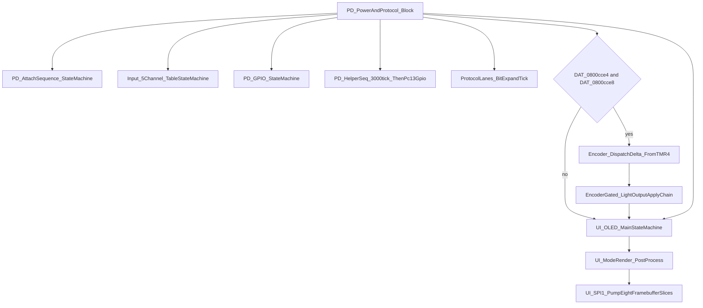

# Phase 3：功能模块分析（初稿）

> 建立日期：2026-04-04  
> 证据来源：Ghidra MCP `decompile_function` / `get_function_callees`（`ZHIYUN-F100-full.bin`）、`[Zhiyun_F100_Repair_Notes.md](../Document/Zhiyun_F100_Repair_Notes.md)`、`[ZHIYUN_F100_官方说明书.md](../Document/Markdown/ZHIYUN_F100_官方说明书.md)`

> **策略更新（2026-04-04，修订）**：**不再等待**屏体规格书 PDF。**OLED / UI** 以 **固件逆推** 为主：`UI_OLED_MainStateMachine`、`UI_ModeRender_Dispatch`、帧缓冲与 SPI 泵的 Ghidra 证据，**23 B** 与 SSD1306 语义对照见 `[04_Protocol_Reverse.md](04_Protocol_Reverse.md)` **§2.0–§2.7**；官方说明书用于 **模式语义** 交叉引用。下文骨架 **持续扩写**。

---

## 0. 电源管理与 PD 周期任务总览（2026-04-04 计划实施）

本节把 **PD_PowerAndProtocol_Block**定为 **灯控/协议/UI 的周期调度核**（由 **main**循环与 **SysTick`→`PD_PeriodicDispatchFromSysTick** 等路径驱动），并与维修笔记 `[Zhiyun_F100_Repair_Notes.md](../Document/Zhiyun_F100_Repair_Notes.md)` 中的 **DPPM/PD 分档策略** 做 **语义级**对照（**不**声称已还原 PL5500/B2B 栅极矩阵）。

### 0.1 顶层调用顺序（`PD_PowerAndProtocol_Block` @ `0x0800CBFC`）

Ghidra 反编译给出的 **顺序**（同一周期内）：

1. **PD_AttachSequence_StateMachine(DAT_0800cce0)**— 上电/插入后的 **多段 tick 协议序列**（与 **PD_GPIO_StateMachine**共用 tick 源 **DAT_0800c644** 等）；**体内无 ADC1 MMIO**（见 `[04_Protocol_Reverse.md](04_Protocol_Reverse.md)` §3.10）。
2. **Input_5Channel_TableStateMachine()**— **PA1+PB4** 与 **ADC 分档** 合成后的 **5 路表驱动** 输入机。
3. **PD_GPIO_StateMachine(DAT_0800cce0 + 2)**— **PC13 / PB3 / PB11** 与 **ADC1_AverageSamples**阈值 **0x65`/`0x15`/`0x7d1`/`0xD17** 的 **PD GPIO + 模拟量** 主状态机。**PB14/MP3398 EN** 不在此状态机内闭合（与 **GPIOB_BSRR** 其它封装及 `[04_Protocol_Reverse.md](04_Protocol_Reverse.md)` §3.11、§3.8.2 **一致**）。
4. **PD_HelperSeq_3000tick_ThenPc13Gpio(DAT_0800cce0 + 4)**— **3000 tick** 窗口后的 **PC13/PB3** 辅助序列。
5. **ProtocolLanes_BitExpandTick()**— **3 路**并行协议位的 **按 tick 位移位展开**。
6. **条件分支**：若 **`DAT_0800cce4`** 非零 **且**` `**DAT_0800cce8`**` 非零，则依次 `**Encoder_DispatchDelta_FromTMR4()**、**EncoderGated_LightOutputApplyChain()**（`0x0800C8C0`，见 §0.3）。
7.**UI_OLED_MainStateMachine**→**UI_ModeRender_PostProcess**→**UI_SPI1_PumpEightFramebufferSlices**。

**与 `main` 的衔接（2026-04-04）**：若 **`CheckMagicWord55AA`** 失败，`**main** 经**thunk_Iwdg_UnlockConfigurePrescaleReloadAndStart**配置 **IWDT**（**`0x40003000`**）并启动；周期内 `**StepBootPhaseCounter8** 后**thunk_IWDG_KR_ReloadAAAA**喂狗 — 见 `[05_Full_Reconstruction.md](05_Full_Reconstruction.md)` §1 表与补充段。

| 项目                                          | 结论                                                                                       | 证据路径                                  | 可信度                  |
| ------------------------------------------- | ---------------------------------------------------------------------------------------- | ------------------------------------- | -------------------- |
| 周期入口 **唯一性**                                | **`Encoder_DispatchDelta_FromTMR4`** 的 `**bl** 仅**PD_PowerAndProtocol_Block**（任务书已述） | `get_function_callers` @ `0x0800D3D2` | **高**                |
| **`EncoderGated_LightOutputApplyChain`**角色 | 在 **输入/PD 子机之后**、**UI 之前** 更新 **双色温分流 / TMR1 占空比** 相关上下文（见 §0.3）                         | `decompile_function` @ `0x0800C8C0`   | **高**（顺序）；**中**（业务名） |

### 0.2 与维修笔记「PD 输入策略」的语义对照

| 手册要点（`[Zhiyun_F100_Repair_Notes.md](../Document/Zhiyun_F100_Repair_Notes.md)` §2） | 固件侧可复核锚点                                                                                                                          | 可信度                |
| --------------------------------------------------------------------------------- | --------------------------------------------------------------------------------------------------------------------------------- | ------------------ |
| 插入 Type-C 时 **先断后通**、灯 **强制熄灭 1–2 s**                                             | **`PD_AttachSequence_StateMachine`**与**PD_GPIO_StateMachine**内 **多段 tick 门控**；**PD_HelperSeq_3000tick**的 **3000 tick** 长窗 | **中**（时间量级需示波器/LA） |
| **PD 功率分档** 与 **能否全功率** 的 **提示**                                                  | **`UI_OLED_MainStateMachine`**与**DAT_0800c648**门控字节（**0x20`/`0x40`/`0x10**）及**ProtocolLanes**— **非**单纯 ADC 阈值          | **中**              |

### 0.3 `EncoderGated_LightOutputApplyChain`（`0x0800C8C0`，Ghidra 重命名）

| Callee                                                     | 地址           | 行为摘要                                                                                                                                                   | 可信度                              |
| ---------------------------------------------------------- | ------------ | ------------------------------------------------------------------------------------------------------------------------------------------------------ | -------------------------------- |
| **`LightOutput_PendingHSI_Dispatch`**（原 `FUN_0800acfa`）    | `0x0800ACFA` | 短状态机：在**0xb5**子态下读**DAT_0800ae18**，调**HSI_FloatMath_ComputeRGBTriple**/**RGBTriple_PushPattern_TMR2Gated**— **HSI/混色** 参数更新             | **高**（反编译）；**中**（与 PA2 RGB 网络对应） |
| **`CCT_Slew_TableSplit_TMR1Shadow`**（原 `FUN_0800cd14`）     | `0x0800CD14` | 大段 **暖/冷** 或 **CCT 列表** 查表 +**TMR1_PeriodHalfword_Write**— **与 TMR1/占空** 相关的 **数值整形**                                                              | **高**（结构）；**中**（W/C 语义）          |
| **`EncoderGated_ADC_TMR1Compare_Apply`**（原 `FUN_0800d044`） | `0x0800D044` | 调**LightApply_ClassifyADC_ToControlByte**（ADC）、多**TMR1_CompareHalfword_Write**— 仅写***g_TMR_CCR_WriteTargetPtr**（**间接 CCR 半字**；池见 **§0.3.2**） | **高**                            |

**归纳**：该链在 **编码器门控** 打开时，把 **旋钮/模式** 推导结果 **写回 TMR1 通道与颜色上下文**，与**Init_TMR1_PWM_WarmColdADIM_PA8PA9_PB15**（**0x0800DD28**，`[02_Hardware_Init.md](02_Hardware_Init.md)` §Timer）形成 **闭环**。**PB14（EN）**：硬件 **万用表** + 固件**MP3398_EN_SetHigh_BSRR_PB14**/**PD_OnAttachDone_ResetEncoderAndUI**等已闭合（见 `[04_Protocol_Reverse.md](04_Protocol_Reverse.md)` §3.8.2、`02` §GPIO PB14）。

### 0.3.1 `EncoderGated` 子链细化（2026-04-04 续推计划）

证据：Ghidra MCP `decompile_function`；Ghidra 重命名**LightOutput_PendingHSI_Dispatch**、**CCT_Slew_TableSplit_TMR1Shadow**、**TMR1_CompareHalfword_Write**、**TMR1_PeriodHalfword_Write**；书签 **Light` @ `0x0800C8C0**；`save_program`。

| 函数（地址）                                                  | 结论                                                                                                                                                                                                                                                                                                                  | 证据路径                                        | 可信度                                           |
| ------------------------------------------------------- | ------------------------------------------------------------------------------------------------------------------------------------------------------------------------------------------------------------------------------------------------------------------------------------------------------------------- | ------------------------------------------- | --------------------------------------------- |
| **`LightOutput_PendingHSI_Dispatch`**@ `0x0800ACFA`    | 参数为 **短状态字指针**（`DAT_0800ca70`）；`*param==0` 时置**0xb5**；在**0xb5**下若***(DAT_0800ae18+0xe)==1**则清该标志，按 **DAT_0800ae18+8`（上限 `0x167`）**`、`**+10`/`+12** 调**HSI_FloatMath_ComputeRGBTriple**，再**RGBTriple_PushPattern_TMR2Gated**输出三字节；最后 `*param=0`，返回 **3**                                          | `decompile_function`                        | **高**                                         |
| **`HSI_FloatMath_ComputeRGBTriple`**@ `0x0800AE20`     | **浮点 HSI→RGB** 大段（**microlib**：**Microlib_UIntToFloat**/**Microlib_FloatMul**/**Microlib_FloatAdd**/**Microlib_FloatSub**/**Microlib_DoubleMul**/**Microlib_DoubleAdd**等；非应用业务逻辑）；向**param_4..6**写 **R/G/B** 字节，并维护**DAT_0800b1d0**内 **归一化/最大值/模式字节**（`param_2<4` 时分档映射 **1/3/4/6**） | `decompile_function`；Ghidra **PRE_COMMENT** | **高**（算法形态）；**中**（与 HSI 说明书语义一致）              |
| **`RGBTriple_PushPattern_TMR2Gated`**@ `0x0800ABCC`    | 将 **RGB 三字节** 展开为 **大块半字缓冲**（`DAT_0800ae10`），**0x32`/`0x10** 两档图案；**TMR_SetCounterEnable**（**Peripherals::TMR2**）、**DMA1** 通道、**NVIC_SetPendingIRQ**、**BlockZero_BufferUnaligned**/**BlockZero_BufferFromEnd**— **RGB 侧链与 TMR1 冷暖 PWM 解耦**，与维修笔记 **PA2→RGB_PWM** **相容**                              | `decompile_function`；Ghidra **PRE_COMMENT** | **高**（TMR2 符号）；**中**（灯珠/协议细节）                 |
| **`CCT_Slew_TableSplit_TMR1Shadow`**@ `0x0800CD14`     | **`DAT_0800cf9c`**目标色温索引 **向 `cf9c[3]` 步进**（±0x1e）；在**DAT_0800cfa0**表（**0x28** 项）中匹配 **当前 CCT**，按**DAT_0800cfa4/20000**拆分 **暖/冷** 到 **cfa0[0x50]`/`[0x51]**；调**TMR1_PeriodHalfword_Write**；把 **比较目标** 写入**DAT_0800ded8**指向的 **成对半字**（`*ded8` 与 `ded8[2]`）                                         | `decompile_function`                        | **高**                                         |
| **`TMR1_PeriodHalfword_Write`**@ `0x0800DE28`          | **`*DAT_0800dedc = param`**— **TMR1 自动重装载/周期类半字**（与**TMR1_CompareHalfword_Write**配对）                                                                                                                                                                                                                           | `decompile_function`                        | **高**（寄存器语义：**中**，需与 `apm32f10x_tmr` 影子寄存器对照） |
| **`TMR1_CompareHalfword_Write`**@ `0x0800DD22`         | **`*DAT_0800ded0 = param`**— **TMR1 通道比较值半字**（**FUN_0800d044**多路径调用）                                                                                                                                                                                                                                            | `decompile_function`                        | **高**                                         |
| **`EncoderGated_ADC_TMR1Compare_Apply`**@ `0x0800D044` | 读**LightApply_ClassifyADC_ToControlByte()**（**ADC1_AverageSamples(4,6)**+ 分档表），**g_LightApply_ADCContextState**上下文；多分支下写**TMR1_CompareHalfword_Write**（***g_TMR_CCR_WriteTargetPtr**）；**-1`/`0xFF** 等与 **UI 模式字 `g_LightApply_UIContextPtr+0x12** 交叉                                               | `decompile_function`                        | **高**（调用）；**中**（业务名）                          |

### 0.3.2 `TMR1_CompareHalfword_Write` 与 Flash 字面量池（寄存器级）

对**ZHIYUN-F100-full.bin**中 **read_memory` @ `0x0800DED0**（长度 16）的小端字解析：

| 字索引 | 值            | SDK 对照（`[apm32f103xb.h](../SDK/APM32F10x_SDK_V2.0.0/Libraries/Device/Geehy/APM32F10x/Include/apm32f103xb.h)` `TMR_T`） |
| --- | ------------ | --------------------------------------------------------------------------------------------------------------------- |
| 0   | `0x40000438` | **TMR3_BASE` + 0x38** → **TMR3->CC2**（`TMR3`=`0x40000400`）                                                         |
| 1   | `0x40012C00` | **`TMR1_BASE`**（`TMR1` 块基址）                                                                                           |
| 2   | `0x40012C34` | **TMR1_BASE` + 0x34**` → `**TMR1->CC1**（暖/冷 PWM 链之一，与 `[02_Hardware_Init.md](02_Hardware_Init.md)` §Timer **相容**）    |
| 3   | `0x40012C3C` | **TMR1_BASE` + 0x3C**` → `**TMR1->CC3**（**PB15/ADIM** 通道常与 **TMR1 CH3** 绑定，见 §0.4）                                   |

**结论**：**TMR1_CompareHalfword_Write**通过**DAT_0800ded0**做 **间接 STRH**；**运行时** `*DAT_0800ded0` 指向 **哪一路 CCR** 决定 **单次写入目标**。池内 **同时** 出现 **TMR3 CC2** 与 **TMR1 CC1/CC3**，与 **RGB（TMR2 侧链）/ 双色温 + ADIM（TMR1）** 分工 **一致**。  

**证据路径**：Ghidra `read_memory` @ `0x0800DED0`；`TMR_T` 布局（`CC1`@+0x34，`CC2`@+0x38，`CC3`@+0x3C，`AUTORLD`@+0x2C）。  

**可信度**：**高**（地址算术）；**中**（运行时指针选路需 RAM 转储或仿真）。

### 0.3.3 灯光应用上下文：全局指针与 RAM 基址（Ghidra 重命名）

对 Flash 字面量 **read_memory` @ `0x0800D1C4**（小端首字）：

| Ghidra 全局（新名）                      | Flash 标称地址   | 首字（指针值）          | 语义                                                                                                       |
| ---------------------------------- | ------------ | ---------------- | -------------------------------------------------------------------------------------------------------- |
| **`g_LightApply_ADCContextState`**| `0x0800D1C4` | **`0x20000180`**| **`EncoderGated_ADC_TMR1Compare_Apply`**中**pcVar1**指向的 **状态字节块**（`*pcVar1`、**pcVar1+3**等被多处分支使用） |
| **`g_LightApply_UIContextPtr`**| `0x0800D1C8` | **`0x2000000C`**| **`piVar2`**：与 **UI 模式字 `+0x12**、***piVar2` 描述符** 同源，与 **OLED 状态机** 共享数据面                              |

**薄封装**（便于 UI 读首字节）：

| 函数                                                | 行为                                                                        |
| ------------------------------------------------- | ------------------------------------------------------------------------- |
| **LightApply_ReadContextState0** @ `0x0800D1A8` | **`return *g_LightApply_ADCContextState`**（首字节；**0xFF**分支与 UI 字符串路径相关） |
| **`LightApply_ReadContextState3`**@ `0x0800D1B2` | **`return *(g_LightApply_ADCContextState+3)`**|

**g_TMR_CCR_WriteTargetPtr` / `g_TMR_PeriodWriteTargetPtr**（`0x0800DED0` / `0x0800DEDC`）：分别由**TMR1_CompareHalfword_Write**/**TMR1_PeriodHalfword_Write**做 **间接 STRH**，与 **§0.3.2** 字面量池一致。

**证据路径**：Ghidra `read_memory`、`rename_global_variable`、`rename_function_by_address`；`decompile_function` @**EncoderGated_ADC_TMR1Compare_Apply**、**LightApply_ReadContextState0**。  

**可信度**：**高**（指针值与符号）；**高**（**0x20000180**：**Ghidra** 已建**LightApplyContext**（**52 B**），与**EncoderGated_ADC_TMR1Compare_Apply**显式偏移 **一致**；工程内已 **create_memory_block` SRAM `0x20000000` + `apply_data_type**、`save_program`）。

**结构体字段收敛（2026-04-05）**：与 **§0.3.4** 斜坡子块（根 **+0x10`…`+0x1C**）对齐，Ghidra**modify_struct_field**：**field10`→`compareOrTarget_i32**、**field14`→`rampDelta_i32**、**field18`→`rampAcc_i32**、**field1c`→`pwmScaled_i32**、**unk08`→`tmrCompareWrittenLatch_u8**、**tickAt30`→`tickSnapshotAt30**；**save_program**。**可信度**：**高**（与**LightApply_UpdateRampScratchFromADC**一致）；**低–中**（**unk01`…`unk07** 仍保留）。

### 0.3.4 `g_LightApply_ADCContextState`（`0x20000180` 起）字段偏移与关联例程

**前提**：**pcVar1**=**g_LightApply_ADCContextState**（指向**0x20000180**的**char ***）。下列为 **反编译中显式出现** 的偏移（单位：字节）。

| 偏移（hex）     | 伪代码中的访问                   | 行为摘要                                                                           |
| ----------- | ------------------------- | ------------------------------------------------------------------------------ |
| **`+0x00`**| `*pcVar1`、`pcVar1[0]`     | 写入**LightApply_ClassifyADC_ToControlByte()**返回值（ADC 量化字节）；**0xFF**走特殊分支 |
| **`+0x01`**| `pcVar1[1]`               | 与**+0x00**比较（迟滞/方向）                                                        |
| **`+0x02`**| `pcVar1[2]`               | 子状态机（**0`/`1** 等）                                                            |
| **`+0x03`**| `pcVar1[3]`               | 与**LightApply_ReadContextState3**一致                                        |
| **`+0x06`**| `pcVar1[6]`               | 在 tick 窗口分支中被 **清零**                                                           |
| **`+0x08`**| `pcVar1[8]`               | **「已写 TMR 比较」** 类闩锁（**0`/`1**）                                               |
| **`+0x0C`**| `(int)(pcVar1 + 0xc)`     | 作为**LightApply_UpdateRampScratchFromADC**的 **子结构基址**（见下表）                  |
| **`+0x10`**| `*(int *)(pcVar1 + 0x10)` | 与**(int)*pcVar1**比较（阈值/目标）                                                 |
| **`+0x1C`**| `*(int *)(pcVar1 + 0x1c)` | 与**g_ADC_Average_u32**组合 **缩放 PWM 字**                                      |
| **`+0x30`**| `*(int *)(pcVar1 + 0x30)` | **快照** **g_SystemTickCounter_u32**，用于 **>0x13 tick** 判定                      |

**子结构（`param_1 = pcVar1 + 0xC` → `LightApply_UpdateRampScratchFromADC` @ `0x0800DEE4`）**

| 相对**param_1**| 等价 **根 `+offset** | 摘要                                      |
| ---------------- | ------------------ | --------------------------------------- |
| `+0x4`           | **`+0x10`**| 与**param_2**相减得增量                   |
| `+0x8`           | **`+0x14`**| 写增量**iVar1**|
| `+0xC`           | **`+0x18`**| 读入**iVar2**，按**iVar1**缩放         |
| `+0x10`          | **`+0x1C`**| 写**(iVar2*iVar1)/100**（**斜坡/滤波** 语义） |

**同池其它字面量指针（Flash 连续字，紧接 `[§0.3.3](03_Function_Modules.md)`）**

| 全局名                           | Flash 地址     | RAM 指针           | 用途（由**EncoderGated_ADC_TMR1Compare_Apply**）                                        |
| ----------------------------- | ------------ | ---------------- | ------------------------------------------------------------------------------------- |
| **`g_ADC_Average_u32`**| `0x0800D1CC` | **`0x20000268`**| 与**/20000**组合做 **占空/亮度比例**（全镜像**68 02 00 20**共 **4** 处字面量，含 `0x0000CFA0` 数据区） |
| **`g_LightModeAuxFlags_u16`**| `0x0800D1D0` | **`0x20001E18`**| **`mode==6`**时与 **关断/缺省占空** 分支相关                                                     |
| **`g_SystemTickCounter_u32`**| `0x0800D1D4` | **`0x20003004`**| **tick 快照** 与 **迟滞窗口**                                                                |

**证据路径**：Ghidra `decompile_function` @**EncoderGated_ADC_TMR1Compare_Apply**、**LightApply_UpdateRampScratchFromADC**；`read_memory` @**0x0800D1CC**；`xxd**ZHIYUN-F100-full.bin**搜索**68 02 00 20**；`rename_global_variable` /**rename_function_by_address**。  

**可信度**：**高**（偏移与除法常数**20000**）；**高**（**IN4→PA4** 与 `[02_Hardware_Init.md](02_Hardware_Init.md)` §ADC **通道/GPIO 表** 一致）；**中**（字段 **业务名**）。

### 0.3.5 `LightApply_ClassifyADC_ToControlByte`（原 `FUN_0800cfa8`，@ `0x0800CFA8`）

| 项目      | 内容                                                                                                                                                                                                                                                |
| ------- | ------------------------------------------------------------------------------------------------------------------------------------------------------------------------------------------------------------------------------------------------- |
| **调用**  | 仅**EncoderGated_ADC_TMR1Compare_Apply**|
| **ADC** | **`ADC1_AverageSamples(4, 6)`**— **通道 4**、**6 次平均**（与 `[02_Hardware_Init.md](02_Hardware_Init.md)` §ADC**ADC1_AverageSamples**签名一致；**静态闭合 IN4 → PA4**，见**ADC1_SetChannelSampleTimeAndRegularRank1**+**Init_ADC_GPIO_AnalogChannels**） |
| **饱和**  | 若**avg - 0x49 > 0xEDB**（无符号语义），返回 **-1`（`0xFF` as `char`）**` — 与 `**EncoderGated** 首分支**== 0xff**对齐                                                                                                                                       |
| **分档**  | 否则在**uVar2 < 0xF25**时，沿 Flash 表**g_ADC_LightClassThresholdTable_u16**（**0x0800D1DA**起，**ushort**降序台阶，`puVar4 += 4` 步进）做 **区间搜索**，输出**cVar6 = (char)(iVar3 - 0x1E)**（**-0x1E` 偏置** 的 **档位字节**）                                    |
| **全局**`  | `**g_ADC_LightClassThresholdTable_u16**（Ghidra 重命名自**DAT_0800d1da**）                                                                                                                                                                          |

**证据路径**：Ghidra `decompile_function` @**0x0800CFA8**；`read_memory` @**0x0800D1DA**；`rename_function_by_address` /**rename_global_variable**；`[02_Hardware_Init.md](02_Hardware_Init.md)`**ADC1_AverageSamples**。  

**可信度**：**高**（调用参数与表地址）；**中**（档位与 **亮度/模式** 的语义命名）。

### 0.3.6 `ADC1_AverageSamples` 调用者全表（Ghidra MCP 穷尽，2026-04-04）

对符号**ADC1_AverageSamples**@ `0x0800CB7A` 执行 **get_function_callers`（limit=100）**，得到 **恰好 4** 处调用（无第五路径）。

| 调用者                                                        | 地址           | `ADC1_AverageSamples(ch, n)` | ADC 通道  | MCU 引脚  | 维修笔记测试点（§6）      | 固件语义（结论）                                                                                                                | 证据路径                                                                           | 可信度                        |
| ---------------------------------------------------------- | ------------ | ---------------------------- | ------- | ------- | ---------------- | ----------------------------------------------------------------------------------------------------------------------- | ------------------------------------------------------------------------------ | -------------------------- |
| `**PD_GPIO_StateMachine**                                 | `0x0800C4E0` | `(3, 4)`                     | **IN3** | **PA3** | **PA3**（DC 侧分压链） | PD 附着后 **与 `0xD17` 比较** 的 **母线/输入电压** 判定，写 `ctx+8` 等                                                                    | `decompile_function`；`Init_ADC` 掩码                                             | **高**（寄存器+GPIO）；**中**（网络名） |
| **`LightApply_ClassifyADC_ToControlByte`**| `0x0800CFA8` | `(4, 6)`                     | **IN4** | **PA4** | **NTC**          | **灯光档位/分类字节** → `g_LightApply_ADCContextState`                                                                          | `decompile_function`；§0.3.5                                                    | **高**                      |
| **`Input5Channel_ADC_IN8_BandClassify`**（原 `FUN_0800D68E`） | `0x0800D68E` | `(8, 4)`                     | **IN8** | **PB0** | **PB0**（47K 分压链） | **`Input_5Channel_TableStateMachine`**用 **IN8** 与**DAT_0800D890**三阈值带比较（死区**0x65**），与 **PA1+PB4** 键位 **按位或** 合成 | `decompile_function`；`get_function_callers`                                    | **高**                      |
| **`BatteryGauge_ADC9_UpdateFromSysTick600`**| `0x0800C2BA` | `(9, 4)`                     | **IN9** | **PB1** | **PB1**（电池电量相关）  | **SysTick>599** 路径 **电量条/分段** +**UI_Framebuffer_CopyRect**UI                                                        | `decompile_function`；`[04_Protocol_Reverse.md](04_Protocol_Reverse.md)` §3.5.1 | **高**                      |

**Ghidra 持久化**：**ADC1_AverageSamples** **PRE_COMMENT** + 书签 **ADC` @ `0x0800CB7A**；**Input5Channel_ADC_IN8_BandClassify**@ `0x0800D68E`**rename_function_by_address**；**save_program**（2026-04-04）。

**可信度（表级）**：**通道→引脚** 与 **ADC1_SetChannelSampleTimeAndRegularRank1` + `Init_ADC_GPIO_AnalogChannels** 一致 → **高**；**模拟前端分压比/NTC 型号** → **中–低**（需原理图或实测）。

### 0.4 TMR1 初始化与引脚（`Init_TMR1_PWM_WarmColdADIM_PA8PA9_PB15` @ `0x0800DD28`）

-**FUN_0800a340**掩码**0x300**：**PA8 / PA9** 复用为 **TMR1** CH1/CH2（**W_PWM / C_PWM**）。
- 掩码**0x8000**：**PB15**（**ADIM**）。
- Ghidra 已有 **plate 注释** 指向维修笔记 §6。

---

## 1. OLED / UI 主状态机（OI-005）

### 1.1 锚点函数

| 项目                                                         | 地址           | 说明                                                  |
| ---------------------------------------------------------- | ------------ | --------------------------------------------------- |
| **`UI_OLED_MainStateMachine`**（Ghidra 重命名自 `FUN_0800d89c`） | `0x0800D89C` | 大型 `switch`/状态机；驱动 **帧缓冲填充**、**子状态机**与 **延时/滴答** 门控 |

### 1.2 直接 callee（第一层）

含：**UI_OLED_DisplayInitAndFlushFramebuffer**（`0x0800940c`）、`UI_SPI_GpioIdlePattern`、`UI_Framebuffer_Clear768`、`UI_Framebuffer_CopyRect`（帧缓冲矩形写）、`UI_Framebuffer_OrMergeRect`、`UI_Framebuffer_DrawGlyphBand`、**UI_Framebuffer_OrMergeBand_FromPromptWorkSlice**（`0x0800E7C8`，经**UI_WorkBuffer_SelectSlicePtr_FromPromptIndex**取片后 **OR 合并条带**）、**UI_ModeRender_CCT234_CopyHeaderBand_AndOrMerge**（`0x0800E620`，模式字 **2/3/4** 时拷头图再**OrMergeBand**）、`UI_PromptGlobals_Reset`、`UI_PromptGlobals_GetStatus`、`UI_DialogTimed_SequenceA`、`UI_ActiveContext_Byte1_Get`、`UI_DialogTimed_SequenceB`、**LightApply_ReadContextState3**（`0x0800D1B2`）、**UI_ModeRender_Dispatch**（`0x0800D600`，多模式分支）、**UI_ModeActiveContext_Clear**（`0x0800D654`）等。**灯光引擎初始化链**另含**Init_TMR2_GPIO_ForRGBPattern_LightEngine**（`0x0800DB7C`，**唯一调用者** **Init_LightEngine_PWM_DMA_TMR1_TMR3Sequence**）。

### 1.3 状态字 `*param_1` 与说明书对照（骨架）

| 状态值（hex）        | 固件侧行为（摘录）                                                                                                                                   | 与说明书/维修笔记的 **推测**对应                                     | 可信度     |
| --------------- | ------------------------------------------------------------------------------------------------------------------------------------------- | ------------------------------------------------------- | ------- |
| `0`             | 调 `UI_PromptGlobals_Reset`，置状态 `0x6f`，记录时间戳                                                                                                 | 上电/会话入口                                                 | **中**   |
| `0x6f`          | 等 **500 tick** 后 → `0x74`；否则**UI_OLED_DisplayInitAndFlushFramebuffer**| 启动/延时门                                                  | **中**   |
| `0x74`          | `UI_ActiveContext_Byte1_Get` 判空则退出；否则刷新、`UI_Framebuffer_CopyRect(0x1a,1,0x45,7,…)` → `0x7e`                                                 | 首屏或菜单帧                                                  | **中**   |
| `0x7e`          | `delta < 0x7D1` 且某标志为 0 则返回码 3；否则进入 **模式分支**（读 `DAT_0800db58+0x12`）                                                                         | 与 **CCT/HSL/MAX** 等模式相关的 **模式字**（值 **2–7** 分支在反编译中显式出现） | **中**   |
| `0x83`…`0x8b`   | 各模式下调**UI_ModeRender_Dispatch**与不同 **子进度字**（`0x36`/`0x29`/`0x42`/…）                                                                     | 子步骤（如画线/多页）                                             | **低–中** |
| `0x97` / `0x9b` | 分别进入 `UI_DialogTimed_SequenceA`、`UI_DialogTimed_SequenceB` 子状态机                                                                             | 对话框/二级流程                                                | **低–中** |
| `0xa0`          | `UI_ActiveContext_Byte1_Get` 非空时递增 `puVar2[1]`，刷新 `UI_Framebuffer_CopyRect` / `UI_Framebuffer_DrawGlyphBand` / `UI_Framebuffer_OrMergeRect` | **列表/多页 UI**（与说明书「左右键切换行」类行为 **相容**，未逐条证明）              | **低–中** |
| `0xa6`          | 等 **300 tick** 循环                                                                                                                           | 动画/刷新节拍                                                 | **中**   |

**说明**：**模式字** `*(short*)(DAT_0800db58+0x12)` 与维修笔记 **[§7](../Document/Zhiyun_F100_Repair_Notes.md)** 中 **CCT / HSL / MAX** 及按键逻辑：**§1.5.1** 已给出 **直接写 `0x2000001e** 的**PD_OnAttachDone_ResetEncoderAndUI**；**2…7** 的 **静态写点** 仍待 **行回调反汇编/仿真**。

### 1.4 与 SPI 的关系

-**UI_Framebuffer_CopyRect**仅写 **SRAM 帧缓冲**，**不**调 SPI（与 `[04_Protocol_Reverse.md](04_Protocol_Reverse.md)` §2.6 一致）。
- **SPI 刷新**仍在**main**循环**SPI1_PumpEightFramebufferSlices**路径。

### 1.5 模式渲染子链（`UI_ModeRender_Dispatch` / `UI_ModeBitmap_CopyRows`，2026-04-04 续）

| 函数（地址）                                                       | 行为摘要                                                                                                                                                                                                                                                                                                  | 证据路径                                                                                                            | 可信度                          |
| ------------------------------------------------------------ | ----------------------------------------------------------------------------------------------------------------------------------------------------------------------------------------------------------------------------------------------------------------------------------------------------- | --------------------------------------------------------------------------------------------------------------- | ---------------------------- |
| **`UI_ModeRender_Dispatch`**| **`param_1`**为 **模式描述符指针**；经**ldr r5,[0x0800D668]**得 **SRAM 槽 `0x20000184**，写***slot←param_1**（**g_UI_ModeRender_ActiveDescriptorPtr**语义对应该槽，**非** Flash**0x0800D668**本体）；若旧描述符非空则***(old)=2**并**UI_ModeBitmap_CopyRows**；最后**(*(code**)(param_1+4))(…)**— **vtable 渲染入口** | `decompile_function` / `disassemble_function` @ `0x0800D600`                                                    | **高**                        |
| **`UI_ModeBitmap_CopyRows`**| 按描述符内 **行计数/步长**（`param_1[0]`、`param_1[1]`、`param_1[2]`、`*(uint*)(param_1+4)`）分块**FUN_0800a244**（**对齐 `memcpy**）拷入目标缓冲；用于 **位图/字体条带** 展开                                                                                                                                                          | `decompile_function` @ `0x0800D626`、`0x0800A244`                                                                | **高**                        |
| **`UI_ModeActiveContext_Clear`**| 将**g_UI_ModeRender_ActiveDescriptorPtr**所指对象首字节置 **0**，并清**DAT_0800d66c**— **结束一次模式绘制会话**                                                                                                                                                                                                     | `decompile_function` @ `0x0800D654`                                                                             | **高**                        |
| **`UI_ModeRender_PostProcess`**| 对当前描述符调**(*(code**)(*ctx+0x18))()**；按***(char*)(ctx+1)**与***(int*)(ctx+0xc)**分支，可能再**(*(code**)(ctx+0xc))()**— **后处理/收尾**                                                                                                                                                              | `decompile_function` @ `0x0800D5CC`                                                                             | **中**                        |
| **`UI_ModeRender_LightApplyDiagnosticsAscii`**（`0x0800E9DC`） | **+4` vtable** 目标之一：**清 768B 帧缓冲**、**ASCII 标签**、读 **LightApply_ReadContextState0**；**FUN_08009828** **仅** 被本函数调用（数字/条形绘制）；**无直接 `bl` xref**（**bx r1**间接）                                                                                                                                      | `decompile_function` @ `0x0800E9DC`；`disassemble_function` @ `0x0800D600`；`get_function_callers` @ `0x08009828` | **高**（间接调用链）；**中**（屏上文案与模式号） |

**Flash 描述符指针池**（`read_memory` @**0x0800DB5C**，小端，2026-04-05 Ghidra 复核）：连续 **5** 个 **SRAM 描述符指针**，与**UI_OLED_MainStateMachine**内**UI_ModeRender_Dispatch**五路分支 **一一对应**；其后另有 **字模/位图指针**（如**0x080082CC**）供**UI_Framebuffer_OrMergeRect**等使用。

| Flash 标签（实参）       | 池内指针值（SRAM）      | 分支条件 `*(ushort*)(DAT_0800db58+0x12)` | 子进度字（`puVar2+4`）首拍后 |
| ------------------ | ---------------- | ------------------------------------ | ------------------- |
| **`DAT_0800db5c`**| **`0x20000190`**| **`< 2`**| `0x36`              |
| **`DAT_0800db60`** | **`0x200001CC`** | **`2` / `3` / `4`**                  | `0x29`              |
| **`DAT_0800db64`**| **`0x200001F8`**| **`5`**| `0x42`              |
| **`DAT_0800db68`**| **`0x200001AC`**| **`6`**| `0x4E`              |
| **`DAT_0800db6c`**| **`0x20000218`**| **`7`**| `0x5A`              |

**全局当前描述符槽**：**UI_ModeRender_Dispatch**经**ldr r5,[0x0800D668]**载入 **字面量 `0x20000184**（SRAM：**当前活动描述符指针槽** + 位图区**+4**），再写***r5 <- param_1**；符号**g_UI_ModeRender_ActiveDescriptorPtr**语义上对应 **该 SRAM 槽**，**非** Flash 地址**0x0800D668**本身（该址为 **Thumb 池字**，值为**0x20000184**）。**get_xrefs_to` @ `0x0800D668`（DATA）** 的 **READ**：**UI_ModeRender_Dispatch**（`0x0800D606`）、**UI_ModeRender_PostProcess**（`0x0800D5CE`）、**UI_ModeActiveContext_Clear**（`0x0800D654`）、**ProtocolLane_VtableDispatch_FromPtr20000184**（`0x0800D5B4`）。**UI_OLED_MainStateMachine**经 **0x0800DB5C`…`DB6C** 五池**ldr r0,[pool]; bl**传入 **描述符指针实参**，**不**经**0x0800D668**池字。

**与 `[ZHIYUN_F100_官方说明书.md](../Document/Markdown/ZHIYUN_F100_官方说明书.md)` 的编号对照**（用户可见 ↔ 固件模式字；**中**，文案与 RAM 字段仍需运行时/抓屏辅证）：

| 模式字 `+0x12` | 说明书章节               | 用户操作/模式名                                               | 备注                                                                         |
| ----------- | ------------------- | ------------------------------------------------------ | -------------------------------------------------------------------------- |
| `< 2`       | —                   | **极简/待机类 UI**（非主 CCT 屏）                                | 与 **① DIM 单击进 CCT** 前界面 **相容**；精确文案待抓屏                                     |
| `2`–`4`     | **§3.1**、**§2.2 ①** | **CCT**（亮度/色温，**DIM** 循环子项）                            | 三值共用**DAT_0800db60**描述符，与子状态/参数页 **相容**                                |
| `5`         | **§3.2**、**§2.2 ③** | **HSI**（H/S/I）                                         | **单击 HSI 模式键** 进入                                                          |
| `6`         | **§3.3**、**§2.2 ⑥** | **FX 光效**                                              | **单击 FX 键** 进入                                                             |
| `7`         | **§3.4**、**§2.2 ④** | **MAX 全功率** 相关 UI 壳层（**在 CCT 下 toggles 全功率**，说明书 §3.4） | 固件为 **独立模式字分支**；与 **MAX 键** 业务 **相容**，是否 **仅** 全功率屏 **待** `+0x12` 写入点 xref |

**字面量池（补充）**（`read_memory` @ `0x0800DB50` 一带）：含 **Flash 图形表** **0x080081C8**、**0x080082CC**等；**DAT_0800db70**在 **0xa0` 列表态** 指向 **0x080082CC**（与上表 **OrMerge** 条带 **一致**）。

**UI_OLED_MainStateMachine` 内 `bl UI_ModeRender_Dispatch` 汇编锚点（2026-04-10；2026-04-05 复核）**：外层主状态字 **[r5,#0]** 需已进入 **0x83`/`0x85`/`0x87`/`0x89`/`0x8b** 子状态机；**r4+4**子进度为 **0** 时**ldr r0,[pool]; bl 0x0800d600**；**mode=*((ushort*)(*DAT_0800db58)+0x12)**（**DAT_0800db58`→`0x2000000C**）决定 **五选一** 池 **0x0800DB5C`…`0x0800DB6C**。**Ghidra 书签 `UI` @ `0x0800D96C**（**首处 `bl**；紧邻 **ldr` @ `0x0800D96A**）。

| `bl` 指令 VA       | 前导 `ldr` 池地址                  | 模式半字 `+0x12`               | 子进度首写      |
| ---------------- | ----------------------------- | -------------------------- | ---------- |
| **`0x0800D96C`**| **0x0800DB5C`→`0x20000190** | **0` 或 `1**（**<2**谓词） | **`0x36`**|
| **`0x0800D9AE`**| **0x0800DB60`→`0x200001CC** | **2`/`3`/`4**            | **`0x29`**|
| **`0x0800D9E6`**| **0x0800DB64`→`0x200001F8** | **`5`**| **`0x42`**|
| **`0x0800DA18`**| **0x0800DB68`→`0x200001AC** | **`6`**| **`0x4E`**|
| **`0x0800DA4A`**| **0x0800DB6C`→`0x20000218** | **`7`**| **`0x5A`**|

**证据路径**：`disassemble_function` @**0x0800D89C**（**ZY_F100**，**2026-04-05**）；`read_memory` @**0x0800DB50**。**可信度**：**高**（`bl`/`ldr` VA 与池字解码）；**中**（子进度 **用户文案**）。

#### 1.5.4a Ghidra**UI_ModeRender_Dispatch**PLATE 与 OI-005 导航（2026-04-05 执行）

| 结论                                                                                                                                                                                                                                                                                                                     | 证据路径                                                                     | 可信度                            |
| ---------------------------------------------------------------------------------------------------------------------------------------------------------------------------------------------------------------------------------------------------------------------------------------------------------------------- | ------------------------------------------------------------------------ | ------------------------------ |
| **`UI_ModeRender_Dispatch`**（`0x0800D600`）已写 **函数头 PLATE**：概括***g_UI_ModeRender_ActiveDescriptorPtr <- param_1**、**UI_ModeBitmap_CopyRows**旧描述符收尾、**(*(fn**)(desc+4))(…)**；并指向 **Flash 池 `0x0800DB5C`…`0x0800DB6C** 与**UI_OLED_MainStateMachine**五路**bl**（**§1.5** 表）、**UI_ModeEvent_***（**§1.5.3**） | Ghidra MCP**set_plate_comment**@**0x0800D600**；**save_program**| **高**                          |
| **五路描述符 SRAM 指针**（`0x20000190` / `1CC` / `1F8` / `1AC` / `218`）在 **静态镜像** 中 **未** 预填 — **Ghidra `read_memory` @ ram:*** 失败与 **运行态/散载后** 一致；**vtable `+4` 目标** 仍以 **反编译 + 间接 xref** 为主（与既有 **§1.5**、**UI_ModeRender_LightApplyDiagnosticsAscii**行 **相容**）                                                            | MCP `read_memory`（**ram** 负向）；**§1.5** 池表                                | **高**（工具）；**中**（逐槽 **运行时** 单步） |

#### 1.5.1 模式字 `*(uint16*)(ctx+0x12)` 的静态写入点（`0x2000001e`，2026-04-06）

**基址**：**g_LightApply_UIContextPtr**→**0x2000000C**（Flash 池字**0x0800D1C8**；**UI_OLED_MainStateMachine**用**DAT_0800db58**指向同一指针）。**DAT_0800ca68**在 Ghidra 中亦为 **同一字面量 `0x0C000020**（已打标签**flash_literal_g_light_apply_ui_ctx_ptr**），供**PD_OnAttachDone_ResetEncoderAndUI**使用。

| 结论                                                                                                                                                                                                                                                   | 证据路径                                                                                                                                               | 可信度                                                              |
| ---------------------------------------------------------------------------------------------------------------------------------------------------------------------------------------------------------------------------------------------------- | -------------------------------------------------------------------------------------------------------------------------------------------------- | ---------------------------------------------------------------- |
| **`PD_OnAttachDone_ResetEncoderAndUI`**（`0x0800C974`）首条有效语句为***(uint16*)(ptr+0x12)=1**— PD **附着/协商完成**后把模式字 **重置为 `1**，与**UI_OLED_MainStateMachine**中**<2**分支走**DAT_0800db5c**描述符的语义 **相容**（非 0、进入低模式区）                             | `decompile_function` @ `0x0800C974`；Ghidra**set_decompiler_comment**@ 入口                                                                       | **高**                                                            |
| Ghidra **get_xrefs_to` @ `0x2000001e** 在 **DATA 空间**仅列出 **一处 `WRITE**（上条）；**READ**含**UI_OLED_MainStateMachine**、**EncoderGated_ADC_TMR1Compare_Apply**、**PD_GPIO_StateMachine**等                                                       | MCP `get_xrefs_to`                                                                                                                                 | **高**（工具）；**间接写** 可能 **未进** 固定地址 xref                            |
| 模式 **2`…`7** 的 **半字写** 经**STRH [reg,#0x12]**（`reg` 为**g_LightApply_UIContextPtr**运行时值**0x2000000C**）在 **多处 UI/vtable 助手** 出现；**固定地址** **get_xrefs_to` @ `0x2000001E** 仍 **仅** **PD_OnAttachDone** **WRITE**（间接寻址 **不进** 该 DATA xref） | Capstone 全镜像**STRH *,[#0x12]**扫描（例：**0x0800E5FE**、**0x0800E61C**、**0x0800E886**、**0x0800E9AA**…）；**0x0800E664**字面量**0x2000000C**| **高**（指令+池字）；**中**（事件码 **0x21`/`0x23`/`0x24** 与说明书按键 **逐条命名**） |

**UI_ApplyEventCode_ToModeHalfword_21_23_24` 尾链（2026-04-08 增量，Ghidra 符号闭合）**

| 结论                                                                                                                                                                                                                                                                                                                        | 证据路径                                                                                                          | 可信度   |
| ------------------------------------------------------------------------------------------------------------------------------------------------------------------------------------------------------------------------------------------------------------------------------------------------------------------------- | ------------------------------------------------------------------------------------------------------------- | ----- |
| 事件 **0x21`/`0x23**：在 **STRH` 0/1 → `ctx+0x12** 之后，顺序调用**HSI_CommitPendingRGB_ToShadow**（`0x0800AD78`）→**PD_SetDoneFlagHalfword**→**MP3398_EN_SetHigh_BSRR_PB14**— 将**DAT_0800AE18**上 **待处理 HSI RGB 半字**（`+8`/`+10`/`+0xC`）**提交**到 **+0x10`/`+0x12`/`+0x14** 影子区并清 pending，再置 **PD 完成标志** 与 **升压 EN** | `decompile_function` @ `0x0800E5E6`、`0x0800AD78`；Ghidra**rename_function_by_address**/**save_program**| **高** |
| 事件**0x24**：**不**走上一尾链；仅在**UI_ApplyEventCode**内**STRH**更新**+0x12**（与**UI_ModeHalfword_IncrementOrWrapAt4_Event24**逻辑等价分支）                                                                                                                                                                                | 同上 @ `0x0800E5E6`                                                                                             | **高** |

#### 1.5.2 五行输入表基址（SRAM）与**Init_TMR3_PB5_AndTickSyncLoop**注册回调（2026-04-07 建立；**2026-04-05** 桩区与**+0x12**写点补全）

| 结论                                                                                                                                                                                                                                                                                                                                                                                                                                                                                                                                                                             | 证据路径                                                                                                                                                                                                                                                  | 可信度                                                                            |
| ------------------------------------------------------------------------------------------------------------------------------------------------------------------------------------------------------------------------------------------------------------------------------------------------------------------------------------------------------------------------------------------------------------------------------------------------------------------------------------------------------------------------------------------------------------------------------ | ----------------------------------------------------------------------------------------------------------------------------------------------------------------------------------------------------------------------------------------------------- | ------------------------------------------------------------------------------ |
| **`Input5Channel_DispatchRowEvent`**首条**ldr r6,[pool]**的立即数经**0x0800D884**载入***0x0800D884 = 0x20000020**— **五行表本体在 SRAM**，不在 Flash**0x0800D884**处连续排布                                                                                                                                                                                                                                                                                                                                                                                                         | `disassemble_function` @ `0x0800D6DA`；`read_memory` @ `0x0800D884` 首字                                                                                                                                                                                 | **高**                                                                          |
| **`Input5Channel_SetRowPrimaryCallback`**（原**FUN_0800d70a**）向**base + row×0x14 + 4**写入 **32 位 Thumb 主回调指针**；**唯一**静态调用者**Init_TMR3_PB5_AndTickSyncLoop**@ `0x0800CC7E`，按**row = 0,2,3,4,1**顺序从 Flash 池取指针并登记                                                                                                                                                                                                                                                                                                                                                    | `decompile_function` / `disassemble_function` @ `0x0800CC7E`、`0x0800D70A`；`get_function_callers` @ `0x0800D70A`                                                                                                                                       | **高**                                                                          |
| **`Input5Channel_StoreInitOpaqueArgAtContextPlus8`**@**0x0800D422**（原**FUN_0800d422**）：**str r0,[*(0x20001DE0),#8]**— 在五行 **主回调** 注册之后，将 **池实参**（**0x0800CD0C` → Thumb `0x0800C7D5**）写入 **Input5Channel 侧上下文 `+8**；**唯一调用者** **Init_TMR3_PB5_AndTickSyncLoop**| `disassemble_function` @ `0x0800D422`；`read_memory` @**0x0800D428**（**0x20001DE0**）、**0x0800CD0C**；Ghidra**rename_function_by_address**/**PRE_COMMENT**/ **set_bookmark`（Input @ `0x0800D422`）** / **save_program**（**2026-04-05**） | **高**（指令与池字）                                                                   |
| Flash 池（**ldr r1,[imm]**源地址）：**0x0800CCF4**→**0x0800CBE1**（**入口指令 @ `0x0800CBE0**），**0x0800CCFC**→**0x0800CBD3**（**@0x0800CBD2**），**0x0800CD00**→**0x0800CBD5**（**@0x0800CBD4**），**0x0800CD04**→**0x0800CBDD**（**@0x0800CBDC**），**0x0800CD08**→**0x0800CBDF**（**@0x0800CBDE**）— 五段 **Thumb 入口** 落在 **0x0800CBD2`…`0x0800CBE1** 一带（**LSB=1** 的池字为 **Thumb 调用约定**）                                                                                                                                                                             | `disassemble_function` @ `0x0800CC7E`；`read_memory` @ `0x0800CCF4`；Capstone                                                                                                                                                                           | **高**（地址）                                                                      |
| **间隙桩不写 `g_LightApply_UIContextPtr+0x12**：**0x0800CBE0`…`0x0800CBFA** 将 **事件码 `r1** 映射为 **lane 类字节 `0x10`/`0x20`/`0x40** 并**STRB**至***(0x20001E14)**（**ldr r1,[pc,#0xe4]` @ `0x0800CBF6** → 字面量**0x0800CCDC**→**0x20001E14**），**与 UI 模式半字无关**。Ghidra：**ProtocolLanes_MapEventCode_ToLaneByte_10_20_40**@**0x0800CBE0**，`PRE_COMMENT`，书签 **Input` @ `0x0800CBE0**                                                                                                                                                                                  | Capstone；`read_memory` @**0x0800CCDC**；MCP**create_function**/**set_decompiler_comment**/**set_bookmark**/**save_program**| **高**                                                                          |
| **Row2 专用路径**：**0x0800CBD2** **b` → `0x0800CBD6** →**orrs r0,r1**→**b.w 0x0800D5B4**；**0x0800D5B4`…`0x0800D5C8** 经***(uint32*)0x20000184**做 **vtable 式间接调用**（**byte[0]==1**时**bx *(obj+8)**）。Ghidra：**ProtocolLane_VtableDispatch_FromPtr20000184**，书签 **Protocol` @ `0x0800D5B4**                                                                                                                                                                                                                                                                  | Capstone；MCP**create_function**/**set_bookmark**| **高**（寄存器链）；**中**（与 **ProtocolLanes 位展开** 的业务名 **一一闭合**）                       |
| **共享尾 `0x0800CBD6`（2026-04-05 续）**：**FUN_0800cbd6**→**ProtocolLane_OrMergeR0R1_VtableDispatch20000184**—**orrs r0,r1**后**b.w**至**ProtocolLane_VtableDispatch_FromPtr20000184**。**Row 3** 入口**0x0800CBD4**为 **NOP` + 同尾**（与 Row2 汇合）；**Row 4 / Row 1** 入口 **0x0800CBDC` / `0x0800CBDE** 为 **短分支** 汇入**0x0800CBD6**（指令字节见固件 `dump`；与 **Row2** 同 **20000184** 链）。书签 **Protocol` @ `0x0800CBD6**，`save_program`                                                                                                                                      | Ghidra MCP `rename_function_by_address` / `set_bookmark` / `save_program`                                                                                                                                                                             | **高**（汇编形态）；**中**（行 ↔ 说明书 **DIM/HSI/FX** 仍依 **事件码** 闭合）                        |
| **模式半字 `+0x12` 的静态写点（补充）**：**UI_ApplyEventCode_ToModeHalfword_21_23_24**@**0x0800E5E6**— 事件**r1==0x21**→**STRH 0**；**0x23**→**STRH 1**；**0x24**→**UI_ModeHalfword_IncrementOrWrapAt4_Event24**@**0x0800E610**（**ldrh [ctx,#0x12]**，**<4` 则 `+1` 否则置 `2**，再**STRH**）。**ldr r1,[pc]**字面量 **0x0800E664` → `0x2000000C**（与**g_LightApply_UIContextPtr** **一致**）。Ghidra：**PRE_COMMENT**@**0x0800E5E6**/**0x0800E610**，书签 **UI` @ `0x0800E5E6**、**0x0800E610**（**OI-005，`0xE610` 为 `IncrementOrWrap` 分支**；**2026-04-05**） | Capstone；`read_memory` @**0x0800E664**；MCP                                                                                                                                                                                                         | **高**（**写 `+0x12**）；**中**（**0x21`/`0x23`/`0x24** 与 **说明书模式键** 的 **文案级** 对照） |

**Init_TMR3_PB5_AndTickSyncLoop` 注册顺序 ↔ 行号 ↔ Flash 池 ↔ 主回调语义（闭合表）**

| 注册调用序（`Init` 内 `Input5Channel_SetRowPrimaryCallback` 顺序） | **行号** `row` | Flash `ldr` 池字（Thumb 指针）        | 解析后的 **入口标签**（Ghidra）                                                                                   | **静态语义**                                                                                       |
| -------------------------------------------------------- | ------------ | ------------------------------- | ------------------------------------------------------------------------------------------------------- | ---------------------------------------------------------------------------------------------- |
| 1                                                        | **0**        | **0x0800CCF4` → `0x0800CBE1** | **`ProtocolLanes_MapEventCode_ToLaneByte_10_20_40`**@ `0x0800CBE0`                                     | **r1` 事件码 → lane 类字节 `0x10`/`0x20`/`0x40`，**STRB**至 **0x20001E14**|
| 2                                                        | **2**        | **0x0800CCFC` → `0x0800CBD3**| **ProtocolLane_Row2_Entry_JumpVtableDispatch** @ `0x0800CBD2`                                         | **b` → `0x0800CBD6**，进入 **ORRS + vtable**                                                    |
| 3                                                        | **3**        | **0x0800CD00` → `0x0800CBD5** | **`ProtocolLane_Row3_Entry_NopThenOrMergeVtable`**@**0x0800CBD4**（**create_function**，2026-04-05） | **`NOP`**后落入**ProtocolLane_OrMergeR0R1_VtableDispatch20000184**（**orrs` + `b.w` vtable**） |
| 4                                                        | **4**        | **`0x0800CD04` → `0x0800CBDD`** | **`ProtocolLane_Row4_BranchToOrMergeVtable`** @ **`0x0800CBDC`**（**2 B** 短分支 → 共享尾）                     | 与 **Row1** 同为 **汇入 `0x0800CBD6`** 的 **跳板**                                                     |
| 5                                                        | **1**        | **0x0800CD08` → `0x0800CBDF** | **`ProtocolLane_Row1_BranchToOrMergeVtable`**@**0x0800CBDE**（**2 B** 短分支 → 共享尾）                     | **Init** 登记序 **最后**（第 5 次**Input5Channel_SetRowPrimaryCallback**）                           |

**说明书侧（推测，中）**：五行对应**Input_5Channel_TableStateMachine**的 **行 0…4**（见 **§2.1**），与 **DIM / 模式键 / HSI / FX / MAX** 的 **一一按键映射** 仍依赖 **事件码 `0x10`…`0xF0** 与 **抓屏/LA**；上表仅闭合 **Init 注册 ↔ 指令入口 ↔ 协议 lane / vtable**。

**归纳**：**五行主回调桩** 的 **协议 lane 字节 / Row2 vtable** 语义已 **静态闭合**；**`+0x12` 模式半字** 的 **主要非 PD 写路径** 已落在 **`0x0800E5E6`/`0x0800E610`** 一带（**另有 `STRH [#0x12]`** 命中 **`0x0800E886`、`0x0800E9xx`** 等 **UI 绘制链**，见 **Capstone 全表**）。**OI-005**：**`param_2`** 见 **§1.5.3.1**；**`UI_ModeRender_Dispatch` 入口 `r1`=模式半字** 见 **§1.5.3.3**；**`UI_ModeEvent_*` 内 `r1 ≡ merged`** 见 **§1.5.3.2.1**。

#### 1.5.3.1 物理输入层 → **Input5Channel_DispatchRowEvent` 第二参 `param_2**（**OI-005**，2026-04-06）

> **与下节 `UI_ModeEvent_*` 的 `r1` 区分**：本节事件字来自**Input_5Channel_TableStateMachine**的 **按压状态机**，经**Input5Channel_DispatchRowEvent(row, param_2)**下发（ARM：**r0`≈行号、`r1`=`param_2**）。**0x10`/`0x20`/… 与 `0x11`/`0x21`/`0x41` 不在同一立即数命名空间**；后者仅出现在 **UI_ModeEvent_*` / `UI_ApplyEventCode_ToModeHalfword_***（§1.5.3 主表）。

**前置**：**Input_SamplePA1PB4_As2bit**@**0x0800D670**与**Input5Channel_ADC_IN8_BandClassify**合成**uVar7**，与 **上一拍掩码** 比较后驱动 **行 FSM**（`decompile_function` @**0x0800D74E**）。

| **`param_2`**| **静态语义**       | **触发摘要**                                                                                                                                              | 证据路径                                                                                                 | 可信度   |
| ------------------------------------- | -------------- | ----------------------------------------------------------------------------------------------------------------------------------------------------- | ---------------------------------------------------------------------------------------------------- | ----- |
| **`0x10`**| **按下沿 / 首次闭合** | 行状态**bVar6==0**且**(uVar3 & 1)!=0**（位来自**uVar2 >> (行表项移位)**）                                                                                 | `decompile_function` @**0x0800D74E**；`bl**Input5Channel_DispatchRowEvent**@**0x0800D7A0**| **高** |
| **`0x20`**| **释放 / 低电平支路** | 状态**1**：**(uVar3&1)==0**时调 **行主回调 `+4` 与表基 `+0x64` 共享回调**，实参**0x20**；并递增 **长按代数** `*(byte*)(row+9)`                                          | 同上                                                                                                   | **高** |
| **`0x40`**| **按住越过消抖窗口**   | 状态**1**：**位仍置位** 且 **tick 差 ≥ `*(byte*)(row+3)*100**                                                                                              | 同上                                                                                                   | **高** |
| **`0x80`**| **状态 `2` 下释放** | **`bVar6==2`**且**(uVar3&1)==0**→ 双回调**0x80**| 同上                                                                                                   | **高** |
| **0x30` / `0x60` / `0x70` / `0xF0** | **长按分级**       | **`bVar6==0`**、**子状态字节 `*(char*)(row+9)** 非 0，且***g_SystemTickCounter - *(int*)(row+8) > 299**：`1→0x30`、`2→0x60`、`3→0x70`、**与行首半字匹配时** **0xF0**| 同上；`bl**Input5Channel_DispatchRowEvent**@**0x0800D7C6**| **高** | **`Input5Channel_DispatchRowEvent`**（**0x0800D6DA**）：对 **base = *0x0800D884`（SRAM `0x20000020`）** 计算 **base + row×0x14**，若***(base+row×0x14+4)!=0**则 **blx` 行主回调**`（`**r0`/`r1** 同上）；**再**若***(base+100)!=0**则 **同一实参** 调 **共享尾**（**0x64` 字节偏移**）。**证据**：`decompile_function` @ `**0x0800D6DA**。

**行号 ↔ `Init` 登记** 仍取 **§1.5.2 闭合表**（**row=0,2,3,4,1**与 Flash 池 **0x0800CCF4`…`CD08**）。

#### 1.5.3.2 底层 `param_2` → **merged` → `ProtocolLane_VtableDispatch_FromPtr20000184**（**OI-005**，2026-04-06）

| **环节**                               | **行为**                                                                                                                                                                                                                                                                                                     | 证据路径                                                                                                    | 可信度                                  |
| ------------------------------------ | ---------------------------------------------------------------------------------------------------------------------------------------------------------------------------------------------------------------------------------------------------------------------------------------------------------- | ------------------------------------------------------------------------------------------------------- | ------------------------------------ |
| **Row2–4 / Row1 共享尾**                | **`ProtocolLane_OrMergeR0R1_VtableDispatch20000184`**@**0x0800CBD6**：**orrs r0,r1**（**r0`/`r1** 即 **行回调** 收到的 **行号字符** 与**param_2**）→**b.w ProtocolLane_VtableDispatch_FromPtr20000184**| `disassemble_function` @**0x0800CBD6**；§1.5.2 行表                                                     | **高**                                |
| **vtable 哨**                         | **`ProtocolLane_VtableDispatch_FromPtr20000184`** @ **`0x0800D5B4`**：读 **`*(uint32*)0x20000184`**；若 **`*obj==1`** 则 **`(*(code*)(obj+8))(obj, merged)`** — **`merged` 为 `0x0800CBD6` 处 `orrs` 输出**；**`bx` 前 `mov r1,r0` 使第二实参恒为 `merged`**（§1.5.3.2.1） | `disassemble_function` @ **`0x0800D5B4`**；`LitPool_Ptr_UI_ModeRender_Globals_20000184` @ **`0x0800D668`** | **高** |
| **→ `UI_ModeEvent_*` 的 `r1`（0x11…）** | **汇编已闭合**：**`merged` ≡ `r1`**（见下 **§1.5.3.2.1**）。**`get_function_callers` 为空** 仍成立（**vtable `+8` 间接 `bx`**）；池字 **0x0800E85B**@**0x0800F34D**、**0x0800EB03**@**0x0800F339** 为 **描述符模板** 内 **Thumb 槽**，与 **`merged` 变换无关** | **`disassemble_function` @ `0x0800CBD6`、`0x0800D5B4`**；Ghidra **`set_decompiler_comment`** + **`save_program`** | **高** |
| **仍开放（语义层）** | **五行槽首半字 `tag`**（`ldrh` 源）在 **RAM 解压完成态** 下 **期望** 与 **逻辑行号 0…4** 对齐，使 **`tag | param_2`** 落在 **`0x10`/`0x20`/`0x41`** 等 **OI-005 表**；**物理键 ↔ `param_2`** 仍 **§1.5.3.1**；**SRAM 冷启动转储** 可核对 **`0x20000020+row×0x14` 首半字** | §1.5.3.1；**`logs/renode-oi001/LATEST`** / 板载调试器 | **高**（公式）；**中**（`tag` 初值 **无 `.map`** 时 **建议** 动态快照） |

**余量与验证（更新）**：**不再**假设 **`obj+8` 包装层** 会 **改写 `r1`** — **`bx` 前 `mov r1,r0` 已固定传递 `merged`**。**可选**：Renode **`hbreak *0x0800d5c6`**（`bx` 前）核对 **`r1 == (tag|param_2)`**；或 **SRAM 转储** 核对 **`tag` 半字**。**任务书 §4/§7**：**`continue` 后** 可靠动态证据以 **本机 `scripts/renode_gdb_capture.sh` 等脚本 + Renode** 为准（**勿**依赖 Cursor **F100 GDB MCP**）。

#### 1.5.3.2.1 `merged` ≡ `UI_ModeEvent_*` 第二实参 `r1`（汇编闭合，2026-04-06 续）

| 步骤 | 地址 / 符号 | 指令语义 | 结论 |
|------|----------------|----------|------|
| 1 | **`ProtocolLane_OrMergeR0R1_VtableDispatch20000184`** @ **`0x0800CBD6`** | **`orrs r0,r1`** → **`b.w ProtocolLane_VtableDispatch_FromPtr20000184`** | **`r0 ← r0 \| r1`**。入 ORR 时 **`r0`** 来自 **`Input5Channel_DispatchRowEvent`** 路径内 **`ldrh r0,[r6,r5]` + `uxtb r0,r0`**（**`r6=*0x0800D884→0x20000020`**, **`r5=row×0x14`**）；**`r1`** 为 **`Input5Channel_DispatchRowEvent(row,param_2)` 的 `param_2`**（§1.5.3.1）。记 **`tag = (uint8)(*(uint16*)(0x20000020+row×0x14))`**，则 **`merged = tag \| param_2`**。 |
| 2 | **`ProtocolLane_VtableDispatch_FromPtr20000184`** @ **`0x0800D5B4`…`0x0800D5C6`** | **`ldr`/`cbz`/`cmp` 哨**后 **`mov r1,r0`**；**`mov r0,r2`**（**`*LitPool_Ptr_UI_ModeRender_Globals_20000184`**）；**`ldr r2,[r2,#8]`**；**`bx r2`** | 间接目标 **`(*(obj+8))`** 的调用约定为 **`r0=obj`、`r1=merged`** — **第二实参即 ORR 输出**，**无**中间重赋值。 |
| 3 | **`UI_ModeEvent_*`**（**`0x0800E85A` / `0x0800E98E` / `0x0800EB02`** 等） | 经 **`UI_ModeRender_Dispatch`** 的 **`(*(desc+4))(...)`** 可达；**`get_function_callers` 为空** | 事件分支比较的 **`r1`** 与 **`merged` 恒等**（**高**）。 |

**示例（`tag` 与行号对齐时）**：**`param_2=0x10`**（按下沿）且 **`tag=1` → `merged=0x11`**；**`param_2=0x20`** 且 **`tag=1` → `0x21`**；**`param_2=0x40`** 且 **`tag=1` → `0x41`** — 与 §1.5.3 主表 **相容**。**`tag` 初值** 依赖 **RAM 映像**（散载/解压后），**无 `.map`** 时 **建议** 用 **`logs/renode-oi001/`** 或调试器读 **`0x20000020`…** 核实。

**证据路径**：Ghidra **`disassemble_function` @ `0x0800D6DA`、`0x0800CBD6`、`0x0800D5B4`**；**`set_decompiler_comment`** @ **`0x0800CBD6`/`0x0800D5B4`**，**`save_program`（ZY_F100）**。

#### 1.5.3.3 `UI_OLED_MainStateMachine` → `**UI_ModeRender_Dispatch` 第二实参 `r1`（静态闭合，2026-04-06）**

> **与 §1.5.3.1–§1.5.3.2 / §1.5.3.2.1 区分**：**`Input5Channel_DispatchRowEvent` 的 `param_2`（`0x10`…）** 与 **`ProtocolLane_*` 的 `merged`** 属于 **输入/协议层**；**`UI_ModeRender_Dispatch` 入口第二参 `r1`**（§1.5.3.3）是 **模式半字 `*(ctx+0x12)`**，**不同于** **`UI_ModeEvent_*` 内的 `r1`**。**`UI_ModeEvent_*` 的 `r1`** 与 **`merged` 汇编恒等**（§1.5.3.2.1），**不要**与 §1.5.3.3 的 **`mode_halfword_r1`** 混淆。

| 结论            | 证据路径                                                                                                                                                                                                                                                                                                                                                                                                                                              | 可信度                                                                 |
| ------------- | ------------------------------------------------------------------------------------------------------------------------------------------------------------------------------------------------------------------------------------------------------------------------------------------------------------------------------------------------------------------------------------------------------------------------------------------------- | ------------------------------------------------------------------- |
| **唯一静态调用者**`   | `**get_xrefs_to` @ `UI_ModeRender_Dispatch` `0x0800D600**：**五处** **UNCONDITIONAL_CALL**，**全部**落在 **UI_OLED_MainStateMachine` `0x0800D89C** 体内：**0x0800D96C` / `0x0800D9AE` / `0x0800D9E6` / `0x0800DA18` / `0x0800DA4A**                                                                                                                                                                                                                   | Ghidra MCP `get_xrefs_to`；`disassemble_function` @**0x0800D89C**|
| **r1` 形成方式**` | `**while (*DAT_0800db54)** 循环内：**ldr r0,[0x0800db58]**（**g_LightApply_UIContextPtr` 池**`）→ `**ldrh r0,[r0,#0x12]** →**movs r1,r0**（**0x0800D94E`–`0x0800D950**）；随后按 **<2` / `2–4` / `5` / `6` / `7** 分支择池**bl UI_ModeRender_Dispatch**时，**r1` 保持为该次迭代的模式半字**`（五处 `**bl` @ `0x0800D96C`…`0x0800DA4A** 前 **未见** 对**r1**的覆盖写；反编译**param_2**与**flash_literal_ptr_LightApply_UIContext->mode_halfword_oled_render** **一致**） | 同上；`disassemble_function` @ **0x0800D942`–`0x0800DA4A**           |
| **第一实参 `r0** | 自 Flash 池 **0x0800DB5C` / `0x0800DB60` / `0x0800DB64` / `0x0800DB68` / `0x0800DB6C** **ldr r0,[pc]**载入 **描述符指针**（→ SRAM **0x20000190` / `0x200001CC` / `0x200001F8` / `0x200001AC` / `0x20000218**），与 **§1.5.5.3** 总表 **一致**                                                                                                                                                                                                               | `disassemble_function` @ **0x0800D96A`…`0x0800DA4A**              |

**OI-005 口径更新**：**`UI_ModeRender_Dispatch(desc, mode_halfword_r1, …)`** 的 **`r1`** 已 **静态闭合**（§1.5.3.3）。**`UI_ModeEvent_*` 内 `r1`** 与 **`merged ≡ tag|param_2`** **汇编闭合**（§1.5.3.2.1）。**仍开放**：**物理键 → `param_2`**（§1.5.3.1）；**`tag` 半字** 在 **`0x20000020+row×0x14`** 的 **运行态初值**（**建议** SRAM 快照）；**说明书逐键文案**。

#### 1.5.3 UI 事件码 → **+0x12` / `+0x1c** 分发器（vtable 间接；**2026-04-06 续**）

**说明**：下列函数 **Ghidra `get_function_callers` 为空**（经 **UI_ModeRender_Dispatch` +4** 等 **间接调用**）；证据为 **指令级分支 + 池字 → `0x2000000C**。

| 函数（入口）                                                                             | 事件码 `r1`（摘要）                                      | 对**g_LightApply_UIContextPtr+0x12**（模式半字）                                                           | 其它                                                                                                                                                                                                                                                                                                                                                                                              | 证据路径                                                                  | 可信度                                            |
| ---------------------------------------------------------------------------------- | ------------------------------------------------- | ------------------------------------------------------------------------------------------------------ | ----------------------------------------------------------------------------------------------------------------------------------------------------------------------------------------------------------------------------------------------------------------------------------------------------------------------------------------------------------------------------------------------- | --------------------------------------------------------------------- | ---------------------------------------------- |
| **`UI_ModeEvent_Dispatch_Codes11_12_13_14_41_44`**@**0x0800E85A**| **0x11`…`0x14**                                 | 不直接写；**STRB` 1…4 → `+0x1c**（子状态/子页）                                                                  | **`0x41`**：**STRH 1**到**+0x12**，并**CCT_Context_ApplyPreset4000_100_OrClear**/**CCT_Context_WriteAuxHalfwordAtPlus4**（原 **FUN_0800cf0e`/`cf2c**）；**(r1&0xf0)==0x20**时 **STRB 0` → `+0x1c**                                                                                                                                                                                   | `decompile_function`；Ghidra 重命名；书签 **UI` @ `0x0800E85A**            | **高**                                          |
| **`UI_ModeEvent_Apply_Codes21_22_23_41_SetMode0_1_6`**@**0x0800E98E**| **`0x21`**/ **0x22`/`0x23** /**0x41**| **0x21`→0**；**0x22`/`0x23`→1**`；`**0x41`→6**（与 **§1.5 模式字 `6`=FX** **相容**`）                            | `**0x41** 路径另调**CCT_WriteHalfwordPair_ToDed8Ptr**（原**FUN_0800de20**，`0x0800DE20`：向**DAT_0800ded8**写 **一对半字**）并写**DAT_0800ca74+0x12**| 同上；`decompile_function` @**0x0800DE20**；书签 **UI` @ `0x0800E98E** | **高**                                          |
| **`UI_ModeEvent_Apply_Codes21_22_23_24_41_ToggleOrSetMode5_2`**@**0x0800EB02**| **`0x21`**/**0x22**/**0x24**/**0x41**| **0x41`→5**（**HSI**`）；`**0x24`→2**（**CCT**`）；`**0x21**：将**+0x12** **规范为 0/1**（**==1` 谓词**` 位 trick） | `**0x24**：**MP3398_EN_ClearPB14_BRR_FromPool**（**0x0800A11E**，经池写**GPIOB->BC** **0x4000`→清 PB14/EN**`）、`**HSI_CopyPendingRGB_ToCommittedSlots**（**0x0800AD8E**，**DAT_0800AE18**半字搬运）、**PD_SetDoneFlagHalfword**；**0x22**：**CCT_ReadFlagByteAtContextPlus8**（**0x0800CF26**）分支 →**CCT_Context_ApplyPreset4000_100_OrClear**/**CCT_Context_WriteAuxHalfwordAtPlus4**| 同上；书签 **UI` @ `0x0800EB02**；Ghidra 重命名 2026-04-05                   | **高**（寄存器）；**中**（与说明书 **按键/模式名** 的 **文案级** 绑定） |

**与 `[ZHIYUN_F100_官方说明书.md](../Document/Markdown/ZHIYUN_F100_官方说明书.md)` 的对照（推测，待抓屏/LA 辅证）**：**0x24`→CCT（模式 2）**`；`**0x41** 在固件中共有 **三套互斥入口**（均由**UI_ModeRender_Dispatch**的 **描述符 `+4` vtable** 选择，**不会**在同一调用点并列命中）：

| 入口（函数）                                                                        | `r1==0x41` 时对**+0x12**| 附注                                                                                          |
| ----------------------------------------------------------------------------- | -------------------------------------------- | ------------------------------------------------------------------------------------------- |
| **`UI_ModeEvent_Dispatch_Codes11_12_13_14_41_44`**（`0x0800E85A`）              | **`STRH 1`**| 另**CCT_Context_ApplyPreset4000_100_OrClear**/**CCT_Context_WriteAuxHalfwordAtPlus4**|
| **`UI_ModeEvent_Apply_Codes21_22_23_41_SetMode0_1_6`**（`0x0800E98E`）          | **`STRH 6`**（**FX**，与 **§1.5** 模式字 **6** 对照） | 另**CCT_WriteHalfwordPair_ToDed8Ptr**、**DAT_0800ca74+0x12**|
| **`UI_ModeEvent_Apply_Codes21_22_23_24_41_ToggleOrSetMode5_2`**（`0x0800EB02`） | **`STRH 5`**（**HSI**）                        | 与上两者 **互斥**                                                                                 |

**证据路径**：Ghidra MCP `decompile_function` @ **0x0800E85A`/`0x0800E98E`/`0x0800EB02**；**set_decompiler_comment**/**set_bookmark**（**UI` @ `0x0800E98E`/`0x0800EB02**）；**UI_ModeRender_Dispatch**（`+4` **间接调用**）。**可信度**：**高**（寄存器立即数）；**中**（与说明书 **按键印刷字** 的 **逐键命名** 仍待 **抓屏**）。

**OI-005 余量（2026-04-06 更新；2026-04-06 续）**：**`param_2` / `merged` / `UI_ModeRender_Dispatch` 模式半字 `r1`** 分域见 **§1.5.3.1–§1.5.3.3**、**§1.5.3.2.1**。**`merged ≡ UI_ModeEvent r1`** 已 **指令级闭合**。**仍开放**：**说明书物理键 → `param_2`**；**`tag` 半字**（**`0x20000020+row×0x14`**）**运行态**；**三套 `0x41` vtable** 与 **不同 `tag` 行** 的 **交叉辅证**（**可选 Renode `hbreak` @ `0x0800D5C6`**）。

#### 1.5.5 官方说明书 **§二 / §三** 与固件锚点索引（2026-04-05 续分析）

下列将 **[《ZHIYUN_F100_官方说明书》](../Document/Markdown/ZHIYUN_F100_官方说明书.md)** 的 **章节标题** 与 **已命名固件符号** 对齐，便于跨文档检索；**按键→`UI_ModeEvent` `r1** 仍见 **§1.5.3.2 余量**；**→ 底层 `param_2** 见 **§1.5.3.1**。

| 说明书位置                | 用户可见语义                   | 固件锚点（静态）                                                                                                                                                                         | 可信度                           |
| -------------------- | ------------------------ | -------------------------------------------------------------------------------------------------------------------------------------------------------------------------------- | ----------------------------- |
| **§二、2.2 ① DIM**     | 亮度/模式键，**CCT 下** 调 DIM 等 | **`ProtocolLanes_MapEventCode_ToLaneByte_10_20_40`**（Row0）；**UI_ApplyEventCode_ToModeHalfword_21_23_24**（**0x21`/`0x23`/`0x24** 写**+0x12**）                               | **高**（符号）；**中**（键位→事件码）       |
| **§二、2.2 ③ HSI 模式键** | 进入 HSI                   | **`UI_ModeEvent_Apply_Codes21_22_23_24_41_ToggleOrSetMode5_2`**@**0x0800EB02**：**r1==0x41**→**STRH 5**→**g_LightApply_UIContextPtr+0x12**（与 **§1.5** 模式字 **5** 一致） | **高**                         |
| **§二、2.2 ⑥ FX**      | 进入 FX                    | **`UI_ModeEvent_Apply_Codes21_22_23_41_SetMode0_1_6`**@**0x0800E98E**：**r1==0x41**→**STRH 6**（与 **§1.5** 模式字 **6** 一致）                                                 | **高**                         |
| **§二、2.2 ④ MAX**     | 全功率相关                    | 模式字**7**分支（**DAT_0800db68**池）与**UI_OLED_MainStateMachine**内**0x8b**等子态 — 见 **§1.5** 表                                                                             | **中**（模式字 **高**；MAX 文案 **中**） |
| **§三、3.1 CCT**       | 色温/亮度                    | **+0x12` 为 `2`–`4**（**DAT_0800db60**）；**0x24` 事件**（**EB02**）写**+0x12:=2**与 **CCT 入口** 相容                                                                              | **高**（模式字）；**中**（旋钮细调）        |
| **§三、3.2 HSI**       | H/S/I                    | 模式字**5**+**EB02**/**EncoderGated**链                                                                                                                                  | **中–高**                       |
| **§三、3.3 FX**        | 光效                       | 模式字**6**+**E98E**| **中–高**                       |
| **§三、3.4 全功率**       | 全功率模式                    | 模式字**7**；与 **MAX` 键** 说明书交叉 — 见 **§1.5**「`7`」行                                                                                                                               | **中**                         |

#### 1.5.5.1 说明书图示编号 ①–⑥ 与固件速查（执行计划，2026-04-05）

下列与 **[《ZHIYUN_F100_官方说明书》](../Document/Markdown/ZHIYUN_F100_官方说明书.md) §二、2.1 布局图** 中 **①–⑥**` 编号对齐，便于与 `**UI_ModeRender_Dispatch** 五路池、`+0x12` 模式半字交叉检索；**物理按键→`UI_ModeEvent` `r1** 仍见 **§1.5.3.2**；**→ 底层 `0x10…** 见 **§1.5.3.1**。

| 图示编号  | 说明书 §二 标题    | 主要固件锚点                                                                                                                                                                                              | `+0x12` 模式字（若已知） | 可信度                        |
| ----- | ------------ | --------------------------------------------------------------------------------------------------------------------------------------------------------------------------------------------------- | ---------------- | -------------------------- |
| **①** | **DIM 模式键**  | **`ProtocolLanes_MapEventCode_ToLaneByte_10_20_40`**（Row0）；**UI_ApplyEventCode_ToModeHalfword_21_23_24**；CCT 入口常与 **0x24`→2**（**UI_ModeEvent_Apply_Codes21_22_23_24_41_ToggleOrSetMode5_2**）同链 | **2–4**（CCT 系）   | **高**（符号）；**中**（键→码）       |
| **②** | **转盘（编码器）**  | **TMR4` 正交** +**Encoder_DispatchDelta_FromTMR4**；经**EncoderGated_LightOutputApplyChain**与 **灯光/ADC** 闭环                                                                                     | （非单一模式字）         | **高**                      |
| **③** | **HSI 模式键**  | **`UI_ModeEvent_Apply_Codes21_22_23_24_41_ToggleOrSetMode5_2`**@**0x0800EB02**：**r1==0x41**→**STRH 5**| **5**            | **高**                      |
| **④** | **MAX 全功率键** | Flash 池**DAT_0800db68**；**UI_OLED_MainStateMachine**子态**0x8b**等；与 **§三、3.4** 文案交叉                                                                                                         | **7**            | **中–高**（模式字）；**中**（MAX 文案） |
| **⑤** | **电源/切换键**   | **`PD_OnAttachDone_ResetEncoderAndUI`**、**Input_5Channel_***长按/双击；与 **§四** 升级组合键 **独立** 文档化                                                                                                      | —                | **中**                      |
| **⑥** | **FX 光效模式键** | **`UI_ModeEvent_Apply_Codes21_22_23_41_SetMode0_1_6`**@**0x0800E98E**：**r1==0x41**→**STRH 6**| **6**            | **高**                      |

#### 1.5.5.2 OI-005 主表：图示 ①–⑥ ↔ 模式字 ↔ 事件 `r1` ↔ vtable（2026-04-05 续闭）

> **用途**：把 **[说明书 §二 2.1](../Document/Markdown/ZHIYUN_F100_官方说明书.md)** 图示编号、**`LightApply_UIContext` 半字 `+0x12`**、**`UI_ModeRender_Dispatch` 五路 Flash 池**、**描述符 `vtable+4`** 压到可检索的一张总表。**物理按键 → 底层 `param_2`** 见 **§1.5.3.1**；**`UI_ModeEvent` 的 `r1`** **等于 `merged`**（§1.5.3.2.1）；**`tag` 半字** 可 **SRAM 辅证**。

**子表 A — 图示编号 ↔ 主界面族 ↔ `UI_OLED_MainStateMachine` 选池**

| 图示    | 说明书 §二 要点         | **+0x12` 模式半字**            | **ldr r0,[pool]; bl UI_ModeRender_Dispatch` 池字** | SRAM 描述符块（见 §1.5）                                  |
| ----- | ----------------- | --------------------------- | ------------------------------------------------- | -------------------------------------------------- |
| **①**` | DIM / CCT 调节      | `**2` / `3` / `4**（CCT 主族） | **`0x0800DB60`**| **`0x200001CC`**|
| **①** | 进入 CCT 前壳 / PD 后等 | **0` / `1**（**<2**谓词）  | **`0x0800DB5C`**| **`0x20000190`**|
| **②** | 转盘（编码器）           | （随当前**+0x12**）           | *不经过「单击模式键 → 换池」单一路径*                             | —                                                  |
| **③** | HSI 模式键           | **`5`**| **`0x0800DB64`**| **`0x200001F8`**|
| **④** | MAX 全功率键          | **`7`**| **`0x0800DB6C`**| **`0x20000218`**|
| **⑤** | 电源 / 长按 / 双击      | （多路径；PD 后常见**+0x12:=1**） | 常与**<2**池或状态机**0x7e**等交叉                  | 见**PD_OnAttachDone_ResetEncoderAndUI**、**§2.1** |
| **⑥** | FX 光效键            | **`6`**| **`0x0800DB68`**| **`0x200001AC`**|

**子表 B — 事件 `r1`（第二参）↔ `vtable+4` 处理函数 ↔ RAM 效果**

| **`r1`**| **函数（Thumb 入口）**                                                                   | **对 `g_LightApply_UIContextPtr+0x12`（`+0x12`）**        | **对 `+0x1c` 等**                                                 | **与图示/说明书（推断）**                                              |
| ---------------------------- | ---------------------------------------------------------------------------------- | ------------------------------------------------------ | --------------------------------------------------------------- | ------------------------------------------------------------ |
| **0x11`–`0x14**            | **`UI_ModeEvent_Dispatch_Codes11_12_13_14_41_44`**@**0x0800E85A**| 不写                                                     | **STRB` 1…4 → `+0x1c**                                        | **①** CCT 下 **子页/子状态**（亮度↔色温循环 **相容**，待按键→`r1`）              |
| **`0x41`**| 同上**0x0800E85A**| **`STRH 1`**| （经**0x44**分支清**+0x1c**）                                  | **①** 与 **CCT preset** 链；与 **③⑥** 的**0x41** **互斥**（不同描述符） |
| **`(r1 & 0xF0)==0x20`**| 同上**0x0800E85A**| 不写                                                     | **STRB 0` → `+0x1c**                                          | 子页复位类                                                        |
| **0x21` / `0x23**          | **`UI_ApplyEventCode_ToModeHalfword_21_23_24`**@**0x0800E5E6**| **0` / `1** +**HSI_CommitPendingRGB_ToShadow**尾链 | —                                                               | **①** DIM/模式 **循环** 与 **HSI 待提交** 文案 **相容**（§1.5.1）          |
| **`0x24`**| 同上**0x0800E5E6**（内联分支）                                                          | **<4` 则 `+1` 否则置 `2**                                | —                                                               | **①** 子项轮换 **相容**                                            |
| **0x21` / `0x22` / `0x23** | **`UI_ModeEvent_Apply_Codes21_22_23_41_SetMode0_1_6`**@**0x0800E98E**| **0` / `1**（**0x22`/`0x23**）                       | —                                                               | **FX 描述符上下文** 内参数态                                           |
| **`0x41`**| 同上**0x0800E98E**| **`STRH 6`**| +**CCT_WriteHalfwordPair_ToDed8Ptr**、**DAT_0800ca74+0x12**| **⑥** → **FX（模式字 6）**                                        |
| **`0x22`**| **`UI_ModeEvent_Apply_Codes21_22_23_24_41_ToggleOrSetMode5_2`**@**0x0800EB02**| 不写（**CCT flag** 分支）                                    | —                                                               | **①** CCT **preset** 路径                                      |
| **`0x24``**`| 同上`**0x0800EB02`**`|`**STRH 2`**+ **EN/RGB/PD** 副作用                       | —                                                               | **自 HSI 侧回 CCT 主族**（**+0x12:=2**）与 §三 CCT **相容**           |
| **`0x41`**| 同上**0x0800EB02**| **`STRH 5`**| —                                                               | **③** → **HSI（模式字 5）**                                       |
| **`0x21`**| 同上**0x0800EB02**| **+0x12` 规范为 0/1**（位技巧）                               | —                                                               | **①** / 跨模式 **相容**                                           |

`**r1==0x41` 三路互斥（再摘）**

| 写入 `**+0x12** | **唯一命中函数**                                                                         |
| -------------- | ---------------------------------------------------------------------------------- |
| **`1`**| **`UI_ModeEvent_Dispatch_Codes11_12_13_14_41_44`**@**0x0800E85A**|
| **6`（FX）**`    | `**UI_ModeEvent_Apply_Codes21_22_23_41_SetMode0_1_6** @**0x0800E98E**|
| **5`（HSI）**`   | `**UI_ModeEvent_Apply_Codes21_22_23_24_41_ToggleOrSetMode5_2** @**0x0800EB02**|

**证据路径**：Ghidra MCP**decompile_function**@**0x0800E85A**、**0x0800E98E**、**0x0800EB02**、**0x0800E5E6**；本文 **§1.5** `bl` 锚点表、**§1.5.3**；说明书**Document/Markdown/ZHIYUN_F100_官方说明书.md**。**可信度**：**立即数与 `STRH/STRB` 目标偏移** **高**；**图示①–⑥ ↔ 具体 `r1** **中**（待 **Input_5Channel** 行→码表）。**UI_ModeRender_Dispatch**（`0x0800D600`）复核：写入**g_UI_ModeRender_ActiveDescriptorPtr**后**(*(code**)(param_1+4))(…)**— **vtable `+4** 与 **§1.5.3** 三套**UI_ModeEvent_***一致 — Ghidra **decompile_function` @ `0x0800D600**（会话 **ZY_F100**，2026-04-05）。

**2026-04-09 续**：Ghidra **PLATE`/`PRE_COMMENT** @**UI_ModeRender_Dispatch**— 明确 **描述符字 `param_1` → `*descriptor` → `(*(code**)(param_1+4))** 与 **§1.5.3 事件码 `0x41` 等** 发生在 **被调 `UI_ModeEvent_*` 内部**（**非**本函数直接比较**r1**）。**save_program**（**ZY_F100**）。

#### 1.5.5.3 OI-005 / Phase 6 预备：说明书 **§二 图示 + §三 模式** ↔ 固件一表（2026-04-06）

> **口径（避免与 `DAT_0800d668` 混淆）**：**主模式 → 五选一描述符池** 由**UI_OLED_MainStateMachine**按***(ushort*)(LightApply_UIContext+0x12)**比较后执行**ldr r0,[0x0800DB5C + i*4]; bl UI_ModeRender_Dispatch**（**§1.5** 主表）。Flash**0x0800D668** **不参与**该比较；其 **首字** 为 **SRAM 槽 `0x20000184**（**g_UI_ModeRender_ActiveDescriptorPtr**；Ghidra 反编译符号**LitPool_Ptr_UI_ModeRender_Globals_20000184**），供 **UI_ModeRender_Dispatch` / `UI_ModeRender_PostProcess` / `UI_ModeActiveContext_Clear` / `ProtocolLane_VtableDispatch_FromPtr20000184** 读写 **「当前活动描述符指针」**。

| 说明书 [§二 2.1 图示](../Document/Markdown/ZHIYUN_F100_官方说明书.md) | 说明书 [§三](../Document/Markdown/ZHIYUN_F100_官方说明书.md) 模式标题 | **+0x12` 模式半字**         | **五选一池字** `ldr r0,[imm]` → **SRAM 描述符块** | **与 CCT/HSI/FX 编号关系**                                      |
| ---------------------------------------------------------- | -------------------------------------------------------- | ------------------------ | ---------------------------------------- | ---------------------------------------------------------- |
| **①** DIM                                                  | **§3.1 CCT**（§二：单击进 CCT 调节）                              | **2`–`4**              | **`0x0800DB60`**→**0x200001CC**| **CCT** 主界面族                                               |
| **①**（壳层 / PD 后等）                                          | —                                                        | **0`–`1**（谓词**<2**） | **`0x0800DB5C`**→**0x20000190**| 进主 CCT 前或 **附着后** **+0x12:=1**（**§1.5.1**）               |
| **②** 转盘                                                   | —                                                        | *随当前***+0x12**| —                                        | **非**「单击模式键换池」；**Encoder_DispatchDelta_FromTMR4**等      |
| **③** HSI 键                                                | **§3.2 HSI**                                             | **`5`**| **`0x0800DB64`**→**0x200001F8**| **HSI**；**0x41`→`STRH 5** @**0x0800EB02**（**§1.5.3**） |
| **④** MAX                                                  | **§3.4 全功率**                                             | **`7`**| **`0x0800DB6C`**→**0x20000218**| **独立模式字分支**；与 §二 **④** 文案交叉（**中**）                         |
| **⑤** 电源/切换                                                | **§四** 等                                                 | 多路径                      | 常与**<2**池或 PD 子态交叉                   | 见 **§1.5.5.2** 子表 A                                        |
| **⑥** FX 键                                                 | **§3.3 FX**                                              | **`6`**| **`0x0800DB68`**→**0x200001AC**| **FX**；**0x41`→`STRH 6** @**0x0800E98E**（**§1.5.3**）  |

**0x0800D668` MCP 复核（2026-04-06）**：**read_memory** 首 **4** 字节**84 01 00 20**→**0x20000184**；**get_xrefs_to**命中**0x0800D606**（**UI_ModeRender_Dispatch**）、**0x0800D5CE**、**0x0800D654**、**0x0800D5B4**— 与任务书 **Handoff** 一致。**可信度**：**高**。

**本轮闭合边界**：**§二 图示编号 + §三 CCT/HSI/FX（及 MAX 模式字 7）** 与 **`+0x12` / 五选一池** 的 **静态对照** 已上表；**仍属 OI-005 余量** 的 **物理按键 → `param_2` / `tag` 半字** 见 **§1.5.3.1**、**§1.5.3.2.1**（**`UI_ModeEvent r1` 已由 `merged` 公式闭合**；**Renode / 抓屏 / LA** 仍作 **辅证**）。

#### 1.5.6 模式渲染 vtable 模板与 HSI 屏助手（2026-04-05 Ghidra 命名）

下列符号由**FUN_0800e5d0**等 **重命名**；多为**UI_ModeRender_Dispatch** **vtable `+4** 的 **间接目标**（**get_function_callers` 常为空**），证据以 **反汇编/反编译** 为主。

| 符号                                               | 地址           | 结论                                                                                                                                                                               | 证据路径                                                                                        | 可信度                              |
| ------------------------------------------------ | ------------ | -------------------------------------------------------------------------------------------------------------------------------------------------------------------------------- | ------------------------------------------------------------------------------------------- | -------------------------------- |
| **UI_ModeVtable_Clear768_State1_JumpPlusC**    | `0x0800E5D0` | **`UI_Framebuffer_Clear768`**→***param_1=1**→**bx *(param_1+0xc)**；与**UI_ModeVtable_Clear768_State1_JumpPlusC_FX**@**0x0800E978** **指令序列同构**（后者供 **FX** 描述符池可能引用） | `disassemble_function`；Ghidra**rename_function_by_address**；书签 **UI** @**0x0800E5D0**| **高**                            |
| **`UI_ModeVtable_Clear768_State1_JumpPlusC_FX`**| `0x0800E978` | 同上                                                                                                                                                                               | 同上                                                                                          | **高**                            |
| **`UI_ModeScreen_DrawGlyphBands_FrameLayout`**| `0x0800E7FC` | 多**UI_Framebuffer_DrawGlyphBand**画分区后 **vtable 尾调用**（壳层布局）                                                                                                                   | `decompile_function`                                                                        | **高**（绘制）；**中**（说明书 **§三** 文案逐条） |
| **`UI_Framebuffer_DrawBandRow_Call095d8_0x16`**| `0x0800E7DE` | 调**FUN_080095d8**（**0x16**行参数）                                                                                                                                             | `decompile_function`                                                                        | **高**                            |
| **`UI_ModeScreen_HSI_CopyRectAndNumericRows`**| `0x0800EB68` | **HSI** 屏：**UI_Framebuffer_CopyRect**+**FUN_08009828**数值 +**UI_Framebuffer_OrMergeBand_FromPromptWorkSlice**| `decompile_function`                                                                        | **高**                            |
| **`UI_FormatUInt_DecimalDigits_ToBuffer`**| `0x0800EA7A` | **`UI_ModeRender_LightApplyDiagnosticsAscii`****唯一** 调用者；**无符号整数 → 十进制 ASCII** 写入缓冲区偏移**+1/+3/+4**| `get_function_callers` @**0x0800EA7A**| **高**                            |
| **`UI_ActiveDescriptor_ReadFieldPtrAtPlus8`**| `0x0800EAD8` | **`return *(uint32*)(*activeDescriptor + 8)`**| `decompile_function`                                                                        | **高**                            |

#### 1.5.7 Ghidra 结构体与 Flash 池字（2026-04-05，任务书 OI-005 收口）

**目的**：将**UI_OLED_MainStateMachine**内原 **DAT_0800db48` / `DAT_0800db58** 字面量提升为 **可复用数据类型**，与 **§1.5** 五路 `UI_ModeRender_Dispatch` 表一致。

| 符号（Ghidra）                                                | 物理地址 / 类型                                                                                  | 要点                                                                                                                                                                                                                                                              | 证据路径                                                                                                                                           | 可信度                                         |
| --------------------------------------------------------- | ------------------------------------------------------------------------------------------ | --------------------------------------------------------------------------------------------------------------------------------------------------------------------------------------------------------------------------------------------------------------- | ---------------------------------------------------------------------------------------------------------------------------------------------- | ------------------------------------------- |
| **`flash_literal_ptr_UI_OLED_MainState_SubstateScratch`**| Flash**0x0800DB48**→**UI_OLED_MainState_SubstateScratch ***→ SRAM**0x20001DD4**| **`UI_OLED_MainState_SubstateScratch`**（**12 B**）：**+0` gate**、**+1` menu/banner 行**、**+4` `phase_subprogress_halfword**、**+6` `_pad_to_tick_anchor[2]**（对齐占位）、**+8` `tick_anchor_u32**（与汇编**[r?,#8]**存取 **一致**；初版 10 B 曾导致反编译误用**tick+2**，已修正）  | `read_memory` @**0x0800DB40**；`decompile_function` @**0x0800D89C**；MCP `add_struct_field` / `apply_data_type`                            | **高**                                       |
| **`flash_literal_ptr_LightApply_UIContext`**| Flash**0x0800DB58**→**LightApply_UIContext ***→ SRAM**0x2000000C**| 与**g_LightApply_UIContextPtr**（**0x0800D1C8**）同目标；**LightApply_UIContext.mode_halfword_oled_render**@**+0x12**驱动 **§1.5** 分支；**lane_or_subpage_byte_1c**@**+0x1c**（与 **§1.5.3 `STRB`→`+0x1c** 对照）。**总长 32 B** 为 **已文档化前缀**；更大对象尾部 **未** 全量展开 | 同上 + **§1.5.3**                                                                                                                                | **高**（**+0x12`/`+0x1c**）；**中**（**对象总大小**） |
| **`flash_pool_UI_ModeRender_DescriptorSRAM_Ptrs`**| Flash**0x0800DB5C**| **`undefined4[5]`**：五路 **SRAM 描述符基址字** → **0x20000190` / `0x200001CC` / `0x200001F8` / `0x200001AC` / `0x20000218**（与 **§1.5** `UI_ModeRender_Dispatch` 池表 **一致**）；汇编 **EOL** + 书签 **UI** @**0x0800DB5C**| `read_memory` @**0x0800DB40**；Ghidra MCP**apply_data_type**/**create_label**/**set_bookmark**；**save_program**（**2026-04-05**） | **高**                                       |
| **`g_UI_ModeRender_ActiveDescriptorPtr``**`| Flash`**0x0800D668`**`| 字面量类型`**undefined4 *`**：指向 **SRAM 槽**`（运行态`**0x20000184**），槽内存 **当前活动描述符指针**；**UI_ModeRender_Dispatch**读写***slot**| 同上；**decompile_function` @ `0x0800D600**                                                                                                     | **高**                                       | **`UI_OLED_MainStateMachine`**：**PRE_COMMENT**@**`0x0800D89C`**指向上表；**save_program**（**ZY_F100**）。

---

## 2. `PD_PowerAndProtocol_Block` 子调用数据流（2026-04-04 续）

> 与 `[04_Protocol_Reverse.md](04_Protocol_Reverse.md)` §3.9 对照；下列函数已在 Ghidra 重命名。

### 2.1 `Input_5Channel_TableStateMachine` @ `0x0800D74E`

| 项目   | 结论                                                                                                                                                                                                                                                                                                | 证据路径                 | 可信度                  |
| ---- | ------------------------------------------------------------------------------------------------------------------------------------------------------------------------------------------------------------------------------------------------------------------------------------------------- | -------------------- | -------------------- |
| 输入合成 | **`bVar6 = Input_SamplePA1PB4_As2bit()`**（**PA1 bit0 + PB4 bit1**）与**Input5Channel_ADC_IN8_BandClassify()**（**ADC IN8 三档**，返回宽整数低部）做 **按位或** 成**uVar7**，与上一周期比较边沿                                                                                                                           | `decompile_function` | **高**                |
| 表结构  | **5 行**（`iVar10` 0…4），每行**puVar11 += 10**（**ushort *` 步进 10** → **20 字节/行**）；**表基址** 为 **SRAM `0x20000020**（见 **§1.5.2**）；子状态在**puVar11[4]**（0/1/2），**299 tick** 长按门控，与**Input5Channel_DispatchRowEvent(iVar10, code)**事件 **0x10`/`0x20`/`0x30`/`0x40`/`0x60`/`0x70`/`0x80`/`0xf0** | 同上；**§1.5.2**        | **高**（结构）；**中**（业务名） |
| 与 UI | 行内***(code**)(puVar11+2)**与***(code**)(puVar4+0x32)**双回调（短按/长按/释放），与 **OLED 状态机**为 **并行** 周期任务                                                                                                                                                                                            | 同上                   | **高**                |

### 2.2 `PD_HelperSeq_3000tick_ThenPc13Gpio` @ `0x0800C994`

| 项目  | 结论                                                                                                                                                            | 证据路径                                                     | 可信度   |
| --- | ------------------------------------------------------------------------------------------------------------------------------------------------------------- | -------------------------------------------------------- | ----- |
| 时序  | `*param_1`：**0`→`0x128`→`0x12e**；**DAT_0800ca80 - DAT_0800ca84 < 3000**tick 时返回 **0**；超时后**PD_GPIO_ReadPc13ToggleApplyPb3**，***param_1=0**，返回 **3** | `decompile_function`                                     | **高** |
| 角色  | 与 **attach 序列**（§3.10）并列的 **空闲/充电提示** 类 **辅助序列**（与 **PC13/PB3** 同源 GPIO 辅助函数）                                                                                 | `[04_Protocol_Reverse.md](04_Protocol_Reverse.md)` §3.10 | **中** |

### 2.3 `ProtocolLanes_BitExpandTick` @ `0x0800C692`

| 项目  | 结论                                                                                                                                                                                      | 证据路径                 | 可信度   |
| --- | --------------------------------------------------------------------------------------------------------------------------------------------------------------------------------------- | -------------------- | ----- |
| 行为  | **3 通道**（`uVar2<3`），每通道**pbVar3 += 8**，从**DAT_0800c6fc**派生源字节，经 **移位/掩码** 后**GPIOB_Pin9_BSRR_BRR_ProtocolLane0( lane, bit )**输出（**lane0** 时写 **GPIOB` BSRR/BRR `0x200`→PB9） | `decompile_function` | **高** |
| 语义  | **并行协议字节**的 **按 tick 推进的位展开**`（与 `**ProtocolBytes_SetSlot0to2`** 槽 **并列**）                                                                                                               | §3.10；§3.9           | **中** |

### 2.4 ADC 调用簇（保护路径）

- `**`ADC1_AverageSamples`** 的 **caller**` 仍仅为 `**Input5Channel_ADC_IN8_BandClassify`**`、`**BatteryGauge_ADC9_UpdateFromSysTick600**（`0x0800C2BA`）、**LightApply_ClassifyADC_ToControlByte**、**PD_GPIO_StateMachine**（与 `[02_Hardware_Init.md](02_Hardware_Init.md)` 一致；**§0.3.6** 全表）。**未发现** 独立于上述路径的 **第五类**「热敏」专用 ADC 状态机。

### 2.5 `PD_Attach_PostCCTResetChain` @ `0x0800C95A`（2026-04-05 Ghidra 命名）

| 项目                            | 结论                                                                                                                                                                                                                                                                                                                                                                                                                                                                                                                                        | 证据路径                                                                                                                              | 可信度                                                                      |
| ----------------------------- | ----------------------------------------------------------------------------------------------------------------------------------------------------------------------------------------------------------------------------------------------------------------------------------------------------------------------------------------------------------------------------------------------------------------------------------------------------------------------------------------------------------------------------------------- | --------------------------------------------------------------------------------------------------------------------------------- | ------------------------------------------------------------------------ |
| 调用者                           | **`PD_AttachSequence_StateMachine`**、`**PD_600tickAttachWindow_StateMachine**                                                                                                                                                                                                                                                                                                                                                                                                                                                            | `get_function_callers` @ `0x0800C95A`                                                                                             | **高**                                                                    |
| 顺序 callee                     | **`PD_Attach_CopyCCT_HSI_TripleCompareDescriptors`**（`**0x0800C8D4**；内联：**CCT_CopyActiveColorPairToBuffer`(`DAT_0800ca74+4`)**` ← `**DAT_0800cf9c`**`；`**HSI_FillDescriptorTripleHalfwords_FromMode`(`DAT_0800ca74`)**` 按 `**DAT_0800ae1c+0x12`** 模式选 **RGB 半字源**`；`**CompareHalfwordArrays_0x14_Microlib`(`DAT_0800ca78`,`DAT_0800ca74`,0x14)** 最多 **3**` 次直至一致）→ `**Encoder_ClearSoftwareStateAt20000D428`**` → `**CCT_ResetTo2700K_SlewShadowAndClearEN** →**HSI_ClearPendingFlagAndGPIOA_BRR_Bit15**→**GPIOB_BRR_ClearPB8_0x100**| `decompile_function` @ `0x0800C95A`/`0x0800C8D4`；**PRE_COMMENT**@**0x0800C8D4**；书签 **PD_GPIO` @ `0x0800C8D4**（2026-04-09） | **高**（顺序与池字）；**中**（**ca74/ca78** 业务名）；**中**（**PB8/PA15** 与维修手册 **需原理图**） |
| 与 **`PD_AttachSequence`** 其它桩 | 同序列内另有 `**GPIOA_BSRR_SetODRBit15_0x8000**（**0x0800A154**，经池写**`GPIOA->BSC`****0x8000**）                                                                                                                                                                                                                                                                                                                                                                                                                                            | `decompile_function` @ `0x0800C156`；`get_function_callees`                                                                        | **高**（寄存器址）                                                              |

### 2.5.1 `PD_Attach_CopyCCT_HSI_TripleCompareDescriptors` — 汇编级三次比较（2026-04-05）

**目的**：在 **CCT_CopyActiveColorPairToBuffer(r4+8)**`（源 `**DAT_0800cf9c**）与**HSI_FillDescriptorTripleHalfwords_FromMode(r4)**（**r4`=`DAT_0800ca74**）刷新 **目标缓冲** 后，使 **`DAT_0800ca78`** 与 `**DAT_0800ca74** 上 **长 `0x14`（20）字节** 描述符 **一致**。

**证据**：`disassemble_function` @ **`0x0800C8D4`**（`ZY_F100`，2026-04-05）。

| 步骤  | 指令要点                                                                             | 语义                                                         |
| --- | -------------------------------------------------------------------------------- | ---------------------------------------------------------- |
| 1   | `movs r2,#0x14`；`mov r1,r4`；`mov r0,r5`；`bl CompareHalfwordArrays_0x14_Microlib` | `**Compare(r5=ca78, r4=ca74, len=0x14)**                  |
| 2   | `cbnz r0, 0x0800c90e`                                                            | 若 **Compare` 非 0**（**全半字相等**，返回 **1**），**立即返回**（`pop` 出口） |
| 3   | 若 **0**（不匹配），重复 **同一实参**` 再 `**bl Compare`**` 一次；再次 `**cbnz**                     |                                                            |
| 4   | 若仍 **0**，**`pop.w {r3,r4,r5,lr}`** 后 `**b.w Compare** — **第三次** 尾调用（**无**第四次）   |                                                            |

**结论**：**最多 3 次** 相同 **memcmp` 式** 比较；**任一次成功**（返回 **1**）即 **退出**`。`**CompareHalfwordArrays_0x14_Microlib`**` 内 `**param_3>>1** 次 **16 位** 比较 — **0x14` 字节 = 10 个 `ushort`**。**反编译** 将 `if ((iVar3==0)&&(iVar3=Compare…)==0)` 展成 **冗余 C**；**以汇编为准**。

**可信度**：**高**（指令）；**中**（**ca74/ca78** 字段 **用户语义名**）。

## 3. 后续工作

- 为 `DAT_0800db48` / `DAT_0800db58` 等 UI 上下文 **建结构体** 并命名（**2026-04-05**`：Ghidra `**UI_OLED_MainState_SubstateScratch`**` @ `**0x20001DD4**；**LightApply_UIContext**@**0x2000000C**（**+0x12**模式半字）；Flash 池 **flash_literal_ptr_UI_OLED_MainState_SubstateScratch` @ `0x0800DB48**、**flash_literal_ptr_LightApply_UIContext` @ `0x0800DB58**；见 **§1.5.7**）。
- 在 Ghidra 中为 **`g_UI_ModeRender_ActiveDescriptorPtr`**（`**undefined4 *` @ `0x0800D668**）与**flash_pool_UI_ModeRender_DescriptorSRAM_Ptrs**（**undefined4[5]` @ `0x0800DB5C**）建 **Data Type** + 标签/书签；**模式枚举** 仍以 **§1.5** 半字分支与说明书交叉为准（**2026-04-05**）。
- [进行中] 将 **模式字 2–7** 与 **说明书** **逐条挂钩**：**§1.5** 已初对照；**§1.5.1** 已 **`PD_OnAttachDone`**；**§1.5.2**–**§1.5.3** 已 **五行表 / 间隙桩 / `0x0800E5E6`/`E610`/`E85A`/`E98E`/`EB02`** 等 **`STRH [#0x12]`** 分发器；**§1.5.2** 已 **Init 注册序 ↔ 行号 ↔ 池字** 闭合表；**§1.5.3** 已 **`0x41` 三套 vtable 入口** 静态互斥说明；**§1.5.3.1–§1.5.3.2.1** 已 **`param_2` / `merged` / `merged≡UI_ModeEvent r1`** 链 **闭合**。**余量**：**物理键 → `param_2`**；**`tag` 半字** 运行态；**说明书逐键文案**（**可选 Renode/抓屏**）。
- 与 **电源模块**（`PD_PowerAndProtocol_Block`）的 **交互字段** 做数据流图 — **§0**` mermaid + `**EncoderGated_LightOutputApplyChain`** 子链（2026-04-04）。

---

## 4. 证据路径

- Ghidra：**§0** `decompile_function` @ `0x0800CBFC`、`0x0800C8C0`、`0x0800ACFA`、`0x0800CD14`、`0x0800D044`、`0x0800DD22`、`0x0800DD28`（`**`Init_TMR1_PWM_WarmColdADIM_PA8PA9_PB15`**）；`**EncoderGated_LightOutputApplyChain** 重命名与书签 @ `0x0800C8C0`
- Ghidra：`decompile_function` @ `0x0800D89C`、`0x0800D600`、`0x0800D626`、`0x0800D654`、`0x0800D5CC`；`read_memory` @ `0x0800DB50`；**Input_5Channel_TableStateMachine**@ `0x0800D74E`、**PD_HelperSeq_3000tick_ThenPc13Gpio**@ `0x0800C994`、**ProtocolLanes_BitExpandTick**@ `0x0800C692`；**UI_ModeEvent_Apply_Codes21_22_23_24_41_ToggleOrSetMode5_2**子调用**MP3398_EN_ClearPB14_BRR_FromPool**`/`**HSI_CopyPendingRGB_ToCommittedSlots`**/**CCT_ReadFlagByteAtContextPlus8**（**§1.5.3**）；**官方说明书 §二/§三 ↔ 固件**（**§1.5.5**）；**`PD_Attach_CopyCCT_HSI_TripleCompareDescriptors`** 与 `**CCT_CopyActiveColorPairToBuffer** /**HSI_FillDescriptorTripleHalfwords_FromMode**`/`**CompareHalfwordArrays_0x14_Microlib`**（**§2.5**、**§2.5.1** `disassemble_function` @ `**`0x0800C8D4`**）
- 用户文档：`[ZHIYUN_F100_官方说明书.md](../Document/Markdown/ZHIYUN_F100_官方说明书.md)`

