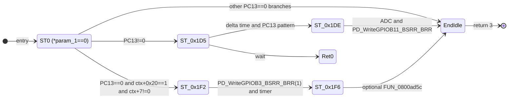

# Phase 4：协议与启动数据逆向（结构化证据）

> 建立日期：2026-04-04  
> 证据来源：Ghidra MCP（程序 `ZHIYUN-F100-full.bin`）、离线 Thumb 反汇编（Capstone，`[dump/ZHIYUN-F100-full.bin](../dump/ZHIYUN-F100-full.bin)`）、`[02_Hardware_Init.md](02_Hardware_Init.md)`、项目文档 `[Document/Markdown/](../Document/Markdown/)`、SDK `[apm32f103xb_flash.ld](../SDK/APM32F10x_SDK_V2.0.0/Libraries/Device/Geehy/APM32F10x/Source/gcc/apm32f103xb_flash.ld)`

---

## 1. `.data` / `.bss` 与 `__scatterload`（Phase 1 收口）

### 1.0 链接器 `.map` 的项目约束（2026-04-10）

本逆向工程 **无法** 从 **原始工程构建** 或 **已保存的构建产物** 中取得链接器输出的 **.map` 文件**（无可用官方或泄露 map）。因此下文 **OI-001** 验证路径 **①**（依 `.map` 解析 `LOAD` / RW / compress 与 region 表）在本仓库/本工程范围内 **不适用**；闭合 **单一 Flash 压缩源 `[src, src+L)**仅余 **§1.3.4** 所列 **② SRAM 转储**、**③ 调试器 H-OI-001** / 指令仿真等，详见 **§1.3.6–§1.3.9**。

### 1.1 结论


| 项目          | 值                                                                                                                                      |
| ----------- | -------------------------------------------------------------------------------------------------------------------------------------- |
| 散表驱动函数      | **scatterload_table_iterate**@ **0x08006B20**                                                                                     |
| 表迭代区间（汇编推导） | **`[0x08006B6C, 0x08006B8C)`**（`cmp r1,r4` 终止，`r4` 为表尾）                                                                                |
| 字面量池        | `0x08006B40` = `0x2C`，`0x08006B44` = `0x48`（PC 相对寻址后与 `+0x18`/`+0x16` 修正，落到 `0x08006B6C` / `0x08006B8C`）                               |
| C 运行时入口     | **`CRT_ScatterloadThenMain`** @ **`0x08006B8C`**：先 **`scatterload_table_iterate()`**（**`0x08006B20`**），再 **`main`** @ **`0x08002E74`** |
| Entry1 表项 handler（Thumb） | **`0x08006964`**（`0x08006B7C` 首字 **signed −0x217** → `blx` 目标；Ghidra：**`Scatterload_TableEntry1_DecompressToSRAM_20000000_54C`**） |


### 1.2 表项原始字（Flash，`read_memory`）

**Entry0** @ `0x08006B6C`（16 字节）：


| 偏移  | 小端值          | 说明                                      |
| --- | ------------ | --------------------------------------- |
| +0  | `0xFFFFFDCD` | 相对表项首址的 **handler 偏移**（`blx` 目标）        |
| +4  | `0x000032DC` | 与映像搬运相关的长度/参数（见下）                       |
| +8  | `0x20001620` | SRAM 侧参数（与向量表 **初始 SP** 同值，需与 map 对照解释） |
| +12 | `0`          | 填充/保留                                   |


**Entry1** @ `0x08006B7C`（16 字节）：


| 偏移  | 小端值                                  | 说明                |
| --- | ------------------------------------ | ----------------- |
| +0  | `0xFFFFFD E9`（−535，小端 `E9 FD FF FF`） | handler 偏移        |
| +4  | `0xFFFF956C`                         | 链接器参数字            |
| +8  | `0x0000054C`                         | **0x54C（1356）字节** |
| +12 | `0x20000000`                         | **SRAM 基址**       |


**解释（可信度：高）**：**第一项**与 **RW 初始化**（含库解压/非平凡拷贝）一致：handler 落在 **`scatterload_rw_decompress_entry`**（**`0x0800692A`**，表相对入口 **`0x08006938`**），经 **`Scatterload_DecompressRegionOrMemcpy`**（**`0x080012E8`**）等，**不是**单段 `memcpy`（见 §1.3.1–§1.3.9）。**第二项**在 **链接语义**上与 **ZI / RAM 底 0x54C 字节**（**`[0x20000000, 0x2000054C)`**）一致，但 **微库实现**为 **Thumb 解码头 `0x08006964`** 上的 **比特流展开**（`ldrb`/`strb` 游标环），**并非**单指令 `memset` 式填零；汇编级寄存器见 **§1.3.17**。**Flash 侧压缩源指针**仍随比特流语义间接化，**OI-001** 单一 `[src,src+L)` 边界不变。

### 1.3 RW 项闭合（静态分析，2026-04-04 续）


| 项目                           | 值                                                                                                                          | 可信度             |
| ---------------------------- | -------------------------------------------------------------------------------------------------------------------------- | --------------- |
| 第一项 handler 解析               | `0x08006B6C` + **signed**0xFFFFFDCD`(−563) → Thumb 入口 **0x08006938**；完整模板自**0x0800692A**（`push {r3,r4,r5,r6,r7,lr}`） | 高               |
| 表参指针（`FUN_08006B20` 传入 `r0`） | **`0x08006B70`**：`0x32DC`、`0x20001620`、`0`                                                                                 | 高               |
| **SRAM 目的与长度语义**             | 向 **0x20001620**填充 **0x32DC`（13020）字节** 的映像数据（与向量表 **初始 SP `0x20001620** 一致：RW 区与栈顶关系由链接布局决定，见 SDK RAM 窗口）            | 高               |
| 子程序                          | **`FUN_080012E8`**@ `0x080012E8`、**FUN_080013C8**@ `0x080013C8`（`udiv`/`mls` 等与压缩布局相关的算术，**非**单段 `memcpy`）             | 高               |
| 字节级解压 / 搬运                   | **0x08006964**等为 **handler 路径内** `ldrb`/`strb` 块；与 **FUN_080016CC** 字拷贝、`FUN_080012E8` **回调** 并存；详见 **§1.3.1**        | 高               |
| 运行时辅助指针                      | 字面量 **`0x200002C4`**（`ldr r7,[pc]` @ `0x08006932`）作为 `**FUN_080012E8`/`FUN_080013C8` 的上下文基址**                              | 高               |
| **单一连续 Flash 源区间**           | 静态未收敛为「`[src, src+L))` → `0x20001620`」单三元组；压缩流入口由上述例程与解压环共同决定                                                              | **中**（无 `.map`） |


### 1.3.1 RW 解压子链细化（Ghidra MCP，2026-04-04 实施）


| 项目                                                   | 结论                                                                                                                                                                                                                          | 证据路径                                                                      | 可信度          |
| ---------------------------------------------------- | --------------------------------------------------------------------------------------------------------------------------------------------------------------------------------------------------------------------------- | ------------------------------------------------------------------------- | ------------ |
| 字面量 `**0x200002C4**                                 | 对 `ZHIYUN-F100-full.bin` 做 **32 位小端**全镜像扫描：**唯一**命中 @ Flash**0x0800696C**（文件偏移**0x696C**）；作为**scatterload_rw_decompress_entry**内**DAT_0800695c**，传入 **FUN_080012E8` / `FUN_080013C8** 的首参（scatter **控制块**基址） | Python 扫描 `dump/ZHIYUN-F100-full.bin`；`decompile_function` @ `0x0800692A` | **高**        |
| **`scatterload_rw_decompress_entry`**@ `0x0800692A` | 先**FUN_080012E8(ctx, dest, len<<9, …)**，再**do { r = FUN_080013C8(ctx, …); } while (r == 1)**；返回**0**表示完成；**非**单段 `memcpy`                                                                                         | Ghidra 反编译                                                                | **高**        |
| **`FUN_080008EC`**| 在 **region 描述符树**上按块索引查找节点（递归子指针**+0x24**/**+0x40**），命中区间后返回节点指针；典型 **ARM 库 `__scatterload` 查找**形态                                                                                                                   | `decompile_function` @ `0x080008EC`                                       | **高**        |
| **`FUN_080016CC`**| **对齐 `memcpy` 变体**（含**0x200**字节块路径），供解压/填充路径调用                                                                                                                                                                          | `decompile_function` @ `0x080016CC`                                       | **高**        |
| **`DAT_080014B8`**| 指向 SRAM 侧 **region/表项元数据**（字面量池可见**0x20000030**等指针）；具体字段布局待结构体化命名                                                                                                                                                       | `read_memory` @ `0x080014B0`；`decompile_function` @ `FUN_080012E8`        | **中**        |
| **0x08006964` 指令块**`                                 | 反汇编为 `**push`/`ldr`/`strb` 型内联搬运**（与 `FUN_080016CC` 字拷贝并存于不同路径）；**不宜**再概括为单一「仅 microlib 解压环」而不区分子函数                                                                                                                         | `read_memory` @ `0x08006964`                                              | **高**（指令形态）  |
| **OI-001 开放项**                                       | **压缩比特流**的 **Flash 源起始地址**由 **region 节点内字段**与 **handler 回调**（`FUN_080012E8` 内 `(*(code**)(node+0x18))(...)`）在运行时决定；**静态**仍 **无** 单连续 `[src, src+L)` 闭合                                                                      | 同上 + 无 `.map`                                                             | **中**（边界未闭合） |


**结论**：OI-001 在 **目的 SRAM、`0x200002C4` 控制块、查找/拷贝子程序语义** 上进一步收紧；**精确 Flash 压缩源区间**仍依赖 **链接 map**、**仿真**` 或对 `**DAT_080014B8`→RAM 表** 的运行期转储（与任务书 OI-001 一致）。

### 1.3.2 OI-001 再收紧（2026-04-04，Ghidra MCP 续）


| 项目                                               | 结论                                                                                                                                                                                                | 证据路径                                                             | 可信度                      |
| ------------------------------------------------ | ------------------------------------------------------------------------------------------------------------------------------------------------------------------------------------------------- | ---------------------------------------------------------------- | ------------------------ |
| **Flash 字面量池 `0x080014B0`–`0x080014C4**         | 连续**0x2000xxxx**指针：`0x2000005C`、`0x2000004C`、`0x2000003E`、`0x2000005E`、`0x20000030`、**0x20000048**（**DAT_080014B8**首字）；为 **散载 region 元数据在 SRAM 中的镜像基址/索引区**，非单一「源 Flash 块」指针             | `read_memory` @ `0x080014A0`；书签 **Scatterload` @ `0x080014B0** | **高**                    |
| **`Scatterload_FindRegionNode`**（`FUN_080008EC`） | 用**FUN_0800154C**做 **区间/除法**（宽整数除法 helper），与 **node+0xc`/`+0x38** 等字段比对 **逻辑块索引**；**FUN_0800154C` 本身不含 Flash 物理地址**                                                                        | `decompile_function` @ `0x080008EC`、`0x0800154C`                 | **高**                    |
| **解压 handler 槽位（相对 region 节点）**`                  | `**FUN_080012E8** →**(*(code**)(node+0x18))**；**FUN_080013C8**→**+0x1c**；**FUN_08001244**→**+0x14**；**FUN_08000f3c**（大块变体）→**+0x10**；**多槽**说明 **比特流语义分阶段**，**非**单入口 `memcpy` | `decompile_function` @ 上述地址                                      | **高**                    |
| **并行入口 `FUN_080068f8**                          | 循环调用**FUN_08000f3c**/**FUN_08001244**（与**scatterload_rw_decompress_entry**的 **FUN_080012e8`/`FUN_080013c8** 路径**并列**）；**Ghidra 无静态 xref** 指向该入口（可能为 **备用/链接器重复体** 或 **表间接**）         | `decompile_function` @ `0x080068F8`；`get_xrefs_to` **无**         | **中**（路径存在；可达性未证）        |
| **OI-001 仍开放**                                   | **Flash 压缩源字节**由 **各节点 handler** 在运行期消费；静态 **仍无** 单连续**[Flash_src, Flash_src+L)**；下一步：**上电后转储 `0x20000030`–`0x2000005E` 与 `0x200002C4` 块**，或 **带符号仿真**                                         | 同上                                                               | **中**                    |
| **OI-001 复核（2026-04-04 计划实施）**                   | 本轮未新增可静态闭合的 **Flash 源起止**；**FUN_080012E8**经**node+0x18**等 **handler 槽**消费比特流的结论与 §1.3.1 **一致**，边界条件不变                                                                                      | Ghidra MCP `decompile_function` 抽样；与 §1.3.2 表一致                  | **高**（无新矛盾）；**中**（源块仍开放） |


### 1.3.3 OI-001 续推（2026-04-04，Ghidra MCP 计划实施）


| 项目                                                                       | 结论                                                                                                                                                                                                      | 证据路径                                                                        | 可信度                                         |
| ------------------------------------------------------------------------ | ------------------------------------------------------------------------------------------------------------------------------------------------------------------------------------------------------- | --------------------------------------------------------------------------- | ------------------------------------------- |
| **FUN_080016CC` 参数序**                                                   | **FUN_080016CC(dst, src, n)**：按字节***(dst++) = *(src++)**；后续块路径同序                                                                                                                                   | `decompile_function` @ `0x080016CC`                                         | **高**                                       |
| **FUN_080012E8` 快路径**`                                                   | `**FUN_080016CC(DAT_080014b8, param_5, 0x200)** → 目标为 **池指针 `DAT_080014b8` 所代表的地址**，源为**param_5**— **非**「从固定 Flash 立即数 memcpy」                                                                     | `decompile_function` @ `0x080012E8`                                         | **高**                                       |
| **FUN_08000f3c` 与 `FUN_080012E8`/`FUN_080013c8`/`FUN_08001244**        | 大块分支内**FUN_080016cc(param_5, DAT_080014b8, 0x200)**（**dst=`param_5`，src=池元数据指针**）及**Scatterload_FindRegionNode**+**(*(code**)(node+0x10))(...)**；**仍无**裸**0x0800xxxx**Flash 比特流基址字面量贯穿全路径 | `decompile_function` @ `0x08000F3C`                                         | **高**（形态）；**中**（Flash 源仍经 **region 节点** 间接） |
| **`Scatterload_ParallelDecompressEntry`**（原 `FUN_080068F8`，`0x080068F8`） | **`FUN_08000f3c(DAT_0800695c, …)`**后**do { … = FUN_08001244(…); } while (… == 1)**；**DAT_0800695c**与**scatterload_rw_decompress_entry**所用 **0x200002C4` 控制块**为 **同一类上下文**                   | `decompile_function` @ `0x080068F8`                                         | **高**                                       |
| **静态可达性**`                                                                | `**get_xrefs_to` @ `0x080068F8**：**无**；**get_function_callers**：**无**；全镜像 **f8680008`（小端 32 位）** 模式搜索：**无** — **不**改变「**备用/表间接/链接器重复体**」判断                                                          | Ghidra MCP `search_byte_patterns` / `get_xrefs_to` / `get_function_callers` | **高**                                       |
| **Ghidra 持久化**`                                                           | 函数重命名 `**Scatterload_ParallelDecompressEntry**；**PRE_COMMENT**@ `0x080068F8`、`0x08000F3C`；书签**Scatterload**@**0x080068F8**、**0x08000F3C**；**save_program**| MCP                                                                         | **高**                                       |
| **OI-001**                                                               | **单一连续 Flash 压缩源** 仍 **无** 静态**[src, src+L)**；本轮仅强化 **handler/池指针** 形态，**验证手段不变**（map / SRAM 转储 / 仿真）                                                                                                | 同上                                                                          | **中**（开放）                                   |


### 1.3.4 OI-001：静态分析边界与推荐验证路径（收口）


| 结论                                  | 说明                                                                                                                                                                                                                                                                                                                                                                                                                                                                                                                          |
| ----------------------------------- | --------------------------------------------------------------------------------------------------------------------------------------------------------------------------------------------------------------------------------------------------------------------------------------------------------------------------------------------------------------------------------------------------------------------------------------------------------------------------------------------------------------------------- |
| **静态已顶**                            | **handler 槽**（`node+0x10/0x14/0x18/0x1c`）、**Scatterload_FindRegionNode**、**FUN_080016CC`/`FUN_08000f3c** 形态已在 **§1.3.1–§1.3.3** 穷尽；在 **无链接 `.map** 条件下，**无法**唯一还原 **单一 Flash 比特流 `[src, src+L)** 的 **物理起止**。                                                                                                                                                                                                                                                                                                          |
| **推荐验证（择一或组合）**                     | **①**：取得 **Keil/IAR/GCC 链接 `.map**… — **本工程不可用**，见 **§1.0**。 **②**：**上电后 SRAM 转储** `0x20000030`–`0x2000005E`、`0x200002C4` 控制块及**DAT_080014B8**指向区，反推 **已解压** 节点与 **源索引**。 **③**：**指令级仿真**（QEMU/自定义 M3）从**scatterload_rw_decompress_entry**单步到 **首次 `FUN_080016CC**，记录 **源指针** 寄存器。                                                                                                                                                                                                                                |
| **可检验假设 H-OI-001（2026-04-04 计划实施）** | 在**FUN_080012E8**内 **首次** 经**(*(code **)(region_node+0x18))**调用解压 handler 时，若在仿真/调试中捕获 **传入 handler 的与比特流相关的指针**（或 **Scatterload_MemcpyBytes` 的 `src` 实参**），则该指针 **若** 将来能与 **第三方链接 `.map** 中某 `LOAD` 区首址 + 偏移**或** **SRAM 中转储的 `region_node` 字段** 对齐，可加强置信度 — **本工程无 `.map`（§1.0）**，故 **以寄存器/SRAM 证据为主**。若 **始终落在 SRAM** 或 **多段 Flash 不连续**，则 **证伪**「单一连续 `[src,src+L)`」并回到 **§1.3.2** 多槽模型。**最小实验**：路径 **③** 在**0x080012E8**断点，单步 **第一次** 进入 **+0x18` 槽** 的 `blx`，记录是否出现 **0x0800xxxx** 类 **Flash 源地址**。 |
| **可信度**                             | **高**（静态边界）；**验证路径**为 **工程化** 步骤，**非**本轮代码分析可替代。                                                                                                                                                                                                                                                                                                                                                                                                                                                                            |


### 1.3.5 OI-001 静态复核（2026-04-04，Ghidra MCP 续）


| 项目                                                                                       | 结论                                                                                                                                                                                                                         | 证据路径                                                   | 可信度       |
| ---------------------------------------------------------------------------------------- | -------------------------------------------------------------------------------------------------------------------------------------------------------------------------------------------------------------------------- | ------------------------------------------------------ | --------- |
| **get_xrefs_to` @ `0x080012E8**                                                        | **唯一** 无条件调用者：**scatterload_rw_decompress_entry**（`bl` @ `0x0800693C`）；与 §1.3.1 **无矛盾**                                                                                                                                  | MCP `get_xrefs_to`                                     | **高**     |
| **`Scatterload_DecompressRegionOrMemcpy`**（原**FUN_080012E8**，`0x080012E8`）**反编译（复核）** | 快路径**FUN_080016CC(DAT_080014b8, param_5, 0x200)**；主路径**Scatterload_FindRegionNode**后**(*(code**)(node+0x18))(node, scaled, param_5, uVar6)**；**param_5**为 **调用方缓冲区**，**本函数体内无** 裸露 **0x0800xxxx` Flash 源常量** | MCP `decompile_function` @ `0x080012E8`；符号见 **§1.3.6** | **高**     |
| **OI-001**                                                                               | **单一连续 Flash 压缩源 `[src,src+L)** 仍 **静态不闭合**；**H-OI-001**（断点/仿真见 §1.3.4）不变                                                                                                                                                 | 同上                                                     | **中**（开放） |


### 1.3.6 OI-001 符号与推荐下一步（2026-04-08）


| 项目                                    | 结论                                                                                                                                                                                                                                                                                                                               | 证据路径                                                                                          | 可信度                         |
| ------------------------------------- | -------------------------------------------------------------------------------------------------------------------------------------------------------------------------------------------------------------------------------------------------------------------------------------------------------------------------------- | --------------------------------------------------------------------------------------------- | --------------------------- |
| **FUN_080012E8` 重命名**                | Ghidra：**Scatterload_DecompressRegionOrMemcpy** @**0x080012E8**；**PRE_COMMENT**指向 **§1.3.4** 与 **handler `+0x18**；书签**Scatterload**@**0x080012E8**；**save_program**| MCP `rename_function_by_address` / `set_decompiler_comment` / `set_bookmark` / `save_program` | **高**                       |
| **验证优先级（本工程修订）**                      | **①** **链接 `.map**：**不适用**，见 **§1.0**（**无法**从原始工程构建或已保存构建产物取得 `.map`）。**②** **调试器**：在**Scatterload_DecompressRegionOrMemcpy**内 **首次** 经**node+0x18**进入 handler（**H-OI-001**）记录 **Scatterload_MemcpyBytes` 的 `src**。**③** **上电 SRAM 转储** `0x20000030`–`0x2000005E`、`0x200002C4`、`DAT_080014B8` 指向区 — 与 §1.3.4 **②** 一致 | 本表；§1.0；§1.3.4                                                                                | **高**（方法论）；**源块** 待 **②/③** |
| **工作区 `.map` 扫描（2026-04-05）**         | 对**ZHIYUN_F100**根目录递归** **/*.map**：**0** 个文件；且 **§1.0** 已固定：**无法**从原始工程/已保存构建产物取得 map — **①** **永久不适用**；闭合依赖 **②/③**                                                                                                                                                                                                       | 工作区 `Glob`；**§1.0**                                                                           | **高**（负向）                   |
| **get_xrefs_to` @ `0x080012E8`（复核）** | **唯一** 调用类引用：**scatterload_rw_decompress_entry**（自**0x0800693c**，`UNCONDITIONAL_CALL`）— 与 §1.3.5 **一致**                                                                                                                                                                                                                     | MCP `get_xrefs_to`（limit=50）                                                                  | **高**                       |


### 1.3.7 OI-001 计划执行复核（2026-04-08，Ghidra MCP）


| 项目                                             | 结论                                                                                                                                                                   | 证据路径                                                                                   | 可信度                           |
| ---------------------------------------------- | -------------------------------------------------------------------------------------------------------------------------------------------------------------------- | -------------------------------------------------------------------------------------- | ----------------------------- |
| **get_xrefs_to` @ `0x080012E8**              | **仅** **scatterload_rw_decompress_entry**内**bl**（**UNCONDITIONAL_CALL**@**0x0800693C**→**Scatterload_DecompressRegionOrMemcpy**）；**无** 第二处静态调用边      | MCP `get_xrefs_to`（会话 **ZY_F100**）                                                     | **高**                         |
| **FUN_080016CC` → `Scatterload_MemcpyBytes** | Ghidra**rename_function_by_address**@**0x080016CC**；**PRE_COMMENT**指向 **§1.3.3**；与 §1.3.1–§1.3.3 中 **字节 `memcpy** 语义 **一致**（表中旧名**FUN_080016CC**即本符号） | MCP `rename_function_by_address` / `set_decompiler_comment`；**save_program**见任务书 §5 | **高**                         |
| **OI-001 开放项**                                 | **单一连续 Flash 压缩源 `[src,src+L)** 仍 **不闭合**；本工程 **无 `.map**（**§1.0**），验证顺序见 **§1.3.6**：**调试器 H-OI-001** → **SRAM 转储**（与 §1.3.4 **②/③** 一致）                           | 与 §1.3.4–§1.3.6 **无矛盾**                                                                | **中**（方法论 **高**；源块 **待 ②/③**） |


**2026-04-05 复核**：MCP `get_xrefs_to` @ `0x080012E8`（**Scatterload_DecompressRegionOrMemcpy**）仍为 **唯一** **scatterload_rw_decompress_entry` @ `0x0800693C** **UNCONDITIONAL_CALL**，与上表 **一致**。

**Renode / f100-gdb-mcp 操作备忘（2026-04-05 续分析）**：**①** **open**建立 GDB 会话（桥接 **Renode 1.16.x**）。**②** **H-OI-001**：`break *0x080012E8`（或 `*0x0800693A` 进入**scatterload_rw_decompress_entry**后单步），在 **首次** `blx` 进入 **node+0x18` handler** 或 **Scatterload_MemcpyBytes** 前记录 **r0`/`r1`/`r2**（源/目的/长度）。**③** **PD_PowerAndProtocol_Block**动态：`break *0x0800CBFC`，`continue` 后待命中 — **注意**：目标 **continue` 后 GDB 可能长时间 `running**，需**interrupt**或 Renode**monitor machine Pause**再执行**x/4wx 0x2000000C**、**x/hx 0x2000001E**等；**本轮** 在 **continue` 后未稳定获得 `x/` 输出**（会话异步），**SRAM 字** 仍以 **静态池字** 为主证据，**动态** 记 **中** 可信度。**③b** **冷启动未 `continue** 时**x/4wx 0x2000000C**可读出 **全 0**、**pc**为 **0** — 仅说明 **未执行到 Thumb 入口/散载**，**不能**与 **UI` 运行态** 直接对照。**④** 工作区 ****/*.map**：**0** 文件（`Glob` 复核）— **①** 仍不可用。

**静态止点（本轮续分析）**：**OI-001** 在 **目的 SRAM 地址、多 handler 槽、`0x200002C4` 控制块、region 树查找** 上已 **静态收口**；**仍不能**在无 **.map`/运行时** 条件下写出 **单一连续 Flash 压缩源 `[src,src+L)** — 验证仍走 **§1.3.4** 表与 **H-OI-001**。**OI-004**（占空比→光学 / 风扇转速）：固件侧 **TMR1/TMR3 引脚与 MMIO 池** 已闭合；**光学/转速语义** 止点于 **示波器/LA**，见 `[05_Full_Reconstruction.md](05_Full_Reconstruction.md)` §5.1 与任务书 **OI-004**。

### 1.3.8 f100-gdb-mcp 动态验证（2026-04-05 计划实施执行）


| 项目                                                                             | 结论                                                                                                                                                                                                                                                        | 证据路径                                                             | 可信度                                             |
| ------------------------------------------------------------------------------ | --------------------------------------------------------------------------------------------------------------------------------------------------------------------------------------------------------------------------------------------------------- | ---------------------------------------------------------------- | ----------------------------------------------- |
| **Renode 版本**                                                                  | **`monitor version`**→ **Renode 1.16.1**（`d66b0c2a-202602160921`）                                                                                                                                                                                        | MCP**open**→**call**：`monitor version`                    | **高**                                           |
| **break *0x080012E8` → `monitor start` → `continue` / `advance *0x080012e8** | **continue`/`advance** 后 GDB 返回 **MI `^running` / `*running**；随后对同一会话的**call**（**info registers**、**monitor pause**、**interrupt**、**help**）**多次得到空 `output**，**未能**读出 **pc`/`r0`–`r3** 或执行**x/16wx 0x200002C4**| MCP**call**多轮；**list_sessions**仍列出会话                      | **高**（负向：**GDB↔Renode 桥接在 running 态下对后续命令不可靠**） |
| **inferior 运行时设置**                                                             | **`set mi-async off`**/**set non-stop off**在 **monitor start` 之后** 报错：**Cannot change this setting while the inferior is running**；**monitor pause** 后仍 **未能** 恢复可读的**info registers**| MCP**call**| **高**（限制事实）                                     |
| **H-OI-001（首次 `memcpy` `src`）**                                                | **本轮无** 寄存器/SRAM 快照；**OI-001** Flash 源区间 **仍不** 由动态闭合                                                                                                                                                                                                     | 同上；与 §1.3.4 **H-OI-001** 对照                                      | **低**（动态证据缺失）；**静态方法论** 仍 **高**                 |
| **建议后续**                                                                       | **①** 仅在 **monitor start` 之前** 配置 **set mi-async off**（若连接允许）。**②** 使用 **主机 GDB CLI** 批处理**-ex**链并 **日志捕获 `*stopped**。**③** **板载调试器** 在**Scatterload_DecompressRegionOrMemcpy**/**Scatterload_MemcpyBytes**处断点（**.map` 不可用**，见 **§1.0**） | 本表；`[05_Full_Reconstruction.md](05_Full_Reconstruction.md)` §6.4 | **高**（工程步骤）                                     |


### 1.3.9 `scatterload_rw_decompress_entry` → **Scatterload_DecompressRegionOrMemcpy` 调用约定（汇编闭合，2026-04-09）**


| 项目                 | 结论                                                                                                                                                                                                                                                                                      | 证据路径                                                                            | 可信度                                                  |
| ------------------ | --------------------------------------------------------------------------------------------------------------------------------------------------------------------------------------------------------------------------------------------------------------------------------------- | ------------------------------------------------------------------------------- | ---------------------------------------------------- |
| **调用点**            | **scatterload_rw_decompress_entry** 内**bl 0x080012E8**（**0x0800693C**）为**Scatterload_DecompressRegionOrMemcpy** **唯一** 静态调用边（与 §1.3.5–§1.3.7 **一致**）                                                                                                                          | MCP `disassemble_function` @**0x0800692A**；`get_xrefs_to` @**0x080012E8**| **高**                                                |
| **`r0`**| **`ldr r7,[0x0800695c]`**→**r0=r7**；池字小端**C4 02 00 20**→**0x200002C4**（与 **OI-001** 控制块字面量 **同一** SRAM 字）                                                                                                                                                                    | `read_memory` @**0x0800695C**；指令 **0x08006932`–`0x0800693a**               | **高**                                                |
| **r1` / 第 5 实参**  | **mov r6,r1**（入口第二参）；**str r6,[sp,#0]**后**bl**— **ARM APCS**：**栈上传入的第 5 个参数** 与 **r1` 同为 `r6**，即 **scatterload_rw_decompress_entry` 的 `param_2**（**uint**）。反编译里**Scatterload_DecompressRegionOrMemcpy(..., (undefined4 *)param_2)**的**param_5**与此 **一致**         | `disassemble_function` @ **0x0800692C`–`0x0800693C**                          | **高**                                                |
| **r2` / `r3**    | **`r2 = (param_3 << 9)`**（**lsls r4,r2,#0x9**）；**r3 = 0**| 同上                                                                              | **高**                                                |
| **对 H-OI-001 的含义** | **动态仍未闭合** Flash**[src,src+L)**；静态上 **param_5`/`r1** 已可定位为 **与表项迭代相关的 SRAM 侧实参**（与**DAT_080014B8**快路径**Scatterload_MemcpyBytes** **同一缓冲语义族**）。**首次** 进入**node+0x18**时 **r0`=`node**、**r2`/`r3** 为 **缩放因子与缓冲指针** — 详见**Scatterload_DecompressRegionOrMemcpy**反编译 | Ghidra**decompile_function**@**0x080012E8**；本表                           | **高**（调用约定）；**中**（**param_2` 精确业务名** 仍依 **map/断点**） |


**f100-gdb-mcp / 主机 GDB（本轮复测）**`：`**monitor version** → **Renode 1.16.1**；**break *0x080012E8**+**continue**→ **MI `^running**，随后**call**多轮 **空 `output**（与 §1.3.8 **一致，负向**）。**主机** **arm-none-eabi-gdb -batch**：**target remote :3333**→**break *0x080012E8**→**continue**在 **30s** 内 **未返回**（可能 **散载已执行完毕** 或需 **monitor`/复位** 后重跑）— **不** 作为 **src** 闭合证据，仅记 **工具链限制**。

**scripts/renode_oi001_capture.gdb`（2026-04-05 修订）**


| 结论                                                                                                                                                                                                                          | 证据路径                                                                      | 可信度                          |
| --------------------------------------------------------------------------------------------------------------------------------------------------------------------------------------------------------------------------- | ------------------------------------------------------------------------- | ---------------------------- |
| 原脚本在 **target extended-remote** 之后立刻**set mi-async off**时，若 inferior 已 **running**，GDB 报错 **Cannot change this setting while the inferior is running**，整段**source renode_oi001_capture.gdb**在开头即失败，**无断点/无寄存器快照** | `scripts/out/renode_gdb_capture_20260405_152731.log`                      | **高**                        |
| 修订：**删除** 强制**set mi-async off**/**set non-stop off**（注释说明若需同步模式可在交互 GDB 中**interrupt**后手动设置）；避免因 GDB 设置项阻塞 **OI-001** 采集                                                                                        | `[scripts/renode_oi001_capture.gdb](../scripts/renode_oi001_capture.gdb)` | **高**                        |
| 修订后一次**./scripts/renode_gdb_capture.sh**运行：**could not connect: Operation timed out**（**localhost:3333**未就绪或 Renode 未监听）— **仍无** BP1/BP2 输出；**OI-001** **Flash `src` 单块** **不** 由本轮闭合                              | `scripts/out/renode_gdb_capture_20260405_153357.log`                      | **高**（连接事实）；**src** **仍中** |


### 1.3.10 f100-gdb-mcp 会话（2026-04-05 执行；OI-001 动态辅证）


| 项目                                       | 结论                                                                                                                                                                      | 证据路径                                              | 可信度                           |
| ---------------------------------------- | ----------------------------------------------------------------------------------------------------------------------------------------------------------------------- | ------------------------------------------------- | ----------------------------- |
| **get_xrefs_to` @ `0x080012E8**        | **仍仅** **scatterload_rw_decompress_entry**@**`0x0800693C`****UNCONDITIONAL_CALL**（与 §1.3.5–§1.3.9 **一致**）                                                        | Ghidra MCP**get_xrefs_to**（会话 **ZY_F100**）     | **高**                         |
| **`monitor <cmd>`**| GDB 回报**"monitor" command not supported by this target**— **本会话目标** 未实现 **Renode `monitor** 子命令（与 §1.3.8 依赖 **monitor version` / `monitor pause** 的写法 **可能不等价**） | MCP**open**→**call**：`monitor version`     | **高**（负向：无 monitor 通道）        |
| **`info registers`**（未连接 / 无运行 inferior） | **`The program has no registers now.`**| MCP**call**：`info registers pc sp r0 r1 r2 r3` | **高**                         |
| **`target remote localhost:3333`**| **`Remote replied unexpectedly to 'vMustReplyEmpty': ...`**— **未** 建立可用 **GDB stub**（**Renode 未监听**、**端口非 3333** 或 **协议特性与当前 GDB 不兼容** 均可能）                            | MCP**call**：`target remote localhost:3333`     | **高**（负向：**本轮无** 寄存器/`x/` 快照） |
| **对 OI-001**                             | **Flash 压缩源单块** 仍 **不** 由动态闭合；静态 xref 与 §1.3.9 **不变**                                                                                                                   | 上表 + §1.3.9                                       | **高**（方法论）；**中**（**src**）   |


### 1.3.11 OI-001 静态复核（2026-04-05，执行计划）


| 项目                                             | 结论                                                                                                                                                                                        | 证据路径                                   | 可信度        |
| ---------------------------------------------- | ----------------------------------------------------------------------------------------------------------------------------------------------------------------------------------------- | -------------------------------------- | ---------- |
| **Scatterload_DecompressRegionOrMemcpy` 调用边** | **get_xrefs_to` @ `0x080012E8**：**仍仅** **scatterload_rw_decompress_entry**@**0x0800693C** **UNCONDITIONAL_CALL**| Ghidra MCP `get_xrefs_to`（**ZY_F100**） | **高**      |
| **动态闭合**                                       | **不** 在本轮用 **f100-gdb-mcp** 复测；**OI-001** **Flash 单一 `[src,src+L)** 仍依赖 **§1.3.4**（SRAM 转储 / 板载断点）或**[scripts/renode_gdb_capture.sh](../scripts/renode_gdb_capture.sh)**（见任务书 **§7**） | 与 §1.3.8–§1.3.10 **一致**                | **高**（方法论） |


### 1.3.12 Renode + 主机 GDB 成功采集（`renode_oi001_auto.sh`，2026-04-05）

一次完整跑通**./scripts/renode_oi001_auto.sh**后的**可复核产物**：


| 产物                                     | 路径                                                                                                            |
| -------------------------------------- | ------------------------------------------------------------------------------------------------------------- |
| GDB 日志（寄存器 / 栈 / Flash 池 / `x/` / 指令窗） | `[scripts/out/renode_gdb_capture_20260405_171110.log](../scripts/out/renode_gdb_capture_20260405_171110.log)` |
| Renode 侧日志                             | `[scripts/out/renode_auto_20260405_171106.log](../scripts/out/renode_auto_20260405_171106.log)`               |
| SRAM 全镜像 20KB                          | 仓库根 `[renode_sram_20k.bin](../renode_sram_20k.bin)`（与日志中**dump binary memory**一致）                         |


**采集语义（与 §1.3.8 区分）**：脚本在**monitor start**后使用**interrupt**采样执行点，**不保证** PC 停在**hbreak**@**0x0800692A**/**0x080012E8**；日志中 **PC=`0x08006BE9**、**SP=`0x20001620** 为**该次中断时刻**的快照，用于对照**apm32_f100_gdb_first.resc**复位约定，**非**「断点命中时的寄存器窗」。


| 项目                                   | 结论                                                                                                                                                                                         | 证据路径                                                                                                             | 可信度                         |
| ------------------------------------ | ------------------------------------------------------------------------------------------------------------------------------------------------------------------------------------------ | ---------------------------------------------------------------------------------------------------------------- | --------------------------- |
| **Flash 池 `DAT_0800695C**           | 小端字**0x200002C4**，与静态**ldr r7,[pc]**一致                                                                                                                                              | 日志 **「Flash 池字 @ 0x0800695C」**；Ghidra**0x0800695C**| **高**                       |
| **SRAM 控制块 @ `0x200002C4`（首 16 B）**  | **`[0, 0x20000230, 0, 0x20004888]`**（4×`uint32_t`）                                                                                                                                         | 日志**x/4wx 0x200002c4**；**xxd -s 0x2c4 -l 16 renode_sram_20k.bin**（文件偏移**0x2C4**= 逻辑地址**0x200002C4**) | **高**                       |
| **0x20001620` 栈窗**                  | 日志与 bin 中 **64 B 均为 `0x00**                                                                                                                                                               | 同上日志 **「stack 64 bytes」**；**xxd -s 0x1620 -l 64 renode_sram_20k.bin**| **高**（该次快照事实）               |
| **指令窗**                              | **`0x0800692A`**/**0x080012E8**处反汇编与 **离线 bin** 一致（脚本用于文档对齐，**非**断点停机态）                                                                                                               | 日志 **「指令窗」** 段                                                                                                   | **高**（静态一致）                 |
| **OI-001 Flash 压缩源单块 `[src,src+L)** | **仍不闭合**；本轮仅增加 **控制块 SRAM 字** 与 **全 SRAM 镜像** 的**动态旁证**，**不**替代 §1.3.4 **H-OI-001**（在**Scatterload_DecompressRegionOrMemcpy**内追**node+0x18**/ **Scatterload_MemcpyBytes` 的 `src`） | 本表 + §1.3.4                                                                                                      | **高**（方法论）；**`src`** **仍中** |


### 1.3.13 H-OI-001：在 `0x080012E8` 精确停机（`hbreak` + 交互 GDB）

**目标**`：在 `**Scatterload_DecompressRegionOrMemcpy`**` 入口读取 `**r0`/`r1`/`r2`/`r3**（**r0**为传入的 **scatter 上下文 / 控制块**首参，静态上与 **`0x200002C4`** 一致），用于对照 §1.3.9 调用约定。

**一键（批处理，与 §7 脚本同源）**：

```bash
cd /path/to/ZHIYUN_F100
OI001_MODE=hbreak ./scripts/renode_oi001_auto.sh
```

或已有 Renode、仅跑 GDB 包装：

```bash
OI001_MODE=hbreak GDB_TIMEOUT=300 ./scripts/renode_gdb_capture.sh
```

- 使用脚本 `**[scripts/renode_oi001_hbreak_capture.gdb](../scripts/renode_oi001_hbreak_capture.gdb)**：`hbreak *0x080012e8` →**monitor start**→**continue**→ 打印寄存器并**dump binary memory**。
- 若 **continue` 在超时内不返回**：部分 **Renode + GDB**` 组合曾出现远端不停机（与 §1.3.8 类似）；可增大 `**GDB_TIMEOUT`**，或改用下面**纯交互**两终端流程。

**交互两终端（推荐排障）**（与 `[Renode/apm32_f100_gdb_first.resc](../Renode/apm32_f100_gdb_first.resc)` 头注释一致）：


| 步骤  | 终端 A（Renode Monitor）                                     | 终端 B（`arm-none-eabi-gdb -n -q`）                                                                                     |
| --- | -------------------------------------------------------- | ------------------------------------------------------------------------------------------------------------------- |
| 1   | `include @.../apm32_f100_gdb_first.resc`（**勿**先 `start`） | `target extended-remote localhost:3333`                                                                             |
| 2   | （等待）                                                     | `set architecture armv3m`                                                                                           |
| 3   | （等待）                                                     | `set $sp=0x20001620` 与 `set $pc=0x08006be9`（与 `**`apm32_f100_core.resc`** 向量一致，`**0x08006BE9** 为 **Reset_Handler**） |
| 4   | （等待）                                                     | `hbreak *0x080012e8`（Flash 必须用 **`hbreak`**，勿用 `break`）                                                             |
| 5   | （可选）                                                     | `set mi-async off` — 若 `**continue` 后 GDB 无输出**，可尝试                                                                 |
| 6   | `start`（启动仿真）                                            | `continue`                                                                                                          |
| 7   | —                                                        | 命中后：`info registers`，`printf "r0=%#x r1=%#x r2=%#x r3=%#x\n", $r0,$r1,$r2,$r3`，`x/4wx 0x200002c4`，`x/8i $pc`        |


**说明**：同一复位序列可能**多次**`进入 `**Scatterload_DecompressRegionOrMemcpy`**（表项迭代）；**首次**`命中时的 `**r1`/`r2`**` 与 §1.3.9 `**param_2` / `param_3<<9** 对照意义最大。若需停在**scatterload_rw_decompress_entry**入口，可加**hbreak *0x0800692a**再**continue**。

### 1.3.14 Renode 实测（2026-04-05，Agent 自动化）：GDB `continue` / `hbreak` 与到达 `0x080012E8` 的可行性


| 结论                                                                                                                                                                                                                                                                                                                            | 证据路径                                                                                                                                                                                                                                                                        | 可信度         |
| ----------------------------------------------------------------------------------------------------------------------------------------------------------------------------------------------------------------------------------------------------------------------------------------------------------------------------- | --------------------------------------------------------------------------------------------------------------------------------------------------------------------------------------------------------------------------------------------------------------------------- | ----------- |
| **hbreak *0x080012E8` + `monitor start` + `continue**（**OI001_MODE=hbreak**）在 **Renode 1.16.1 + arm-none-eabi-gdb** 下 **continue` 长时间不返回**`（`**GDB_TIMEOUT`**` 终止）；`**expect` + Ctrl-C**` 亦无法在断点语义下稳定拿到 `**0x080012E8`**` 的寄存器窗                                                                                              | 本机执行 `**scripts/renode_gdb_capture.sh**（**OI001_MODE=hbreak**）；**scripts/renode_oi001_hbreak_expect.exp**；**scripts/oi001_gdb_with_hook.py**| **高**（可复现）  |
| **Renode Monitor `cpu AddHook` + `set """ ... """` + `emulation RunFor**可注册 **Pause** 钩子；**但**`在默认 `**apm32_f100_gdb_first.resc`**` 上 `**RunFor` 数秒虚拟时间后 `pause` → `sysbus.cpu PC** 为**0x080045A2**，落在**RCM_SequencePLLHSEAndBusEnable_ApplyControlBlock**（**0x080042F4`–`0x08004617**）内，**未**触发 **`0x080012E8`** 钩子 | **Ghidra** `get_function_by_address` @ `**`0x080045A2`**；`**[scripts/oi001_monitor_runfor_hook.py](../scripts/oi001_monitor_runfor_hook.py)** 输出（**scripts/out/oi001_run3_pause.txt**类）；**sysbus.cpu GetRegister 0..3**与 §1.3.12 日志中 **r2=0xe000ed18`/`r3=0xf** 可对照 | **高**       |
| **解释（推测）**：仿真在 **PLL/HSE 等 RCM 等待环**上**长时间不满足就绪条件**，执行**到不了**散载解压入口；故 **在不改平台/镜像**的前提下，**无法**在 Renode 中**可靠**得到 **Scatterload_DecompressRegionOrMemcpy` 首指令**`处的 `**r0`–`r3`**。**H-OI-001** 仍应优先 **板载调试器** 或 **调整仿真/时钟模型** 后再试                                                                                                | 同上 + `[02_Hardware_Init.md](02_Hardware_Init.md)` / SDK 时钟语义                                                                                                                                                                                                                | **中–高**（仿真） |


**辅助脚本**（不经 GDB `continue`）：`**`[scripts/oi001_monitor_runfor_hook.py](../scripts/oi001_monitor_runfor_hook.py)`** — 参数：`[0x080012E8|0x0800692A] [RunFor 秒]`。依赖 **Monitor telnet `49152`**`（与 `**-P 49152** 一致）。

### 1.3.15 `scatterload_table_iterate` 循环：寄存器、池字与 C 运行时入口（2026-04-05，Ghidra MCP）

**任务书「本轮优先任务」① 收口（静态）**：在 **无 `.map**`前提下，将 `**.data/.bss` 散表迭代** 收敛到 **单函数汇编级** 描述；**RW 解压体** 与 **ZI 清零体** 仍分别落在 **表项 handler**（见 §1.3.1–§1.3.3），**不**在本节重复展开 handler 内部环。


| 项目                                 | 结论                                                                                                                                                                                                                                       | 证据路径                                                                                                                                   | 可信度                    |
| ---------------------------------- | ---------------------------------------------------------------------------------------------------------------------------------------------------------------------------------------------------------------------------------------- | -------------------------------------------------------------------------------------------------------------------------------------- | ---------------------- |
| **驱动符号**`                           | Ghidra：`**scatterload_table_iterate`**` @ `**0x08006B20**（文档旧名**FUN_08006B20**/ **__scatterload` 驱动**）                                                                                                                              | `get_function_by_address`；`disassemble_function` @ `**`0x08006B20`**                                                                    | **高**                  |
| **表指针初值 `r1`**`                     | `**ldr r1,[0x08006B40]** → 与 **pc`（`add r1,pc` 用 `0x08006B28`）相加**` → `**adds r1,#0x18`**` → `**r1 = 0x08006B6C**（**表首项**）                                                                                                              | `0x08006B22`–`0x08006B26`；池首字 **`0x2C`**（`read_memory` @ `**0x08006B40**）                                                             | **高**                  |
| **表尾哨兵 `r4**`| `**ldr r4,[0x08006B44]** +**add r4,pc**（**pc≈0x08006B2E`）**` + `**adds r4,#0x16`**` → `**r4 = 0x08006B8C**；**cmp r1,r4` / `bne 0x08006B30** 即**r1 ∈ [0x08006B6C, 0x08006B8C)**时循环                                              | `0x08006B28`–`0x08006B3C`；池字**0x48**| **高**                  |
| **循环体（`0x08006B30`–`0x08006B38`）** | **r2 = *(uint32_t *)r1`**（行首 **有符号相对偏移**`，供 `**add r1,r2` → `blx r1`**`）；`**r0 = r1 + 4** 为 **handler 首参**（指向 **本行后三枚参数字**）；**blx` 返回后 `mov r1,r0`** — **下一表项指针由 handler 的 `r0` 返回值决定**                                                 | `disassemble_function` @ `**`0x08006B20`**                                                                                              | **高**                  |
| **表项布局（与 §1.2 一致）**`                | `**0x08006B6C`**：**Entry0**` 16 B；`**0x08006B7C`**：**Entry1** 16 B（**ZI：`0x54C` @ `0x20000000`**）                                                                                                                                         | `read_memory` @ `**0x08006B6C**；§1.2 表                                                                                                | **高**                  |
| **C 运行时入口 `0x08006B8C**`| `**CRT_PreScatterload_AlwaysOne()**（体为**return 1**）→ 若非零则**scatterload_table_iterate()**→**main()**→**CRT_MainReturn_BkptHangLoop()**（**main` 返回后** **无限循环**` 调 `**CRT_SoftwareBkptInfiniteLoop()`**`，体为 `**BKPT #0xAB**） | `decompile_function` @**0x08006B8C**、**0x08006BB0**、**0x08006BBC**；Ghidra**CRT_ScatterloadThenMain**等；任务书 §5 **2026-04-05** | **高**                  |
| **OI-001 边界**                      | 本节 **不**闭合 **单一 Flash 压缩源 `[src,src+L)**；仅闭合 **外层迭代器** 与 **表区间**                                                                                                                                                                        | §1.3.4–§1.3.7                                                                                                                          | **高**（外层）；**中**（`src`） |


### 1.3.16 OI-001 一页式可核查摘要（Phase 6 文书交叉引用，2026-04-06）

> **用途**`：在无 `**.map`**（**§1.0**`）前提下，审计人员单表核对 `**.data` / `.bss` 散载** 的 **已闭合** 与 **仍开放** 边界；细节证明见 **§1.3.1–§1.3.15**、**§1.3.17**（Entry1 handler 汇编级）。


| 项目              | 结论                                                                                                                                                                                                            | 证据路径                                                                | 可信度         |
| --------------- | ------------------------------------------------------------------------------------------------------------------------------------------------------------------------------------------------------------- | ------------------------------------------------------------------- | ----------- |
| **链接器 `.map`**  | **不可用**（无法从原始工程构建或已保存产物取得）                                                                                                                                                                                    | **§1.0**；任务书 **§6 OI-001**                                          | **高**（项目约束） |
| **散表驱动**`        | `**scatterload_table_iterate`**` @ `**0x08006B20**                                                                                                                                                            | §1.3.15；Ghidra 书签 **Startup` @ `0x08006B20**                      | **高**       |
| **散表区间**        | **`r1 ∈ [0x08006B6C, 0x08006B8C)`**（**两项** ×16 B）                                                                                                                                                             | §1.3.15；`read_memory` @ `**`0x08006B6C`**                            | **高**       |
| **Entry0（RW）**`  | Handler 模板 `**scatterload_rw_decompress_entry`**` @ `**0x0800692A** →**bl Scatterload_DecompressRegionOrMemcpy**@**0x080012E8**（**唯一**静态调用边，§1.3.9）；表参给出 **SRAM `0x20001620**、**长度 `0x32DC`**（§1.3.1） | §1.3.1、§1.3.5–§1.3.9                                                | **高**       |
| **Entry1（RAM 底）**`  | **语义**：**`0x54C`** @ **`0x20000000`**（§1.2）。**实现**：handler **`0x08006964`**（§1.3.17）；**Ghidra** 已建函 **`Scatterload_TableEntry1_DecompressToSRAM_20000000_54C`** + 书签 **`Scatterload`**                                                                                 | §1.2、§1.3.15、§1.3.17；`save_program` **ZY_F100**                         | **高**       |
| **CRT 入口**      | **`CRT_ScatterloadThenMain`** @ `**0x08006B8C**：`scatterload_table_iterate` →**main**@**0x08002E74**| §1.3.15；Ghidra `decompile_function`                                 | **高**       |
| **仍开放（OI-001）** | **单一 Flash 压缩源块** **`[src,src+L)`** 在未取得 **板载调试器 / SRAM 冷启动转储 / H-OI-001** 前 **不闭合**；**动态**路径见 **§1.3.8**、**§1.3.12–§1.3.14**、任务书 **§7** 脚本索引                                                                 | §1.3.4–§1.3.7；`[REVERSE_TASK_BOOK.md](REVERSE_TASK_BOOK.md)` **§6** | **高**（边界声明） |


### 1.3.17 Entry1（`0x20000000` / `0x54C`）handler：汇编级循环与寄存器（任务书「本轮优先任务」①，2026-04-06）

> **与 §1.3.15 分工**：§1.3.15 只闭合 **散表外层**（`r1`/`r4`、`blx`）；本节闭合 **第二表项 handler 本体** 的 **目标区间** 与 **主循环游标**（仍 **不**闭合 OI-001 的 **单一 Flash 源区间**）。

**入口约定**：`scatterload_table_iterate` 在 **`0x08006B30`–`0x08006B36`** 令 **`r0 = 当前表项首址 + 4`**。对 **Entry1**，**`r0 = 0x08006B80`**，指向表内三枚参数字（§1.2 `+4…+12`）。

| 项目 | 汇编事实 | 说明 |
|------|----------|------|
| **Handler Thumb 入口** | **`0x08006964`** | 由 **`0x08006B7C` + signed32(`0xFFFFFD E9`) = −0x217** 得到 **`0x08006965`** → **`blx` 清 LSB** → **`0x08006964`** |
| **目的区间** | **`r3 ← [r0,#8]`** → **`0x20000000`** | 与 §1.2 **`+12`** 一致；输出字节经 **`strb …, [r3], #1`**（及块拷贝分支）覆盖 **`[0x20000000, 0x2000054C)`** |
| **Flash 读指针上界** | **`r1 ← [r0]`**（signed 相对 **`r0` 修正后）**；**`r2 = r1 + ([r0,#4] >> 1)`**；主环 **`cmp r1, r2`** @ **`0x08006978`** | **`[r0,#4]`** 即表内 **`0x54C`**；**`lsr #1`** 为 **微库编码** 的一部分，**不是**「半字个数 = 字节数 / 2」的通用 C 语义 |
| **主外层环** | **`0x08006978`–`0x08006980`**：`cmp`/`bne` → **`0x08006982`** 起解码；多路分支最终 **`b` 回 `0x08006978`** | 直至 **`r1 == r2`** 时 **`pop` → `adds r0,#0xC` → `bx lr`**，**`r0 = 0x08006B8C`**（**散表尾**，与 §1.3.15 **`r4`** 一致） |
| **内层典型游标** | **`ldrb r5,[r1],#1`**；**`subs r6,r6,#1`** / **`bne`** @ **`0x080069A0`–`0x080069AA`** 等 | **比特流消费** + **向 `r3` 写展开字节**；**`r6`**、**`r4`** 随编码分支充当 **内层计数/块长**（**非**固定 `for(i=0;i<0x54C;i++)` 单环） |
| **`r9` 分支** | **`lsls r4,r4,#31`** 后 **`it mi` / `addmi r3,r9`** | 表参 **`0x54C`** 最高位为 **0**，**本映像该 IT 块不命中**；**`r9`** 不作本路径依赖 |

**证据路径**：`arm-none-eabi-objdump -D -b binary -m armv7 -M force-thumb --start-address=0x6964 --stop-address=0x69e0` on `[dump/ZHIYUN-F100-full.bin](../dump/ZHIYUN-F100-full.bin)`；Ghidra **`disassemble_function` @ `0x08006964`**；`read_memory` @ **`0x08006B7C`**。

**可信度**：**高**（指令与表字互证）；**OI-001** 的 **压缩源 Flash 物理起止** 仍为 **中**（见 §1.3.4–§1.3.7）。

### 1.4 证据路径

- Ghidra：`disassemble_function` @ `**scatterload_table_iterate`（`0x08006B20`）**；`read_memory` @ `0x08006B40`–`0x08006BAB`  
- SDK：`.data` AT>FLASH、`.bss` >RAM 定义见 `[apm32f103xb_flash.ld](../SDK/APM32F10x_SDK_V2.0.0/Libraries/Device/Geehy/APM32F10x/Source/gcc/apm32f103xb_flash.ld)` 中 `_start_address_init_data` / `_start_address_bss`  
- Ghidra 书签：`0x08006B20`、`0x08006B6C`（Category: `Startup`）；`**`0x080014B0`**（Category: `Scatterload`，池指针见 §1.3.2）；`**0x080068F8**、**0x08000F3C**（Category: `Scatterload`，见 §1.3.3）；**0x0800693C**（Category: `Scatterload`，**Call_Scatterload_DecompressRegionOrMemcpy**，§1.3.9）；**`0x08006964`**（Category: `Scatterload`，**Entry1** → **`[0x20000000,0x2000054C)`**，§1.3.17）；**OI-001 动态**：**§1.3.8**（**f100-gdb-mcp + Renode** 负向与改进建议）；**§1.3.12**（**`renode_oi001_auto`** 成功日志 + `**renode_sram_20k.bin**）；**§1.3.14**（**Renode GDB `continue` 负向** + **Monitor `AddHook`/`RunFor` 与 PLL 卡死**）
- 离线反汇编：`FUN_08006B20`、`0x0800692A`–`0x0800695A`、**`Scatterload_DecompressRegionOrMemcpy`**（`0x080012E8`）、`0x08006964` 解压环（`[dump/ZHIYUN-F100-full.bin](../dump/ZHIYUN-F100-full.bin)`）

---

## 2. `0x080041B0`：启动 23 字节 SPI 常量帧

### 2.0 逆推策略（不再等待屏厂规格书，2026-04-04）

项目任务书已改为 **OLED / 23 B / UI 模式** **逆推优先**：**不以** 屏体或模组厂 **PDF 数据手册** 作为继续分析的门禁。本仓库内推进方式为：

1. **23 B 常量**：在 **§2.4** 持续扩写 **逐字节与 SSD1306 族命令语义** 的对照表；**唯一**` Flash 引用与 `**SPI1_StartupSequence`** 调用链已在 **§2.1.1** 闭合；开源实现（如 Adafruit SSD1306）仅作 **寄存器语义** 参考，**非**产品证据。
2. **运行期刷屏**`：`**SPI1_PumpEightFramebufferSlices`**` / `**UI_SPI1_PumpEightFramebufferSlices** 与**UI_Framebuffer_***填充路径 — 以 Ghidra **xref / 反编译** 为主证据。
3. **OI-005**：**`UI_ModeRender_Dispatch`**、模式池 `**DAT_0800d668** — 与 **[官方说明书](../Document/Markdown/ZHIYUN_F100_官方说明书.md)** 做 **编号 ↔ 模式** 表（见 `[03_Function_Modules.md](03_Function_Modules.md)` §1.5）。
4. **可选补强**：**逻辑分析仪**（SCK/MOSI/CS 与字节对齐）、**COG 丝印** — 提高置信度，**不阻塞** 软件侧结论。

### 2.1 结论

- **长度**：`0x17`（23）字节；**十六进制**（完整，**无**尾填充字节）：  
`AE 00 10 40 81 FF A1 A8 3F AD 8B C8 D3 00 DA 12 D9 22 DB 2B A4 A6 AF`
- **代码路径**：`0x08004184`：`addw r0, pc, #0x18` → **`r0 = 0x080041B0`**；`movs r1, #0x17`；`bl FUN_080041E6`（发送封装，见 `[02_Hardware_Init.md](02_Hardware_Init.md)`）；物理：**SPI1 + PB10 类 CS**。
- **与项目文档中候选 IC 的对照**（排除法，**可信度：高**）：
  - **HUSB238**：规格书明确为 **I2C 从机 0x08**，**非 SPI** → 不可能是该 23 字节帧目标。  
  证据：`[Document/Markdown/husb238规格书.md](../Document/Markdown/husb238规格书.md)`
  - **MP3398E**：LED 驱动，控制接口为 **PWM / EN / ADIM** 等，**非 SPI 寄存器总线** → 与 SPI burst 不符。  
  证据：`[Document/Markdown/MP3398E-规格书.md](../Document/Markdown/MP3398E-规格书.md)`
  - **PL5500**：文档侧重 GPIO **STAT** 等，**无 SPI 数字接口描述** → 不作为首选候选。  
  证据：`[Document/Markdown/pl5500规格书.md](../Document/Markdown/pl5500规格书.md)`

**待证实（可信度：低–中）**：该帧更可能面向 **SPI OLED / 辅助电源 PMIC / 未在摘要中列出的从设备**。需 **原理图网络名 + LA（MOSI/SCK/CS）** 与字节序对齐后才能收敛型号。

#### 2.1.1 交叉引用闭合（Ghidra MCP，`2026-04-04` 执行）


| 检查项                                                               | 结果                                                                                                                                                   | 可信度 |
| ----------------------------------------------------------------- | ---------------------------------------------------------------------------------------------------------------------------------------------------- | --- |
| `get_xrefs_to` `**`0x080041B0`**                                   | 唯一引用：`SPI1_StartupSequence` 内 `**`0x08004194`**，为 `SPI1_SendConstBlockWithCS` 的指针实参 [PARAM]                                                           | 高   |
| `get_function_callers` @ `**SPI1_StartupSequence**（`0x08004184`） | **仅** `main` @ **`0x08002e74`**（上电初始化单次调用）                                                                                                           | 高   |
| `get_xrefs_to` @ `**`SPI1_SendConstBlockWithCS`**（`0x080041E6`）    | **两处**：`SPI1_StartupSequence` @ `0x08004198`；`**`SPI1_Send3ByteSlicePrefixForChannel`** @ `0x08004252`（运行期 **3 B**` 栈前缀）。仅前者使用 `**0x080041B0`/`0x17`** | 高   |


**归纳**：23 B Flash 常量 **无**第二数据引用；**无**错误重试/备用路径在静态 xref 中显现（间接分支未穷尽，仍标 **中**）。

### 2.2 证据路径

- Flash：`read_memory` @ `0x080041B0`  
- 调用链：`[02_Hardware_Init.md](02_Hardware_Init.md)` §SPI1  
- Ghidra 书签：`0x080041B0`（Category: `**`Protocol`**；`**OLED** 见 §2.7 — **SSD1306 族指纹**）

### 2.3 SPI 事务模板分型（相对 §2.1 启动帧）


| 类型        | 含义（固件侧）                                                                             | 证据路径                                                   | 可信度            |
| --------- | ----------------------------------------------------------------------------------- | ------------------------------------------------------ | -------------- |
| 初始化常量帧    | 单段 23 B，仅 `SPI1_StartupSequence`                                                    | `decompile_function` @ `0x08004184`                    | 高              |
| 运行期块流     | 8×（3 B 前缀 + 96 B），`main` 循环内 **`SPI1_PumpEightFramebufferSlices`** / `FUN_0800429e` | `[02_Hardware_Init.md](02_Hardware_Init.md)` 运行期 SPI 表 | 高              |
| 读回 / 纯读事务 | `**SPI1_TransferBytes` 仅由两发送包装调用**；未见独立「只读」调用点                                      | `BL` 扫描至 `0x08005664` 仅 2 处                            | 中（仍可能有未识别间接分支） |


### 2.4 字节级结构与 SSD1306 命令对照（软件推测 + LA 证实）

**原始 23 B**（见 §2.1）：`AE 00 10 40 81 FF A1 A8 3F AD 8B C8 D3 00 DA 12 D9 22 DB 2B A4 A6 AF`

**固件唯一发送路径（高可信度）**：`main` → `**`SPI1_StartupSequence`** @ `0x08004184` → `**SPI1_SendConstBlockWithCS(0x080041B0, 0x17)** @ `0x08004198`；见 §2.1.1 `get_xrefs_to` / `get_function_callers`。

下表按 **单字节命令流** 解读（SSD1306 族常用 opcode；**`AD 8B`** 与 Arduino 常见 `**8D 14` 电荷泵** 写法不同，见 §2.7.2）。开源 SSD1306 初始化（如 Adafruit）**仅作寄存器语义参考，非产品证据**。


| 偏移    | 字节序列      | SSD1306 族语义（简述）                                                                      | 匹配度   |
| ----- | --------- | ------------------------------------------------------------------------------------ | ----- |
| 0     | `AE`      | **Display OFF**                                                                      | **高** |
| 1     | `00`      | **Set Lower Column Start Address**（低半字节 `0`）                                         | **高** |
| 2     | `10`      | **Set Higher Column Start Address**（高半字节 `0`）                                        | **高** |
| 3     | `40`      | **Set Display Start Line** = 0（`0x40`…`0x7F` 编码）                                     | **高** |
| 4–5   | `81` `FF` | **Set Contrast Control**：命令 `0x81`，数据 `0xFF`（最大对比度）                                  | **高** |
| 6     | `A1`      | **Set Segment Remap**（`A1` = remap 开启，与面板布线一致）                                       | **高** |
| 7–8   | `A8` `3F` | **Set MUX Ratio**：`N=0x3F` → **64 COM**（**128×64**）                                  | **高** |
| 9–10  | `AD` `8B` | **Function Selection / 内部基准或电荷泵变体**`（与常见 `**8D 14`** 不同；**不**单独否定 SSD1306 族，见 §2.7.2） | **中** |
| 11    | `C8`      | **Set COM Output Scan Direction**（`C8` = remapped COM）                               | **高** |
| 12–13 | `D3` `00` | **Set Display Offset**：偏移 0                                                          | **高** |
| 14–15 | `DA` `12` | **Set COM Pins Hardware Configuration**：`0x12` 为 **128×64** 常见序列号                    | **高** |
| 16–17 | `D9` `22` | **Set Pre-Charge Period**                                                            | **高** |
| 18–19 | `DB` `2B` | **Set VCOMH Deselect Level**                                                         | **高** |
| 20    | `A4`      | **Entire Display ON**（输出跟随 RAM）                                                      | **高** |
| 21    | `A6`      | **Set Normal Display**（非反相）                                                          | **高** |
| 22    | `AF`      | **Display ON**                                                                       | **高** |


- **归纳**：全序列与 **SSD1306 数据手册** 命令集 **逐条可挂靠**`；仅 `**AD 8B`** 为与公开例程差异最大处（已在 §2.7.2 说明）。**LA 金标准**：**PB10 CS 低** 期间 **MOSI** 与本表一致。  
- **可信度**：命令语义 **高**（opcode）；**COG 具体型号** **中–低**（无丝印时见 §2.7）。  
- 与 `[IC_MCU_逻辑关系推测.md](../Document/Markdown/IC_MCU_逻辑关系推测.md)`：可收敛为「**OLED 控制器上电初始化**」，PMIC 专用 SPI 优先级下降。

#### 2.4.0 逐字节「固件侧唯一发送点」（任务书优先项 2 收口）


| 字节偏移 `0…22` | 固件侧唯一发送路径（静态已穷尽 `get_xrefs_to` @ `0x080041B0`）                                                                                                         |
| ----------- | ------------------------------------------------------------------------------------------------------------------------------------------------------ |
| **全部**`      | `**main` → `SPI1_StartupSequence` → `SPI1_SendConstBlockWithCS(0x080041B0, 0x17)`**（`bl` @ `**0x08004198**）；**无**第二 Flash 数据引用、**无**运行期对同 blob 的改写发送。 |


- **结论**：23 字节与上表 **SSD1306 语义列** 一一对应；**发送点** 对上述 **每一字节** 均为 **同一次** `SPI1_TransferBytes` 突发（经 `SPI1_SendConstBlockWithCS`）。  
- **证据路径**：`get_xrefs_to` @ **`0x080041B0`**；`decompile_function` @ `**SPI1_StartupSequence**；本文 **§2.3**（运行期 SPI 分型）与 **§2.6**（UI 帧缓冲与 SPI 泵解耦）。  
- **可信度**：**高**。

#### 2.4.1 MCP 复核（2026-04-05，执行计划）


| 项目                | 结论                                                                                                                                                                                | 证据路径                                     | 可信度   |
| ----------------- | --------------------------------------------------------------------------------------------------------------------------------------------------------------------------------- | ---------------------------------------- | ----- |
| **Flash 原始 23 B** | **read_memory` @ `0x080041B0`** 前 **23**` 字节为 `**ae 00 10 40 81 ff a1 a8 3f ad 8b c8 d3 00 da 12 d9 22 db 2b a4 a6 af`**，与 §2.1 行内 hex **一致**；第 **24** 字节起为 **后续指令/池**（**非**本帧载荷） | Ghidra MCP `read_memory`（会话 **ZY_F100**） | **高** |
| **静态 xref**`       | `**get_xrefs_to` @ `0x080041B0`**：**唯一**` `**[PARAM]`**` 自 `**SPI1_StartupSequence** @**0x08004194**| MCP `get_xrefs_to`                       | **高** |
| **Ghidra 数据注释**   | **set_disassembly_comment` @ `0x080041B0`**`：指向 `**04` §2.4** 与「**唯一 xref = `SPI1_StartupSequence`**`」摘要；`**save_program**                                                        | MCP                                      | **高** |


**2026-04-06 复核（Phase 6 文书审计回合）**：MCP `read_memory` @ **`0x080041B0`**，`length=32` — 前 **23** 字节 **仍为**` 上表 hex（`**ae…af`**）；`get_xrefs_to` **仍仅**` `**SPI1_StartupSequence` @ `0x08004194` `[PARAM]`**；`get_function_callers` @ `**SPI1_StartupSequence` `0x08004184** **仍仅** **main` @ `0x08002E74`**。与 §2.1 / §2.4.0 **无差异**。

#### 2.4.2 Ghidra 数据类型与书签（2026-04-05 续）


| 项目        | 结论                                                                                  | 证据路径                                        | 可信度   |
| --------- | ----------------------------------------------------------------------------------- | ------------------------------------------- | ----- |
| **数组类型**`  | `**apply_data_type`**`：地址 `**0x080041B0** 标为**byte[23]**（23 B 连续命令流，与 §2.4 主表一致） | Ghidra MCP `apply_data_type`；`save_program` | **高** |
| **书签**    | **Category `Protocol**，注释摘要 **OLED SSD1306-class init blob / 唯一 xref**             | MCP `set_bookmark` @ `0x080041B0`           | **高** |
| **汇编行注释**` | `**set_disassembly_comment`**`：指向 `**04` §2.4** 与单 xref 证据                           | MCP（同上表）                                    | **高** |


**OI-001 脚本**：在本机 **无 Renode 监听 `localhost:3333`** 时，`./scripts/renode_gdb_capture.sh` 会在 `**target extended-remote** 处阻塞直至超时；需先按脚本头注释启动**apm32_f100_gdb_first.resc**再执行采集。

### 2.5 启动帧 CS 时序与「OLED 类」静态假设（2026-04-04 续）


| 项目             | 结论                                                                                                                                                                                                                                                                              | 证据路径                                                                                                                            | 可信度                           |
| -------------- | ------------------------------------------------------------------------------------------------------------------------------------------------------------------------------------------------------------------------------------------------------------------------------- | ------------------------------------------------------------------------------------------------------------------------------- | ----------------------------- |
| 发送前 **片选/选择线** | `SPI1_SendConstBlockWithCS` 先调 **`GPIO_SPI_SelectLine_0x40(0)`**（经 `**DAT_08003b4c`→GPIOB BSRR/BRR**` 操纵 `**0x40`** 位，即 **PB6**` 数字线），再 `**GPIO_SPI_CS_PB10_AssertLow`**`，最后 `**SPI1_TransferBytes** 发出 **23 B**                                                                  | `decompile_function` @ `0x080041E6`；`[02_Hardware_Init.md](02_Hardware_Init.md)` `GPIO_SPI_SelectLine_0x40`                     | **高**                         |
| 与 §6 网络对齐      | **PA5–PA7 / PB10** 已指向 **OLED 连接器**；**PB6** 在 §6 为编码器 **A**，与 **同一脚** 在启动序列中被 **GPIO 位带** 使用 **不矛盾**——上电 **Init_GPIO_StatusAndControlPins` / `SPI1_StartupSequence`** 次序下，**SPI 初始化完成后** 再将 PB6 配成 **TMR4 编码器输入**（见 `[02_Hardware_Init.md](02_Hardware_Init.md)` §Timer / 编码器） | `[Zhiyun_F100_Repair_Notes.md](../Document/Zhiyun_F100_Repair_Notes.md)` §6；`Init_TMR4_EncoderQuadrature_PB6PB7` @ `0x0800DE2E` | **中**（依赖初始化顺序与重映射，需 LA 确认无竞态） |
| 目标器件类别         | **排除** **HUSB238 / MP3398E** 等；§2.4 **SSD1306 opcode 强匹配** 后，**板载 SSD1306/兼容 OLED 控制器** 为 **首选**；共享总线邻近从设备仍 **次选**                                                                                                                                                              | §2.4；维修手册 OLED 网络                                                                                                               | **中–高**（软件）；**中**（贴装）         |
| 金标准验证          | 逻辑分析仪：**SCK/MOSI/CS(PB10)**` 与 `**GPIO_SPI_SelectLine_0x40`** 边沿对齐 **23 B** 有效载荷；与 **运行期**` `**SPI1_PumpEightFramebufferSlices`** 8×帧对照                                                                                                                                           | —                                                                                                                               | **高**（方法）                     |


### 2.7 OLED「型号」发掘：无丝印/规格书时的静态结论（2026-04-04）

公开资料与固件内 **ASCII 字符串** 均未出现屏厂型号；以下为 **仅依据固件 + 数据手册语义 + 开源参考实现** 可辩护的结论。

#### 2.7.1 结论（分层）


| 层级        | 结论                                                                                                                                                                                                                                                     | 可信度                       |
| --------- | ------------------------------------------------------------------------------------------------------------------------------------------------------------------------------------------------------------------------------------------------------ | ------------------------- |
| **控制器族**  | **Solomon SSD1306 或与其命令集寄存器兼容的 COG**（含部分兼容驱动芯片的 **SSD1306 兼容模式**）。**不是** HUSB238/MP3398 等已排除器件。                                                                                                                                                        | **高**（命令指纹）               |
| **分辨率**   | **128×64**` 单色：命令 `**A8 3F`** 为 **Set MUX Ratio**`，参数 `**0x3F`** → **N+1=64** COM（与 SSD1306 数据手册一致）。                                                                                                                                                     | **高**                     |
| **电气接口**  | **SPI**（维修手册 **PA5/6/7 + PB10 CS**；与 `SPI1_StartupSequence` 一致）。                                                                                                                                                                                       | **高**（硬件+代码）              |
| **模组/料号** | **用户实测**（见 `[Zhiyun_F100_Repair_Notes.md](../Document/Zhiyun_F100_Repair_Notes.md)` **§6.1**`）：FPC `**02832-MF1-B`**`、玻璃喷码含 `**02832**、**16** 线；**玻璃外形** **22.3×18.8 mm** 与 **128×64** 级模组 **相容**。**仍无** 公开数据手册将 **`02832-MF1-B`** 与 **SSD1306** 逐料号绑定。 | **中**（实物标识）；**低**（厂牌 PDF） |


#### 2.7.2 证据路径

1. **启动 23 B**（§2.1）：`AE 00 10 40 81 FF A1 A8 3F AD 8B C8 D3 00 DA 12 D9 22 DB 2B A4 A6 AF`
2. **与 Adafruit `Adafruit_SSD1306`（128×64 分支）对照**`（开源参考，非产品证据）：尾段 `**DA 12`**（**Set COM Pins**，**0x12** 为 **128×64**` 常用值）、`**D9 22`**（**Set Pre-charge**，**0x22** 与 **外部 VCC 供电**` 路径一致）、`**DB 2B`**（**Set VCOMH**`）、`**A4`/`A6`/`AF`**（全显存 / 正常显示 / 开显）与 **SSD1306 初始化序列** **同寄存器语义**；**命令顺序**与 Adafruit 参考 **不同**（属正常，厂商可裁剪顺序）。
3. `**AD 8B` 两字节**`：与常见 Arduino 例程首选的 `**8D 14`（Charge Pump）** **不同**；在 **SSD1306 族** 数据手册中存在 **扩展命令/功能选择** 类写法，**亦可能**为 **原厂参考 BOM** 选用的 **电荷泵/内部基准** 配置。**不能**单凭此两字节否定 **SSD1306 族**；**金标准** 仍为 **读 COG 丝印** 或 **示波器抓完整上电序列与手册逐条对照**。
4. **固件字符串**：`strings` 扫描 `**`ZHIYUN-F100-full.bin`** 与 Ghidra `**search_strings**：**无** `SSD`/`OLED`/`1306` 等可读 ASCII — **符合**量产裸机固件习惯。
5. **与 SH1106 的关系**：**SH1106** 常见为 **132 列内部 RAM**、列地址与 **SSD1306** 有差异；本序列 **中段** 与 **SSD1306 128×64 典型 `DA`/`D9`/`DB` 组合** **更一致**。在未抓 **LA** 前，**优先假设 SSD1306 兼容**，而非 SH1106。
6. **硬件**：`[Zhiyun_F100_Repair_Notes.md](../Document/Zhiyun_F100_Repair_Notes.md)` §6：**PA5–PA7、PB10** 指向 **OLED 连接器** — 与 **SPI OLED 模组** 拓扑一致。
7. **§6.1 实物标识**：喷码 **V010015101302832` / `WV01000307420`**`、FPC `**02832-MF1-B**、正面 **02830`/`3-12**、**Pin16** 主板侧接地而 **屏端未接**、**Pin13→680 kΩ 下地** 等 — **不推翻** **SSD1306 族 + 128×64** 推断；**Pin13** 电阻功能 **待原理图**（可能为 **BS1/BS2**、**I2C 地址** 或 **复位/模式** 网络之一）。

#### 2.7.3 建议的实物验证（不依赖规格书 PDF）

- **拆机 / COG**：**用户**在可见条件下 **未** 观察到 **COG 顶标**（见 `[Zhiyun_F100_Repair_Notes.md](../Document/Zhiyun_F100_Repair_Notes.md)` §6.1）— **芯片级型号** 证据链 **空缺**；**不推翻** 下述 **固件级** 推断。  
- **LA**：在 **PB10 CS 低** 期间核对 **23 B** 与 **MOSI** 是否一致；运行期 **8×(3+96 B)** 是否与 **SSD1306 页/列寻址** 一致 — **仍为** 最有希望 **闭环** 的手段。  
- **万用表**：**§6.1** 已记 **Pin16/Pin13** 等；**不能**单凭阻值读出 **IC 型号**。

---

### 2.6 UI 帧缓冲与 SPI 推送的静态关系（收紧 OI-002 软件边界，2026-04-04 续）


| 项目                                        | 结论                                                                                                                                                    | 证据路径                                | 可信度                         |
| ----------------------------------------- | ----------------------------------------------------------------------------------------------------------------------------------------------------- | ----------------------------------- | --------------------------- |
| **SPI1_PumpEightFramebufferSlices` 调用点**` | `**main`**（`0x08002f3c`、`0x08002f6e`）与 `**SPI1_StartupSequence**（`0x080041ae`）；**无**来自 **`UI_OLED_MainStateMachine`**（`0x0800D89C`）的 `bl`            | MCP `get_xrefs_to` @ `0x08004258`   | **高**                       |
| **显示内容写入**`                                | `**UI_Framebuffer_CopyRect`**` 向 `**DAT_08009808** 起算的 **0x60 宽** 帧缓冲做矩形拷贝，**体内无** SPI 外设调用                                                           | `decompile_function` @ `0x080095a4` | **高**                       |
| **归纳**                                    | **SPI 物理发送**与 **UI 填缓冲**在静态上 **解耦**：推送由 **main` 循环**（及启动序列内一次）驱动；**不能**`从「`**UI_OLED_MainStateMachine`** 直接调 SPI」推出帧格式，但 **与「先 RAM、后总线刷新」** 模型 **相容** | 同上 + §2.3                           | **高**（结构）；**中**（时序与帧率需运行验证） |


---

## 3. PD 相关 GPIO 与 `FUN_0800C4E0` 状态机

### 3.1 GPIO 辅助函数（寄存器级）


| 函数                                    | 行为                 | 地址证据（`read_memory` 指针池）                                                |
| ------------------------------------- | ------------------ | ---------------------------------------------------------------------- |
| `PD_ReadGPIOC13_IdrBit`（`0x08009F84`） | `(*PTR >> 13) & 1` | `DAT_0800A1E4` → `**`0x40011008`** = **GPIOC_IDR** → **读 PC13**         |
| `PD_WriteGPIOB3_BSRR_BRR(1)`          | `*PTR = 8`         | `DAT_0800A1EC` → `**`0x40010C10`** = **GPIOB_BSRR** → **置位 PB3**（`0x8`） |
| `PD_WriteGPIOB3_BSRR_BRR(0)`          | `PTR[1] = 8`       | `**`0x40010C14`** = **GPIOB_BRR** → **清零 PB3**                          |
| `PD_WriteGPIOB11_BSRR_BRR(≠0)`        | `*PTR = 0x800`     | 同上 `DAT_0800A1EC` → **BSRR** → **置位 PB11**                             |
| `PD_WriteGPIOB11_BSRR_BRR(0)`         | `PTR[1] = 0x800`   | **BRR** → **清零 PB11**                                                  |


**说明**：`PD_WriteGPIOB3_BSRR_BRR` 与 `PD_WriteGPIOB11_BSRR_BRR` **共用** `GPIOB` BSRR/BRR 指针池，但 **位掩码不同**（`0x8` vs `0x800`）→ **PB3** 与 **PB11** 两条独立数字线；**PB3 线**`亦经 `**PD_GPIO_ReadPc13ToggleApplyPb3`** 与 **附着/600-tick** 子状态机间接驱动（见 **§3.1.2**）。

**与 HUSB238 的关系**：HUSB238 数字接口为 **SDA/SCL（I2C）**；上述为 **GPIO 位操作**，**不能**等同为 HUSB238 寄存器读写。引脚与 IC 的对应需 **原理图**（`[husb238规格书.md](../Document/Markdown/husb238规格书.md)`）。

#### 3.1.1 硬件测量（万用表蜂鸣档，用户）

- **结论**：**HUSB238** 的 **SDA/SCL** 与 **APM32F103CBT6 任意 MCU 引脚** 之间 **未测得直接导通**（蜂鸣档策略）。  
- **证据路径**：用户测量记录（对话）；与固件 **无 I2C1/2 外设基址字面量**、§3.8 中 **PB6/PB7 为编码器** 并列，支持 **本 MCU 不经 I2C 访问 HUSB238** 的推断。  
- **可信度**：**高**（实测）；**限制**：若经 **串联电阻**、**电平转换** 或 **仅副板走线** 至其它 MCU，蜂鸣档可能仍不响，需原理图/LA 最终确认。  
- **PD 业务侧**：用户描述整机 **PD 逻辑为诱骗 20V**`；与固件 `**PD_GPIO_StateMachine`** + **PB3 / PB11 / PC13** 数字路径及 **SysTick** 周期调度 **相容**（**不由**本 MCU 读 HUSB238 寄存器完成协商）。

#### 3.1.2 `PD_ReadGPIOC13_IdrBit` / `PD_WriteGPIOB3_BSRR_BRR` 调用者穷尽（2026-04-04 续）

- **结论**：**两函数**`的 Ghidra `**get_function_callers`** 结果 **完全一致**`：仅 `**PD_GPIO_StateMachine`**（`0x0800C4E0`）、`**PD_GPIO_ReadPc13ToggleApplyPb3**（`0x0800C794`）。**无**第三处直接 `bl`。
- **证据路径**：MCP `get_function_callers` @ `0x08009F84`、`0x08009F90`；**`rename_function_by_address`**、`set_decompiler_comment`、`set_bookmark`（`**PD_GPIO** @ `0x08009F84`）、`save_program`。
- **可信度**：**高**（工具穷尽 + 与 §3.10 **`PD_GPIO_ReadPc13ToggleApplyPb3`** 反编译一致）。

**推论**：先前表述「**仅** `FUN_0800C4E0` 路径上出现」易误解为 **唯一调用者**；静态上 **PC13/PB3 原子读写** 亦服务 **附着序列**`（§3.10）与 `**PD_600tickAttachWindow_StateMachine`**（`0x0800C40C`，在 `**PD_PeriodicDispatchFromSysTick** 的 **>599 tick** 分支内 **PD_GPIO_ReadPc13ToggleApplyPb3` 循环**）。

### 3.2 `PD_GPIO_StateMachine`（`0x0800C4E0`）：状态字 `*param_1`（`short`）与阈值

**ADC 形态**：反编译可见 **无** `ADC1` 基址/MMIO 字面量直访路径，**仅**`封装调用 `**ADC1_AverageSamples(3, 4)`**（与 `[02_Hardware_Init.md](02_Hardware_Init.md)` §ADC 一致）。

**定时器采样**：`DAT_0800c644` 指向 **单调时间/滴答**；多处与 `*(int *)(ctx+0x30)` 作差比较（`delta`）。


| 状态值       | 十六进制    | 主要转移 / 动作                                                                                                                                                                                        |
| --------- | ------- | ------------------------------------------------------------------------------------------------------------------------------------------------------------------------------------------------ |
| `ST_IDLE` | `0`     | `PD_ReadGPIOC13_IdrBit()`；若 PC13=0 且 `ctx+0x20==1` 且 `ctx+7!=0`：清标志、`PD_WriteGPIOB11_BSRR_BRR(0)`、记录时间 → `**`0x1F2`**；若 PC13≠0：记录时间 → `**`0x1D5`**；其余分支清 `ctx+7` 并 `PD_WriteGPIOB11_BSRR_BRR(0)` 等 |
| `ST_PD_A` | `0x1D5` | `delta < 0x7D1` 且 PC13 仍有效则等待；否则 `ctx+7=1`；若 PC13=0 → 返回 `**2** 且状态**0**；否则 `PD_WriteGPIOB3_BSRR_BRR(0)`（PB3 低）、→**0x1DE**|
| `ST_PD_B` | `0x1DE` | `delta ≥ 0x15` 后 `PD_WriteGPIOB11_BSRR_BRR(1)`（PB11 高）、`ADC1_AverageSamples(3,4)`；与**0xD17**比较并置 `ctx+8`；满足模式**2/3/4**（自 `DAT_0800c654+0x12`）时可 `FUN_0800AD5C()` → 空闲返回 **3**             |
| `ST_PD_C` | `0x1F2` | `delta ≥ 0x65` → `PD_WriteGPIOB3_BSRR_BRR(1)`（PB3 高）→ **`0x1F6`**                                                                                                                                |
| `ST_PD_D` | `0x1F6` | `delta ≥ 0x15` 且模式 `2/3/4` 时 `FUN_0800AD5C()` → 空闲返回 **3**                                                                                                                                       |


**返回码**：`0` = 继续等待；`2` = 早退（`ST_PD_A` 分支）；`3` = 完成并 `*param_1=0`。

### 3.3 `FUN_0800AD5C`（副作用）

- 写 `***`(DAT_0800AE18 + 0xE) = 1`**（16 位半字）；字面量池 `DAT_0800AE18` → `**`0x20001D78`**（SRAM 上下文基址）。
- **可信度**：高（反编译）；业务语义 **中**（待命名结构体）。

### 3.4 状态转移图（Mermaid）




（图中 `EndIdle` 对应 `LAB_0800c602`：`*param_1=0`；细节阈值 `0x65/0x15/0x7d1` 以反编译为准。）

### 3.5 调用上下文（`FUN_0800C4E0` 上游，Thumb 静态扫描）


| 关系                                                      | 地址 / 说明                                                                                                                                                                                                       | 可信度                                             |
| ------------------------------------------------------- | ------------------------------------------------------------------------------------------------------------------------------------------------------------------------------------------------------------- | ----------------------------------------------- |
| `**FUN_0800C4E0` 唯一 `bl` 调用点**`                          | `**0x0800CC0C`**，`r0 = r4 + 4`（`short *` 状态字），外层 `**`FUN_0800CBFC`**：`bl PD_AttachSequence_StateMachine`、`bl FUN_0800D74E` 后进入 PD 状态机                                                                          | 高                                               |
| **周期监督路径**`                                              | `**FUN_0800CC3C`**：`cmp.w r1, #0x258`（600 tick）等与时间窗相关的分支；`**b.w` 自 `0x0800F0C6` → `0x0800CC3C`**                                                                                                             | 高                                               |
| **IRQ stub**`                                            | `**0x0800F0B0`**：`push {r7,lr}` → `bl FUN_0800F0D4`、`bl FUN_0800E5C8` → 全局计数自增 → `**`b.w FUN_0800CC3C`**（`0x0800F0C6`）；指针 `**0x0800F0B1** 出现在**0x0800803C**起的 NVIC 向量/跳转表（与**0x08008004**起多路 stub 一致） | 高（指令与表项）；中（具体 IRQ 编号需与 `apm32f103xb.h` 中断号人工对齐） |
| **PD_ReadGPIOC13_IdrBit` / `PD_WriteGPIOB3_BSRR_BRR** | 各 **2** 个 **bl` 调用者**：`PD_GPIO_StateMachine`、`PD_GPIO_ReadPc13ToggleApplyPb3`（见 **§3.1.2**）                                                                                                                  | **高**                                           |
| `**PD_WriteGPIOB11_BSRR_BRR`（PB11）**`                    | `**get_function_callers` 仅 `PD_GPIO_StateMachine`**；体内 `bl` 调用点 `**0x0800C55C`/`0x0800C5A4`/`0x0800C5FE** 等                                                                                                  | **高**                                           |


**归纳**：PD GPIO 状态机在 **中断驱动的周期任务**（经 `0x0800F0B0` → `0x0800CC3C`）与 **专用包装函数 `FUN_0800CBFC**两条路径上与系统其余部分耦合；**非**仅在 `main` 大循环内单点顺序调用。

#### 3.5.1 SysTick 向量与 `FUN_0800CC3C` 反编译闭合（`2026-04-04`）

- **第二向量表**（`read_memory` @ `0x08008000`）：字 `**`0x0800803C`** 处存放 `**`0x0800F0B1`**（Thumb 链接），对应 **代码入口 `0x0800F0B0`**。相对 `0x08008000` 的 **字索引 15** → Cortex-M3 标准向量表项 **SysTick**（与 CMSIS `SysTick_IRQn = -1` 对应，见 `[apm32f103xb.h](../SDK/APM32F10x_SDK_V2.0.0/Libraries/Device/Geehy/APM32F10x/Include/apm32f103xb.h)`）。  
**可信度**：高（表布局 + 地址奇偶）。
- `**0x0800F0B0` 指令流**：`push {r7,lr}` → `bl FUN_0800f0d4`（对 `**`DAT_0800f0e0`** 全局计数 **+1**）→ 再 `bl` / `b.w` 进入 `**`FUN_0800CC3C`**（与任务书 `b.w @ 0x0800F0C6 → FUN_0800CC3C` 一致）。  
**可信度**：高（原始字节 + 子过程反编译）。
- `**FUN_0800CC3C`（建议名 `PD_PeriodicDispatchFromSysTick`）**`：对 `**DAT_0800ccec`** 自增；当 `count % 0x14 == 0`（每 **20**` 次进入）调用 `**PD_PowerAndProtocol_Block`**（原 `FUN_0800CBFC`，内含 `PD_GPIO_StateMachine`）；另当 `*DAT_0800ccf0 - puVar1[1] > 599` 时调用 `**`PD_600tickAttachWindow_StateMachine`**（`0x0800C40C`）再 `**BatteryGauge_ADC9_UpdateFromSysTick600**（`0x0800C2BA`，**ADC IN9→PB1** + `UI_Framebuffer_CopyRect` UI）。与「约 **600** tick 窗」叙述一致（比较阈值为 **599**）。  
**可信度**：高（反编译）。

### 3.6 证据路径

- Ghidra：`decompile_function` @ `0x08009F84`、`0x08009F90`、`0x0800A1C0`（**`PD_WriteGPIOB11_BSRR_BRR`**）、`0x0800C4E0`、`0x0800AD5C`；`read_memory` @ `0x0800A1E4`、`0x0800A1EC`、`0x0800AE18`  
- 程序：`ZHIYUN-F100-full.bin`（MCP `list_open_programs`）；离线：`bl`/`b.w` 扫描同上 bin  
- 外设基址：`[apm32f103xb.h](../SDK/APM32F10x_SDK_V2.0.0/Libraries/Device/Geehy/APM32F10x/Include/apm32f103xb.h)` GPIO 布局

---

## 3.7 固件内 32 位外设基址字面量补充扫描（Phase 2 收口）

对 `[dump/ZHIYUN-F100-full.bin](../dump/ZHIYUN-F100-full.bin)` 做 **小端 32 位**全镜像搜索（`2026-04-04`）：


| 字面量                         | 含义            | 命中次数          | 说明                                                                                                                       |
| --------------------------- | ------------- | ------------- | ------------------------------------------------------------------------------------------------------------------------ |
| `0x40005400`                | I2C1          | **0**         | 与既有「无 I2C 外设字面量」结论一致                                                                                                     |
| `0x40005800`                | I2C2          | **0**         | 同上                                                                                                                       |
| `0x40013800`                | USART1        | **0**         | 可能以 `movw/movt` 拆分或非字面量池配置                                                                                               |
| `0x40004400` / `0x40004800` | USART2/3      | **0**         | 同上                                                                                                                       |
| `0x40003800`                | SPI2          | **0**         | 未使用                                                                                                                      |
| `0x40005C00`                | USB/CAN 共用区   | **1**         | 单命中 @ `0x080021E0`；`get_xrefs_to` 显示 `**FUN_08001fbc` / `FUN_08001fde` / `FUN_0800207c`** 等 [READ]（早期初始化/时钟或 USB 相关，待命名） |
| `0x40013000`                | SPI1          | **2**         | 与 SPI1 证据一致                                                                                                              |
| `0x40010C00` / `0x40011000` | GPIOB / GPIOC | **8** / **2** | 与 PD GPIO 路径一致                                                                                                           |


**可信度**：高（可复现脚本计数）；USART 零命中 **不**等价于「未用串口」，仅说明 **连续 32 位立即数**未出现。

**PB6/PB7（默认 I2C1）**：未在本次会话做 **GPIO CRL/AF 位级**反汇编归纳；与 **HUSB238** 的电气对应仍依赖 **LA/通断**（见 OI-003）。

---

## 3.8 维修手册 §6「MCU 引脚定义」与固件 GPIO 对照

**硬件文档**（`[Zhiyun_F100_Repair_Notes.md](../Document/Zhiyun_F100_Repair_Notes.md)` §6，**用户 2026-04-04 起为扩展版**：OLED/SPI、PWM 测试点、编码器与按键5 分条）与 **封装**（`[APM32F103 CBT6规格书.md](../Document/Markdown/APM32F103%20CBT6规格书.md)` LQFP48）要点如下。

### 3.8.1 与 PD / 电源检测强相关（既有证据）


| 手册条目           | 网络/功能（维修侧）                                                                            | 固件侧（寄存器证据）                                                                                                                                                                             | 对照结论              |
| -------------- | ------------------------------------------------------------------------------------- | -------------------------------------------------------------------------------------------------------------------------------------------------------------------------------------- | ----------------- |
| **PC13**（2 脚）  | 10kΩ 下地                                                                               | `PD_ReadGPIOC13_IdrBit` → **GPIOC_IDR** bit13                                                                                                                                          | **高**             |
| **PB3**（39 脚）  | **VS_EN**                                                                             | `PD_WriteGPIOB3_BSRR_BRR` → **GPIOB** 掩码 `0x8` → **PB3**                                                                                                                               | **高**             |
| **PB11**（22 脚） | **DC_IN**                                                                             | `PD_WriteGPIOB11_BSRR_BRR` → 掩码 `0x800` → **PB11**                                                                                                                                     | **高**             |
| **PA3**（13 脚）  | DC24V 分压                                                                              | ADC/GPIO 初始化链（见 `02`）                                                                                                                                                                  | **中**（待阈值）        |
| **PB0**（18 脚）  | 分压/按键相关                                                                               | `ADC1` **IN8** ↔ **PB0** 常规绑定                                                                                                                                                          | **中**             |
| **PB1**（19 脚）  | **VBAT_ADC**（`[§6` 第9条](../Document/Zhiyun_F100_Repair_Notes.md)，通向 **VBAT_ADC**` 测试点） | `**Init_ADC_GPIO_AnalogChannels`**` 掩码 `**0x2**；**BatteryGauge_ADC9_UpdateFromSysTick600**使用**ADC1_AverageSamples(9,4)**→ **IN9→PB1**；与 **电量条/UI**（`UI_Framebuffer_CopyRect`）同链 | **高**（固件 + 板级网络名） |


### 3.8.2 用户新版 §6 扩展项与固件侧静态对照


| 手册条目                 | 网络/功能（维修侧）                                                                         | 固件侧（当前静态证据）                                                                                                                                                                                                                                                                                                                                                                                                                                                                                                                                                                                                                                                                                                                       | 对照结论                                                     |
| -------------------- | ---------------------------------------------------------------------------------- | --------------------------------------------------------------------------------------------------------------------------------------------------------------------------------------------------------------------------------------------------------------------------------------------------------------------------------------------------------------------------------------------------------------------------------------------------------------------------------------------------------------------------------------------------------------------------------------------------------------------------------------------------------------------------------------------------------------------------------- | -------------------------------------------------------- |
| **PA2**（12 脚）        | **RGB_PWM**                                                                        | `Init_GPIO_StatusAndControlPins` 等对 **PA2** 推挽输出（见 `02` §main 初始化摘录）                                                                                                                                                                                                                                                                                                                                                                                                                                                                                                                                                                                                                                                              | **相容**（中）：与 **RGB-PWM** 网络名一致方向                          |
| **PA4**（14 脚）        | **NTC**                                                                            | `Init_ADC_GPIO_AnalogChannels` 等 **ADC1** 模拟通道表                                                                                                                                                                                                                                                                                                                                                                                                                                                                                                                                                                                                                                                                                   | **相容**（中）                                                |
| **PA5–PA7**（15–17）   | **OLED 连接器**                                                                       | **SPI1** `PA4–PA7` 复用、`PB10` CS（见 `02` §SPI1）                                                                                                                                                                                                                                                                                                                                                                                                                                                                                                                                                                                                                                                                                     | **高**（接口形态）                                              |
| **PB10**（21 脚）       | **OLED**                                                                           | **SPI1** CS **PB10**                                                                                                                                                                                                                                                                                                                                                                                                                                                                                                                                                                                                                                                                                                              | **高**                                                    |
| **PA8**（29 脚）        | **W_PWM**                                                                          | **`Init_TMR1_PWM_WarmColdADIM_PA8PA9_PB15`**（`0x0800DD28`）：`FUN_0800a340` 掩码 `**0x300** → **PA8/PA9** 复用                                                                                                                                                                                                                                                                                                                                                                                                                                                                                                                                                                                                                         | **高**（与 TMR1 引脚掩码一致）                                     |
| **PA9**（30 脚）        | **C_PWM**                                                                          | 同上                                                                                                                                                                                                                                                                                                                                                                                                                                                                                                                                                                                                                                                                                                                                | **高**                                                    |
| **PB15**（28 脚）       | **ADIM**                                                                           | **`Init_TMR1_PWM_WarmColdADIM_PA8PA9_PB15`**（`0x0800DD28`）：第二组 `FUN_0800a340` 掩码 `**0x8000** → **PB15** 复用                                                                                                                                                                                                                                                                                                                                                                                                                                                                                                                                                                                                                       | **高**（与手册网络名强一致）                                         |
| **PB5**（41 脚）        | **MO_PWM**（下）                                                                      | **`Init_TMR3_PWM_GPIOB5`** @ `0x0800dc92`（**TMR3 `0x40000400`**，`FUN_0800a340` 掩码 `**0x20**）；**Init_GPIO_Then_TMR3_PB5_PWM**@ `0x0800d006`；与 **TMR4/PB6–PB7 编码器** **独立外设**                                                                                                                                                                                                                                                                                                                                                                                                                                                                                                                                                    | **高**（固件）；**中**（占空比→风扇语义，OI-004）                         |
| **PB6 / PB7**（42/43） | 编码器 **A / B** 相；**C 相接地**（`[§6` 第19–20条](../Document/Zhiyun_F100_Repair_Notes.md)） | **用户万用表**：**A/B→PB6/PB7**（**高**）。**固件（已闭合）**：**`TMR4`** 配置为 **编码器模式**（`TMR_ConfigureEncoderMode_SMCR_CCMR`：`SMS=3`）；`**`Init_TMR4_EncoderQuadrature_PB6PB7`** @ `0x0800DE2E` 对 **TMR4** 写 **CNT 清零** 并配 **TI1/TI2**；APM32F103 默认 **TI1/TI2→PB6/PB7** 与手册一致。**增量**`：`**Encoder_DispatchDelta_FromTMR4`** @ `0x0800D3D2` 读 `**TMR4->CNT`（偏移 0x24）**`，差分 `**±0x65`** 死区后回调 UI                                                                                                                                                                                                                                                                                                                                                           | **硬件：高**；**固件：高**                                        |
| **PB4**（40 脚）        | **按键 5（右键）**                                                                       | **用户万用表：右键通 PB4**（**高**`）。`**FUN_0800a16c(1)`** 恰为 **GPIOB IDR `0x10`→PB4** → **与「按键」语义一致**`；该路径与 `**Input_SamplePA1PB4_As2bit`** 组成 **2 bit** 输入，**第二相为 PA1**（见下行），**非** 编码器 B 相（B 在 **PB7**）                                                                                                                                                                                                                                                                                                                                                                                                                                                                                                                                      |                                                          |
| **PA1**`              | （§6 未单列）                                                                           | `**DAT_0800a1fc`**` 首项：`**GPIOA` 基 `0x40010800**，**IDR` 掩码 `0x2** → **PA1**；**`Input_SamplePA1PB4_As2bit`** 将 `**FUN_0800a16c(0)** 作为 **bit0** 与 **PB4（bit1）** 并入 **`Input_5Channel_TableStateMachine`** 上游                                                                                                                                                                                                                                                                                                                                                                                                                                                                                                                    | **高**（掩码池）；**中**（板级网络名）                                  |
| **PB14**（27 脚）       | **EN**（MP3398E 等）                                                                  | **硬件**：万用表 **PB14↔EN**（**高**）。**固件（2026-04-04 闭合）**`：`**MP3398_EN_SetHigh_BSRR_PB14`** @ `0x0800A11A`：`mov.w r0,#0x4000` → `***DAT_0800A1EC`（`0x40010C10` GPIOB BSRR）** — **无**` 池内 `**0x00004000`** 字面量，故全镜像扫描 **0 命中** 与 **本路径并存**。**唯一调用**`：`**thunk_MP3398_EN_SetHigh_BSRR_PB14`**` ← `**PD_OnAttachDone_ResetEncoderAndUI**（PD 附着完成后 **置 EN 高**）。**上电/外设大初始化**：**`MP3398_EN_ADIM_InitLow_GPIOB_BRR`** @ `0x0800A0DA` 经 `**[GPIOB+0x14]` BRR**` 先 `**0x4000`（清 PB14）**` 再 `**0x8000`（清 PB15）** — 与 §6 **EN+ADIM**` 网络一致；`**get_function_callers`**`：`**Init_LightEngine_PWM_DMA_TMR1_TMR3Sequence**（`0x0800ECEA`，关中断后 **Init_TMR*`/`Init_TMR1_PWM_WarmColdADIM_PA8PA9_PB15** 等长链）。**LA**：可选，用于核对 **关灯/保护** 是否另有 **间接** 写 BSRR/BRR | **硬件：高**；**固件 BSRR/BRR 指令级：高**；**全路径业务语义：中**（运行时其它分支未穷尽） |


**命名澄清**：封装 **13 号脚 = PA3** 与 **PC13（引脚 2）** 为 **不同引脚**；新版 §6 已按 **LQFP48 脚位序号** 分项列出。  
**可信度**：**PD 三针（PC13/PB3/PB11）** 与 **SPI1 OLED**、**TMR1 掩码 ↔ PA8/PA9/PB15** 为 **高–中**；**PB4 按键 vs 固件编码器通道** 为 **中**（待仲裁）。

**OI-006（实测 + Ghidra，2026-04-04 续，已闭合）**：

- **硬件（用户万用表 + §6）**：**编码器 A→PB6、B→PB7**，**C 相接地**；**右键 → PB4**。**可信度：高**。
- **固件（旋转增量）**：**`TMR4`** **硬件编码器模式**` — `**Init_TMR4_EncoderQuadrature_PB6PB7`**（`0x0800DE2E`）调用 `**TMR_ConfigureEncoderMode_SMCR_CCMR**（`0x0800AAF6`，实参 `SMS=3`）及**FUN_0800A89C**（CC 通道映射）；**Encoder_DispatchDelta_FromTMR4**（`0x0800D3D2`）从 **TMR4` 基址 `0x40000800** 的 **CNT（+0x24）** 取增量，**`|Δ|>0x65`** 时夹紧并 **经函数指针** 分发到 UI。**唯一 `bl` 调用点**`：`**PD_PowerAndProtocol_Block`** @ `0x0800CC2C`。**可信度：高**。
- **固件（按键/其它 2 bit）**`：`**Input_SamplePA1PB4_As2bit`**` 仍仅聚合 `**FUN_0800a16c** 的 **PA1+PB4**（**非** PB6/PB7）；**`Input_5Channel_TableStateMachine`** 将 `**Input_SamplePA1PB4_As2bit`∪`Input5Channel_ADC_IN8_BandClassify`（ADC IN8 比较三档）** 合成状态后驱动 **5 路表** — 与 **旋钮角增量** 为 **并行路径**。**可信度：高**。
- **待证实（低）**：**PB6**` 在启动 SPI 中亦作 `**GPIO_SPI_SelectLine_0x40`** — 与 **TMR4** 复用同一引脚时，依赖 **初始化顺序**；建议 **LA** 确认运行时 **无冲突**。

---

### 3.9 `PD_PowerAndProtocol_Block`（`0x0800CBFC`）子调用与 USB 证据（2026-04-04 MCP）

`**PD_PowerAndProtocol_Block` 直接 `bl` callee（`get_function_callees`）**：


| 地址           | Ghidra 名（会话内）                            | 角色摘要                                                                                                                                                                                           |
| ------------ | ---------------------------------------- | ---------------------------------------------------------------------------------------------------------------------------------------------------------------------------------------------- |
| `0x0800C156` | `**`PD_AttachSequence_StateMachine`**     | 以 `param_1[0]`（`short`）为主状态字的 **多段超时序列**（`0xC2`…`0xFE`），嵌套调用 `ProtocolBytes_SetSlot0to2` 等；与 `PD_GPIO_StateMachine` **并列**；详见 §3.10                                                            |
| `0x0800D74E` | `**`Input_5Channel_TableStateMachine`**   | **5 路**`输入边沿/长按状态机（`**Input_SamplePA1PB4_As2bit`**：**PA1+PB4**` 两键位；与 `**Input5Channel_ADC_IN8_BandClassify`** ADC IN8 分档 **按位或** 合成后驱动 **10 字/通道**` 表与 `**Input5Channel_DispatchRowEvent`** 事件码） |
| `0x0800C4E0` | `PD_GPIO_StateMachine`                   | 已述 **PD GPIO** 阈值与 **PC13/PB3/PB11**                                                                                                                                                           |
| `0x0800C994` | `**`PD_HelperSeq_3000tick_ThenPc13Gpio`** | `*param_1`：`0`→`0x128`→`0x12e`；**3000 tick**` 后 `**PD_GPIO_ReadPc13ToggleApplyPb3`**，再置 `*param_1=0` 返回 **3**`；依赖 `**LightApply_ReadContextState3`** / `UI_ActiveContext_Byte1_Get` 门控           |
| `0x0800C692` | `**ProtocolLanes_BitExpandTick**        | **3 路**循环（步长 **8** 字节/通道），按 **`DAT_0800c6fc`** 表移位取位，`**GPIOB_Pin9_BSRR_BRR_ProtocolLane0** 串行输出（**lane0** 驱动 **PB9**；并行 **协议位** 展开）                                                          |
| `0x0800D3D2` | `Encoder_DispatchDelta_FromTMR4`         | 读 **`TMR4->CNT`**，差分 `**±0x65** 死区，经 **函数指针** 调 UI（**旋钮角增量**）                                                                                                                                 |
| `0x0800C8C0` | **`EncoderGated_LightOutputApplyChain`** | `**FUN_0800acfa**（HSI/混色）+**FUN_0800cd14**（CCT 分流 +**FUN_0800de28**`）+`**FUN_0800d044**（ADC 门控 +**FUN_0800dd22**写 TMR1 通道）；由 **DAT_0800cce4`/`DAT_0800cce8** 与编码器路径 **门控**       |
| `0x0800D89C` | `UI_OLED_MainStateMachine`               | **大型 UI/显示状态机**（多 `0x6f`/`0x74`/… 状态，调 `UI_Framebuffer_CopyRect` 等 **OLED 类**绘图封装）                                                                                                             |
| `0x0800D5CC` | **`UI_ModeRender_PostProcess`**          | 周期尾部处理                                                                                                                                                                                         |
| `0x08009492` | `**UI_SPI1_PumpEightFramebufferSlices** | 周期尾部 **SPI** 8 片刷新（UI 路径）                                                                                                                                                                      |


**结论**：`PD_PowerAndProtocol_Block` **不仅是** `PD_GPIO_StateMachine`，还串联 **输入扫描**、**多段延时协议**、**可能的 PI 控制** 与 **OLED 刷新状态机**；与 Phase 3「功能模块」边界交叉。**可信度**：**高**（反编译 + `get_function_callees`）。

### 3.10 `PD_AttachSequence_StateMachine`（`0x0800C156`）：延时子状态机与 PD GPIO 闭合（2026-04-04 续）

**目的**：将初稿推进为 **可命名 callee 链**；**仍不**将魔数状态直接标为「过温/欠压」——因本链 **已证实以 PD GPIO + 协议字节槽为主**，**非** ADC 采样链。

**Ghidra 重命名（已 `save_program`）**：`FUN_0800C156` → **`PD_AttachSequence_StateMachine`**；`FUN_0800c684` → `**ProtocolBytes_SetSlot0to2**；`FUN_0800c794` →**PD_GPIO_ReadPc13ToggleApplyPb3**；`FUN_0800c974` →**PD_OnAttachDone_ResetEncoderAndUI**；**FUN_0800d38c**→**TMR4_EncoderReset_ClearStateAndReinitQuadrature**（`0x0800D38C`，书签**Encoder**）。书签：**PD**@ `0x0800C156`。


| 项目                                      | 内容                                                                                                                                                                                                                                                                                                                     | 可信度                                        |
| --------------------------------------- | ---------------------------------------------------------------------------------------------------------------------------------------------------------------------------------------------------------------------------------------------------------------------------------------------------------------------- | ------------------------------------------ |
| 子状态字                                    | `*param_1` 取 **0xC2`…`0xFE**，与**DAT_0800c644**（与**PD_GPIO_StateMachine**共用，见 §3.2）差分 **1000`/`300`/`0x6A4** tick 门控                                                                                                                                                                                         | **高**（`decompile_function` @ `0x0800C156`） |
| **门控标志 `DAT_0800c648**`| 与 `**' '`（0x20）、`'@'`（0x40）、`0x10** 比较；来自 **并行上下文**（显示/电源提示），**非** ADC 原始值                                                                                                                                                                                                                                            | **高**（反编译）；**中**（字节业务名）                    |
| **`ProtocolBytes_SetSlot0to2`**         | `param_1<3` 时写 `**DAT_0800c6f4 + param_1*8 + 6** — **3 槽协议字节**，**非**寄存器 MMIO                                                                                                                                                                                                                                          | **高**                                      |
| **`PD_GPIO_ReadPc13ToggleApplyPb3`**    | 异或 `**DAT_0800c7d0[1]** 后调**GPIOA_Pin0_Drive_BSRR_or_BRR**、**PD_ReadGPIOC13_IdrBit**（**PC13**）、**`PD_WriteGPIOB3_BSRR_BRR`**（**PB3**）— 与 §3.1 **同一 PD GPIO 辅助函数**                                                                                                                                                | **高**                                      |
| `**`PD_OnAttachDone_ResetEncoderAndUI`** | 调 `**FUN_0800c910**、**FUN_0800ad64**、**thunk_MP3398_EN_SetHigh_BSRR_PB14**（***GPIOB_BSRR=0x4000` → PB14/EN 高**`）、`**TMR4_EncoderReset_ClearStateAndReinitQuadrature`**（`0x0800D38C`，内调 `**FUN_0800a074** 再**Init_TMR4_EncoderQuadrature_PB6PB7**）、***DAT_0800d1bc = 0x100**等 — **附着完成后的 UI/编码器复位 + EN 断言** | **高**                                      |
| **与 `FUN_0800c994` 关系**                 | **`FUN_0800c994`** 在 `**0x12e** 子状态用 **3000` tick**` 窗口后同样调 `**PD_GPIO_ReadPc13ToggleApplyPb3`**（§3.9）— **并行状态机**、**共享** PD GPIO 与 tick                                                                                                                                                                               | **高**                                      |
| **ADC / 热 / 流**                         | 本状态机体内 **无**` `**0x40012400`（ADC1）** 字面量；**保护/降额**` 仍以 `**PD_GPIO_StateMachine` + `ADC1_AverageSamples`**（§3.2）为主证据                                                                                                                                                                                                      | **高**（否定本链为 ADC 主路径）；业务 **中**              |


`**PD_SetDoneFlagHalfword`（原 `FUN_0800AD5C`，`0x0800AD5C`）**：

- 行为：`*(uint16_t *)(DAT_0800ae18 + 0xe) = 1`（`DAT_0800ae18`→`**`0x20001D78`**）。
- **xref**`：自 `**PD_GPIO_StateMachine`**` 内 `**0x0800C588**、**0x0800C5F2**等调用（与 §3.2 表一致）。
- **可信度**：高。

### 3.11 `PD_GPIO_StateMachine` 分支穷尽与 **GPIOB BSRR** / **ADC** 关系（2026-04-04 计划实施）

**目的**：静态确认 **降额/保护** 主链与 **PB14（EN）** 第二路径是否落在本状态机内。


| 项目                                | 结论                                                                                                                                                                                                                                                                                               | 证据路径                                | 可信度       |
| --------------------------------- | ------------------------------------------------------------------------------------------------------------------------------------------------------------------------------------------------------------------------------------------------------------------------------------------------ | ----------------------------------- | --------- |
| **PD_GPIO_StateMachine` 体内 API**` | 仅 `**PD_ReadGPIOC13_IdrBit`**（读 **PC13**`）、`**PD_WriteGPIOB3_BSRR_BRR`**（**PB3**`）、`**PD_WriteGPIOB11_BSRR_BRR`**（**PB11**`）、`**ADC1_AverageSamples(3,4)`**`、`**PD_SetDoneFlagHalfword**；**无** 对 **GPIOB_BSRR`/`BRR`** 的 **直接 MMIO**                                                               | `decompile_function` @ `0x0800C4E0` | **高**     |
| **状态字与阈值**`                        | `***param_1`**`：`**0` / `0x1d5` / `0x1de` / `0x1f2` / `0x1f6**；与**DAT_0800c644**差分比较 **0x65`、`0x15`、`0x7d1**；**ADC1_AverageSamples**结果与**`0xD17`**比较后写**ctx+8**（与 §3.2 一致）                                                                                                         | 同上                                  | **高**     |
| **ADC1_AverageSamples` 调用点**`     | `**get_function_callers` @ `ADC1_AverageSamples`（`0x0800CB7A`）**：**4**` 处 — `**BatteryGauge_ADC9_UpdateFromSysTick600`**（`0x0800C2BA`，**仅**`自 `**PD_PeriodicDispatchFromSysTick`**`）、`**LightApply_ClassifyADC_ToControlByte**、**Input5Channel_ADC_IN8_BandClassify**、**PD_GPIO_StateMachine**| Ghidra MCP                          | **高**     |
| **PB14 / EN**                     | **PD_GPIO_StateMachine` 内无 PB14**`；`**get_xrefs_to` @ `0x40010C10`（GPIOB BSRR）**` 抽样含 `**MP3398_EN_SetHigh_BSRR_PB14`**`、`**Init_GPIO_***、**SPI1_***`、`**Init_TMR1_PWM_WarmColdADIM_PA8PA9_PB15**等 — **EN 断言/关灯** 走 **独立封装**，与 §3.8.2 **一致**                                                   | MCP `get_xrefs_to` @ `0x40010C10`   | **高**（结构） |


**归纳**：**热/流相关 ADC 门控** 仍 **PD_GPIO_StateMachine` + 并列 callee** 证据；**MP3398 EN（PB14）**` 不在 `**PD_GPIO_StateMachine`**` 内闭合，而在 `**PD_OnAttachDone_*` / 初始化链**（§3.8.2、§3.10）— **非矛盾**。

**USB 外设基址 `0x40005C00`（全镜像 32 位 1 命中）**：

- `**`FUN_08001fbc`**：若实参等于 `**0x40005C00**，则对 **RCC APB1 使能寄存器**（池指针）**OR `0x800000**→ 典型 **USB 时钟门控**（与 SDK `RCM_APB1EN_USBEN` 语义一致）。
- `**`FUN_0800207c`**：在 **USB 外设上下文** 内填 `+0x41c` 等寄存器块，并 `**`FUN_08003050`** 多次写入描述符/配置块 → **完整 USB Device 初始化**形态。
- **调用链**`：`**FUN_08002b18`**` → `**FUN_0800207c**；**UsbDevice_CompleteInitFromContext**（`0x0800405C`）调 `FUN_08002b18`（上电/模式建立 USB 上下文）；**`FUN_0800370c`**（USB 类命令处理）在 **case 2 / case 7** 等分支调 **`FUN_08004144`**，后者用 `**DAT_08004158`→`0x20004860** 与 **PWM/DMA** 块交互 → **DFU/升级路径与灯控共享数据块** 的静态证据。
- **结论**：固件 **确实初始化 USB Device**（非「仅 RCC 字面量误命中」）。**可信度**：高（反编译 + 调用链）。

---

## 4. 可信度汇总


| 主题                                                                                                                           | 可信度                                           | 说明                                                 |
| ---------------------------------------------------------------------------------------------------------------------------- | --------------------------------------------- | -------------------------------------------------- |
| 散表区间与第二项 ZI **0x54c@0x20000000**                                                                                             | 高                                             | 与链接脚本 RAM 基址一致                                     |
| 第一项 RW：目的 **`0x20001620`**、长度 `**`0x32DC`**、handler 与解压环                                                                      | **高**（语义）；**中**（单一 Flash 源块）                  | §1.3；无 `.map` 时源块仍不闭合                              |
| 23 字节 SPI 常量存在                                                                                                               | 高                                             | Flash + 调用点                                        |
| SPI 目标芯片型号                                                                                                                   | **中**（**SSD1306 族+128×64**，§2.7）；**低**（模组订货号） | 文档排除 HUSB238/MP3398E；**COG 丝印** 未读                 |
| GPIOC IDR / GPIOB BSRR-BRR 语义（PB3 / PB11 分线）                                                                                 | 高                                             | 与头文件地址一致；`PD_WriteGPIOB11_BSRR_BRR` 为 `0x800`      |
| PC13/PB3/PB11 与 PD/电源路径（**VS EN**、**DC IN**、PC13 下地）                                                                         | **中–高**（手册 §6 + 代码）                           | 用户侧 **PD 诱骗 20V** 与 GPIO 机相容                       |
| HUSB238 **SDA/SCL** 与 MCU 引脚 **无蜂鸣档直连**                                                                                      | **高**（用户测量）                                   | 见 §3.1.1 串联电阻/副板限制                                 |
| SPI 事务分型（23 B 启动 + 8×99 B 运行期）                                                                                               | 高                                             | `main` + `**`SPI1_PumpEightFramebufferSlices`** 反编译 |
| 23 B 常量仅 `SPI1_StartupSequence`→`main` 单次路径                                                                                  | 高                                             | `get_xrefs_to` / `get_function_callers`（§2.1.1）    |
| PD 周期路径经 **SysTick**（`0x0800803C`）而非未命名外设 IRQ                                                                                | 高                                             | `read_memory` 向量表 + §3.5.1                         |
| `FUN_0800CC3C` 每 20 tick 调 `PD_PowerAndProtocol_Block`                                                                       | 高                                             | `decompile_function`（§3.5.1）                       |
| 全镜像 I2C1/2、USART1–3 基址 32 位字面量为 0                                                                                            | 高                                             | 脚本扫描 §3.7                                          |
| 封装「引脚 13」= PA3 与 **PC13（引脚 2）** 为不同引脚；§6 已分项                                                                                 | 高                                             | 规格书 + 修订版维修手册 §6                                   |
| `PD_PowerAndProtocol_Block` callee 列表与 `UI_OLED_MainStateMachine` UI 机                                                       | 高                                             | §3.9；`get_function_callees` @ `0x0800CBFC`         |
| USB：`FUN_0800207c` + `FUN_08002b18` + `**`UsbDevice_CompleteInitFromContext`** 初始化链                                           | 高                                             | §3.9；`decompile_function`                          |
| **TMR4**` 编码器模式 + `**Encoder_DispatchDelta_FromTMR4`** 闭合 **PB6/PB7** 旋钮增量                                                    | **高**                                         | §3.8.2；`get_xrefs_to` `TMR4_CNT`；Ghidra 重命名        |
| `**`FUN_0800a16c`** 仅为 **PA1+PB4**（与 **PB6/PB7** 旋钮 **并行**）                                                                   | **高**`                                         | §3.8.2；`**Input_SamplePA1PB4_As2bit`**             |
| `**PD_AttachSequence_StateMachine**：PD GPIO 子链闭合、**非** ADC 主路径；与 **`FUN_0800c994`** 共享 `**PD_GPIO_ReadPc13ToggleApplyPb3** | **高**                                         | §3.10；`decompile_function`                         |
| `**`Scatterload_ParallelDecompressEntry`**：**无**` 静态 xref/字面量命中；与 `**scatterload_rw_decompress_entry`** **并列**语义               | **高**（否定静态调用者）；**中**（运行时可达）                   | §1.3.3；MCP `get_xrefs_to` / `search_byte_patterns` |
| `**`PD_GPIO_StateMachine`**：**无**` PB14；`**ADC1_AverageSamples`** **4** caller；**PB14/EN** 在 **BSRR** 路径上与该状态机 **解耦**          | **高**                                         | §3.11                                              |
| **UI 缓冲 vs SPI**`：`**SPI1_PumpEightFramebufferSlices`**` 仅 `**main`/启动序列** 调用，**非**` `**UI_OLED_MainStateMachine`** 子调用         | **高**                                         | §2.6；`get_xrefs_to` @ `0x08004258`                 |


