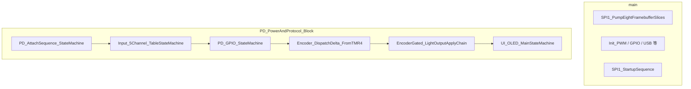

# Phase 5：完整重构（轻量调用图与模块边界）

> 建立日期：2026-04-04  
> 证据来源：Ghidra MCP `get_function_callees` @ `main`（`0x08002E74`）、`PD_PowerAndProtocol_Block`（`0x0800CBFC`）  
> 定位：**Phase 5 前置** — 非全量符号表，仅作 **模块级** 导航与后续重构锚点。

### 文档冻结（`05-MMIO-v1`，2026-04-06）

| 字段       | 说明                                                                                                                                            |
| -------- | --------------------------------------------------------------------------------------------------------------------------------------------- |
| **冻结版本** | `**05-MMIO-v1`**                                                                                                                              |
| **冻结日期** | **2026-04-06**                                                                                                                                |
| **冻结范围** | **§1**、**§2**、**§3**（`main` / `PD_PowerAndProtocol_Block` **直接 callee 表** + **mermaid**）+ **§5** 全文（**§5.1** MMIO↔业务、**§5.2**、**§5.3** 含 DMA） |
| **非冻结**  | **§6**（开放问题、实验草案、维护备忘）— 可独立增删，**不**自动废止上表冻结正文                                                                                                 |
| **修订规则** | 若需改已冻结段落，**递增版本**（如 `**05-MMIO-v2`**）并更新 **日期** 与 **变更一行摘要**                                                                                  |

> **任务书对应**：满足 `[REVERSE_TASK_BOOK.md](REVERSE_TASK_BOOK.md)` **§1「源码输出与职责划分」** 中 **「`05` 调用图与 §5 MMIO↔业务 冻结一版」** 的可核查条件（以本节版本号与日期为准）。

---

## 1. `main` 直接 callee（启动与主循环骨架）

`main` 负责 **初始化链**（`FUN_08002df6`…`Init_PWM_ControlContext`）、**SPI1 启动序列**、**运行期 SPI 大块发送**（`**SPI1_PumpEightFramebufferSlices`**）等。以下为 **直接调用**（第一层）：

| 符号                                                                              | 地址                          | 模块（摘要）                                                                                                                                                                                                                                                                                                                                                                                                            |
| ------------------------------------------------------------------------------- | --------------------------- | ----------------------------------------------------------------------------------------------------------------------------------------------------------------------------------------------------------------------------------------------------------------------------------------------------------------------------------------------------------------------------------------------------------------- |
| `StepBootPhaseCounter8`                                                         | `0x08002DF6`                | 启动阶段计数 / `FUN_08003af4` 与 FMC 半字配合                                                                                                                                                                                                                                                                                                                                                                                |
| `InitializeClock_PLLFlashSysTick`                                               | `0x08002F9C`                | **PLL / Flash 等待 / SysTick 分频**；内部顺序：`**RCM_SequencePLLHSEAndBusEnable_ApplyControlBlock`**（`0x080042f4`）→ `**FMC_ConfigureWaitStatesAndSysClkCache**`（`0x08004618`）→ `**RCM_SequenceSysClkMuxAndAPBPrescale_ApplyControlBlock**`（`0x080047fc`）→ `**SysClkHz_ReadCachedFromSRAM**`（`0x080047B6`，读 `**0x200004D4**` SYSCLK Hz 缓存）→ `**thunk_FUN_08002a92**` / `**FUN_08002ade**` / `**FUN_08002abc**`（SysTick 等收尾） |
| `RCM_SequencePLLHSEAndBusEnable_ApplyControlBlock`                              | `0x080042f4`                | **仅** `InitializeClock_PLLFlashSysTick` 调用；写 `**RCM` `0x40021000`**（HSE/PLL 与总线时钟门控），`**TickVar_Get**` 就绪轮询                                                                                                                                                                                                                                                                                                       |
| `RCM_SequenceSysClkMuxAndAPBPrescale_ApplyControlBlock`                         | `0x080047fc`                | **仅** `InitializeClock_PLLFlashSysTick` 调用（FMC 等待状态之后）；`**CFG` 起指针 `0x40021004`** 索引后续 `**RCM**` 字，系统时钟源 / APB 分频                                                                                                                                                                                                                                                                                                 |
| `InitializeGPIOB_ClockAndPinMode`                                               | `0x08003946`                | **APB2 门控** + `**GPIOB` CRL**（`**RCM_SetOrClearAPB2ENR_Bits`**→`0x40021018`、`**GPIO_WriteCRLCRH_FromPinMaskDescriptor**`）                                                                                                                                                                                                                                                                                         |
| `PatchFMC_LatencyHalfwords`                                                     | `0x08003974`                | FMC 等待周期相关半字补丁                                                                                                                                                                                                                                                                                                                                                                                                    |
| `Init_GPIO_InputMatrix`                                                         | `0x08003A14`                | GPIO / 输入矩阵                                                                                                                                                                                                                                                                                                                                                                                                       |
| `SampleGPIO_FourGroupsToBitmask`                                                | `0x08003A64`                | 四组 GPIO 采样 → 位掩码                                                                                                                                                                                                                                                                                                                                                                                                  |
| `InitializeGPIO_PortsDefaultCR`                                                 | `0x08003AAC`                | 多端口默认 CRL/CRH                                                                                                                                                                                                                                                                                                                                                                                                     |
| `InitializeGPIOD_ClockAndPins`                                                  | `0x08003B0A`                | **GPIOD** 时钟与引脚                                                                                                                                                                                                                                                                                                                                                                                                   |
| `InitializeStartupFlagsAndPrep`                                                 | `0x08003CD2`                | `**Init_GPIO_PortBCD_StartupExtended`** → `**GPIOB_Pin9Drive_BSRR_or_BRR(0)**`；再写启动标志                                                                                                                                                                                                                                                                                                                             |
| `ToggleStartupPathAndNVIC`                                                      | `0x08003CEA`                | 切换路径 / NVIC 分支                                                                                                                                                                                                                                                                                                                                                                                                    |
| `InitializeFlashPrefetchChain`                                                  | `0x08003D1C`                | `**0x40022000` Flash** 控制字、`**FMC_DelayFromStoredSysClkThenKeySequence`** 等                                                                                                                                                                                                                                                                                                                                       |
| `EnableAHBPeriphClock_SRAM`                                                     | `0x08003D84`                | `**RCM->AHBENR**` 大位（SRAM 等）                                                                                                                                                                                                                                                                                                                                                                                      |
| `CheckMagicWord55AA`                                                            | `0x08003DA2`                | **DFU/升级** 魔数 `0x55AA` 探测                                                                                                                                                                                                                                                                                                                                                                                         |
| `thunk_Iwdg_UnlockConfigurePrescaleReloadAndStart` / `thunk_IWDG_KR_ReloadAAAA` | `0x08003D9A` / `0x08003D9E` | `**main`**：若魔数 **失败**（`CheckMagicWord55AA()==0`）则配置并 **启动 IWDT**；主循环中 `**StepBootPhaseCounter8`** 后 `**thunk_IWDG_KR_ReloadAAAA**` **喂狗**                                                                                                                                                                                                                                                                         |
| `DispatchIndirectVectorHandler`                                                 | `0x08003DDC`                | **间接跳转** 向量（跳转表/备用入口）                                                                                                                                                                                                                                                                                                                                                                                             |
| `EnableAHBPeriphClock_DMA1`                                                     | `0x08003DE8`                | `**DMA1` AHB 时钟**（`**RCM_SetOrClearAHBENR_Bits`**）                                                                                                                                                                                                                                                                                                                                                                |
| `SetUsbDeviceContextPointer`                                                    | `0x0800402C`                | 写入 **USB 设备上下文指针**（SRAM）                                                                                                                                                                                                                                                                                                                                                                                          |
| `InitializeUsbControlEndpointDefaults`                                          | `0x08004040`                | EP0 包长等默认值                                                                                                                                                                                                                                                                                                                                                                                                        |
| `UsbDevice_CompleteInitFromContext`                                             | `0x0800405C`                | **USB Device**：`**UsbDevice_InitSessionAndConfigureCore`**→`**UsbDevice_ConfigureCoreRegistersAndEndpoints**` 及 `**UsbDevice_Set***` / `**UsbDevice_StartDeviceAfterDescriptors**` 链，完成描述符/端点/回调                                                                                                                                                                                                                  |
| `Init_PWM_ControlContext`                                                       | `0x080040BC`                | PWM 控制块 / FMC 解锁链                                                                                                                                                                                                                                                                                                                                                                                                 |
| `USB_MainLoop_DataPump`                                                         | `0x08004092`                | **USB Device 主循环数据泵**（非 DMA1 初始化）                                                                                                                                                                                                                                                                                                                                                                                 |
| `InitializeUsbDescriptorsAfterPwmInit`                                          | `0x0800410E`                | PWM 后 `**Memset32_ExpandBytePattern` 清 16 B**，再 `**AES_InitWorkspaceTables`**（GF256 exp/log、S-box、`AES_InitRoundConstantsFromFlashTemplate`）；服务 `**UsbCtl_RequestDispatch_StateMachine` case 7** 的 **16 B AES 块解密**（见任务书 §5 2026-04-05 条）                                                                                                                                                                         |
| `SPI1_StartupSequence`                                                          | `0x08004184`                | **23 B 启动 SPI**                                                                                                                                                                                                                                                                                                                                                                                                   |
| `SPI1_PumpEightFramebufferSlices`                                               | `0x08004258`                | **运行期 SPI 8 通道帧**                                                                                                                                                                                                                                                                                                                                                                                                 |
| `CopyFontGlyphRunsToWorkBuffer`                                                 | `0x0800429E`                | **字模/字形** 展开拷贝（供 UI/OLED 链）                                                                                                                                                                                                                                                                                                                                                                                       |

**启动链补充（非 `main` 第一层，Ghidra 已命名）**：`**InitializeFlashPrefetchChain`** → `**InitializeFlashPrefetch_SecondStage**`（`0x08005100`）：`**RCM->APB2ENR**`（`0x40021018`）**bit0** + `**FUN_08002abc`** FMC/选项字类命令序列。`**thunk_Iwdg_UnlockConfigurePrescaleReloadAndStart**` → `**Iwdg_UnlockConfigurePrescaleReloadAndStart**`（`0x08005184`）：**IWDT** @ `**IWDT_BASE` `0x40003000`**（`apm32f103xb.h`），KR `**0x5555**` → PR `**6**` → RLR `**0x30d**` → `**IWDG_KR_ReloadAAAA**` → `**IWDG_KR_EnableWatchdogCCCC**`（独立看门狗，**非** FMC 密钥；旧 `**thunk_FUN_08005184`** 易误判为 Flash 解锁）。

**归纳**：**显示**路径 = **帧缓冲填充**（周期任务内）+ `**main`** 内 `**SPI1_PumpEightFramebufferSlices**` **SPI 刷屏**；与 `[03_Function_Modules.md](03_Function_Modules.md)` §1.4 **一致**。

---

## 2. `PD_PowerAndProtocol_Block` 直接 callee（电源 / 输入 / UI 周期核）

| 符号                                   | 地址           | 模块                                                                          |
| ------------------------------------ | ------------ | --------------------------------------------------------------------------- |
| `PD_AttachSequence_StateMachine`     | `0x0800C156` | PD 插入序列                                                                     |
| `Input_5Channel_TableStateMachine`   | `0x0800D74E` | 5 路输入表                                                                      |
| `PD_GPIO_StateMachine`               | `0x0800C4E0` | PD GPIO + ADC 阈值                                                            |
| `PD_HelperSeq_3000tick_ThenPc13Gpio` | `0x0800C994` | 辅助 tick / PC13                                                              |
| `ProtocolLanes_BitExpandTick`        | `0x0800C692` | 协议位展开                                                                       |
| `Encoder_DispatchDelta_FromTMR4`     | `0x0800D3D2` | **TMR4 编码器**                                                                |
| `EncoderGated_LightOutputApplyChain` | `0x0800C8C0` | **灯光输出**                                                                    |
| `UI_OLED_MainStateMachine`           | `0x0800D89C` | OLED/UI                                                                     |
| `UI_ModeRender_PostProcess`          | `0x0800D5CC` | UI 后处理                                                                      |
| `UI_SPI1_PumpEightFramebufferSlices` | `0x08009492` | **UI** 路径 **8×**（3 B+0x60）SPI 刷新；与 `**SPI1_PumpEightFramebufferSlices`** 对仗 |

---

## 3. 模块关系图（mermaid）

**说明**：`**SysTick` → `PD_PeriodicDispatchFromSysTick`** 亦驱动 `**PD_PowerAndProtocol_Block**` 相关路径（见 `[04_Protocol_Reverse.md](04_Protocol_Reverse.md)` §3.5）；**本图**仅展示 **函数内顺序 callee** 的 **逻辑分层**。

---

## 5. 寄存器/MMIO 视图 ↔ 业务语义视图（双表初稿，2026-04-04；**已纳入 `05-MMIO-v1` 冻结**）

**目的**：把 **外设层行为** 与 **用户可感知行为** 用 **已命名固件函数** 对齐，便于 Phase 5 后续扩写「寄存器级 + 业务级」双视图文档。

### 5.1 外设（MMIO / 块行为）→ 桥接函数 → 业务语义

| 外设 / 硬件行为             | 典型寄存器或引脚（见 `[PROJECT_INDEX.md](../PROJECT_INDEX.md)` §6.3）                                                                                                                                  | 桥接函数（Ghidra 名）                                                                                                                                                                                                                                                                                                                                                                                                                                                                                                                                   | 用户可见 / 系统语义                                              |
| --------------------- | ------------------------------------------------------------------------------------------------------------------------------------------------------------------------------------------- | ------------------------------------------------------------------------------------------------------------------------------------------------------------------------------------------------------------------------------------------------------------------------------------------------------------------------------------------------------------------------------------------------------------------------------------------------------------------------------------------------------------------------------------------------ | -------------------------------------------------------- |
| **ADC1** 多通道采样        | **IN3/PA3、IN4/PA4、IN8/PB0、IN9/PB1**（**PB1**→**VBAT_ADC** 测试点，`[Zhiyun_F100_Repair_Notes.md](../Document/Zhiyun_F100_Repair_Notes.md)` §6；`[02_Hardware_Init.md](02_Hardware_Init.md)` §ADC） | `**ADC1_AverageSamples`** ← `**PD_GPIO_StateMachine**` / `**LightApply_ClassifyADC_ToControlByte**` / `**Input5Channel_ADC_IN8_BandClassify**` / `**BatteryGauge_ADC9_UpdateFromSysTick600**`                                                                                                                                                                                                                                                                                                                                                    | PD 电压门控与 **「完成」标志**；**亮度/档位分类**；**5 路输入** 合成；**电量条** 分段  |
| **TMR1** PWM          | `**TMR1` CC1/CC3、AUTORLD**（池 `[03_Function_Modules.md](03_Function_Modules.md)` §0.3.2）                                                                                                     | `**TMR1_CompareHalfword_Write`**、`**TMR1_PeriodHalfword_Write**` ← `**EncoderGated_ADC_TMR1Compare_Apply**`、`**CCT_Slew_TableSplit_TMR1Shadow**`                                                                                                                                                                                                                                                                                                                                                                                                 | **双色温 / 冷暖混光** 占空变化（说明书 CCT；**光学→占空** 仍 OI-004）          |
| **TMR3** CC2          | `**TMR3->CC2`**（**PB5 / MO_PWM**）                                                                                                                                                           | `**Init_TMR3_PWM_GPIOB5`** 链 → `**Init_LightEngine_PWM_DMA_TMR1_TMR3Sequence**`（`0x0800ECEA`）→ 尾部 `**Init_TMR3_PB5_AndTickSyncLoop**`                                                                                                                                                                                                                                                                                                                                                                                                            | **风扇 PWM**（转速；**占空→转速** 待示波器）                            |
| **TMR4** 编码器模式        | `**TMR4->CNT`**，**PB6/PB7**                                                                                                                                                                 | `**Encoder_DispatchDelta_FromTMR4`**；**PD 附着后** `**TMR4_EncoderReset_ClearStateAndReinitQuadrature`**（`0x0800D38C`）← `**PD_OnAttachDone_ResetEncoderAndUI**` 清零 `DAT_0800d428` 并重配 quadrature                                                                                                                                                                                                                                                                                                                                                    | **旋钮** 增量（功率/色温/HSI 等，随 UI 模式）；**Type-C 插入** 后编码器上下文复位   |
| **DMA1 Ch1 + `TMR2`** | `**DMA1_Channel1**`=`0x40020008`；`**TMR2**`=`0x40000000`；**SRAM** `0x20000A78`                                                                                                              | `**DMA1_Channel_ApplyCfgAndAddresses`**（`0x0800B2CC`）；`**Init_DMA1Ch1_TMR2CcrDMA**`（`0x0800DC1A`）← `**Init_LightEngine_PWM_DMA_TMR1_TMR3Sequence**`；`**RGBTriple_PushPattern_TMR2Gated**` 门控搬运                                                                                                                                                                                                                                                                                                                                                   | **RGB 模式** 下把半字波形写入 `**TMR2` CCR**（与 **TMR1 冷暖 PWM** 独立） |
| **SPI1**              | **PA5/6/7、PB10 CS、PB6 片选线**                                                                                                                                                                 | `**SPI1_StartupSequence`**（23 B）；`**SPI1_PumpEightFramebufferSlices**` 运行期帧                                                                                                                                                                                                                                                                                                                                                                                                                                                                      | **OLED** 显示刷新（帧缓冲由 `**UI_Framebuffer_CopyRect`** 等填充）    |
| **GPIOB** BSRR/BRR    | **PC13、PB3、PB11、PB14** 等                                                                                                                                                                    | `**PD_ReadGPIOC13_IdrBit`**、`**PD_WriteGPIOB3_BSRR_BRR**`、`**PD_WriteGPIOB11_BSRR_BRR`→PB11**、`**MP3398_EN_*`**                                                                                                                                                                                                                                                                                                                                                                                                                                  | PD 附着检测、**VS_EN**、**DC 路径**、**MP3398 使能**                |
| **USB Device**        | `**0x40005C00` 时钟门控 + USB 寄存器块**                                                                                                                                                            | `**RCM_EnableAPB1_USBCLK_IfBaseIsUsbDevice`**（`0x08001FBC`）、`**UsbDevice_ConfigureCoreRegistersAndEndpoints**`（`0x0800207C`）、`**UsbDevice_CompleteInitFromContext**`（`0x0800405C`）→ `**UsbDevice_InitSessionAndConfigureCore**` / `**UsbDevice_SetDeviceCallbackPtr**` / `**UsbDevice_SetDescriptorTablePtr**` / `**UsbDevice_SetStringDescriptorPtr**` / `**UsbDevice_StartDeviceAfterDescriptors**`（内部 `**UsbDevice_InitEndpointArrayAndHardware**`、`**UsbDevice_AssignEndpointDescriptorSlot**`、`**UsbDevice_ExecuteConnectEnableSequence**`） | **固件升级 / DFU**（与灯控共享 `**DAT_08004158`** 控制块）             |

**证据路径**：`[02_Hardware_Init.md](02_Hardware_Init.md)`；`[03_Function_Modules.md](03_Function_Modules.md)` §0、§0.3；`[04_Protocol_Reverse.md](04_Protocol_Reverse.md)` §3；Ghidra MCP `get_function_callees` / `decompile_function`。

**可信度**：**外设址与函数名**：**高**；**用户语义列**：**中**（与说明书/维修笔记交叉，未逐条波形证明）。

### 5.2 与 §1–§2 调用图的关系

- **§1 `main`**：负责 **初始化 + 大块 SPI 泵**；**§2 `PD_PowerAndProtocol_Block`**：负责 **周期内** PD / 输入 / 灯光 / UI 的 **顺序协作**。
- **本 §5.1** 不按调用顺序展开，而按 **外设总线** 归类，便于与 **数据手册章节**（GPIO/TMR/ADC/SPI）**对照写寄存器注释**。

### 5.3 逐外设寄存器字段（与 SDK `apm32f103xb.h` 对齐，2026-04-04）

下列 **偏移** 均相对各外设 **基址**（见 `[PROJECT_INDEX.md](../PROJECT_INDEX.md)` §6.3）。**结构体成员名** 与 SDK `**TMR_T` / `ADC_T` / `GPIO_T` / `SPI_T`** 一致。

#### 5.3.1 `TMR_T`（灯光 PWM / 编码器 / 风扇）

| 成员（`TMR_T`）     | 偏移              | 固件中角色（结论）                                                                                                                                                                                                                  | 证据路径                                                                                   | 可信度       |
| --------------- | --------------- | -------------------------------------------------------------------------------------------------------------------------------------------------------------------------------------------------------------------------- | -------------------------------------------------------------------------------------- | --------- |
| `**CTRL1**`     | `+0x00`         | 使能、向上/向下计数、`**ARPEN**`（影子寄存器）等                                                                                                                                                                                             | `Init_TMR1` / `Init_TMR3` / `Init_TMR4` 链                                              | **高**     |
| `**SMCTRL`**    | `+0x08`         | **TMR4**：`**SMFSEL=3`** → **编码器模式**（`Encoder_DispatchDelta_FromTMR4` 读 `**CNT`**）                                                                                                                                          | `[02_Hardware_Init.md](02_Hardware_Init.md)` §旋转编码器                                    | **高**     |
| `**CNT`**       | `+0x24`         | **TMR4**：编码器计数值；**TMR1/3**：时基计数（依初始化）                                                                                                                                                                                      | 反编译 `Encoder_DispatchDelta_FromTMR4`                                                   | **高**     |
| `**AUTORLD`**   | `+0x2C`         | **自动重装载**（周期）；`**TMR1_PeriodHalfword_Write`** 间接写此半字                                                                                                                                                                       | `[03_Function_Modules.md](03_Function_Modules.md)` §0.3.1                              | **高**     |
| `**CC1`…`CC4`** | `+0x34`…`+0x40` | **PWM 比较**；池字 `**0x0800DED0`** 指向 `**TMR1+0x34`（CC1）**、`**+0x3C`（CC3）**、`**TMR3+0x38`（CC2）**                                                                                                                               | `[03_Function_Modules.md](03_Function_Modules.md)` §0.3.2；`read_memory` @ `0x0800DED0` | **高**     |
| `**BDT`**       | `+0x44`         | **死区 / `MOEN` 等刹车与主输出**；本镜像 **未见对绝对地址 `0x40012C44` 的引用**；`**Init_TMR1_PWM_WarmColdADIM_PA8PA9_PB15`**（`**0x0800DD28**`；Ghidra 曾用自动名 `**FUN_0800dd28**`，文档一律用现名）仅经 `**FUN_0800a73a**` 等写 `**CTRL1`/`CCx**`，**不**编程 **BDTR** | Ghidra MCP `get_xrefs_to` @ `0x40012C44` **无**；`decompile_function` @ `0x0800DD28`     | **高（负向）** |

**绝对地址示例**：`TMR1_BASE`=`0x40012C00` → `**CC1`**=`0x40012C34`，`**CC3**`=`0x40012C3C`；`TMR3_BASE`=`0x40000400` → `**CC2**`=`0x40000438`；`**BDT**`=`0x40012C44`（本固件 **未直接访问**）。

#### 5.3.2 `ADC_T`（`ADC1`，`0x40012400`）

| 成员（`ADC_T`）   | 偏移      | 固件中角色（结论）                                                                       | 证据路径                                                                         | 可信度   |
| ------------- | ------- | ------------------------------------------------------------------------------- | ---------------------------------------------------------------------------- | ----- |
| `**SMPTIM2`** | `+0x10` | **通道 0–9** 采样时间域（`**ADC1_SetChannelSampleTimeAndRegularRank1`** 写 `param+0x10`） | `[02_Hardware_Init.md](02_Hardware_Init.md)` §ADC；`decompile` @ `0x0800D50A` | **高** |
| `**REGSEQ3`** | `+0x34` | `**REGSEQC1**`：单通道规则序列 **rank1**（与 `ADC1_AverageSamples` 循环平均配合）                | 同上                                                                           | **高** |
| `**REGDATA`** | `+0x4C` | **12 位**转换结果；`**ADC1_AverageSamples`** 经 `**FUN_0800D588**` 读                   | 同上                                                                           | **高** |

#### 5.3.3 `GPIO_T`（`GPIOB` / `GPIOC` 等）

| 成员（`GPIO_T`）       | 偏移      | 固件中角色（结论）                                                                                      | 证据路径                | 可信度   |
| ------------------ | ------- | ---------------------------------------------------------------------------------------------- | ------------------- | ----- |
| `**IDATA`**        | `+0x08` | 读 **输入**；`**PD_ReadGPIOC13_IdrBit`** → **GPIOC** **PC13**                                      | `04` §3；`decompile` | **高** |
| `**BSC`（BSRR 语义）** | `+0x10` | **置位/复位** 原子写；`**PD_WriteGPIOB3_BSRR_BRR`**、`**MP3398_EN_***`、`**PD_WriteGPIOB11_BSRR_BRR**` 等 | `04` §3.8           | **高** |
| `**BC`（BRR 语义）**   | `+0x14` | **仅复位**；`**MP3398_EN_ADIM_InitLow_GPIOB_BRR`**                                                 | `02` / `04` §3.8.2  | **高** |

> **注**：Geehy 头文件将 **STM32 习惯名 BSRR** 合入 `**BSC`**；固件反编译中仍常出现 **字面量 `0x40010C10`** 对应 `**GPIOB->BSC**`。

#### 5.3.4 `SPI_T`（`SPI1`，`0x40013000`）

| 成员（`SPI_T`）           | 偏移                | 固件中角色（结论）                                                                              | 证据路径                                              | 可信度   |
| --------------------- | ----------------- | -------------------------------------------------------------------------------------- | ------------------------------------------------- | ----- |
| `**CTRL1` / `CTRL2**` | `+0x00` / `+0x04` | 主模式、波特率、帧格式；`**SPI1_StartupSequence**` / `**SPI1_PumpEightFramebufferSlices**` 前置 init | `[02_Hardware_Init.md](02_Hardware_Init.md)` §SPI | **高** |
| `**DATA`**            | `+0x0C`           | **半字写** 发射 **8 位** 帧（与 OLED 8 位命令/数据一致）                                                | `decompile` SPI 发送封装                              | **高** |

**可信度（本节总）**：**寄存器偏移与成员名**：**高**（与 SDK 头文件一致）；**与具体函数的一一映射**：**高**（已有 `[02](02_Hardware_Init.md)`/`[03](03_Function_Modules.md)` 交叉引用）。

#### 5.3.5 `DMA_Channel_T`（`DMA1` 通道 1，`0x40020008`）

Geehy SDK 将 **全局状态/清标志** 放在 `**DMA_T`**（`DMA1` 基址 `0x40020000`），**各通道** 使用 `**DMA_Channel_T`**（`[apm32f103xb.h](../SDK/APM32F10x_SDK_V2.0.0/Libraries/Device/Geehy/APM32F10x/Include/apm32f103xb.h)`：`CHCFG` / `CHNDATA` / `CHPADDR` / `CHMADDR`）。

| 成员            | 偏移      | 固件中角色（结论）                                                                                                                | 证据路径                                                                                    | 可信度   |
| ------------- | ------- | ------------------------------------------------------------------------------------------------------------------------ | --------------------------------------------------------------------------------------- | ----- |
| `**CHCFG**`   | `+0x00` | 通道使能、方向、宽度等；`**DMA_Channel_ApplyCfgAndAddresses**` 合并写入                                                                  | `decompile_function` @ `0x0800B2CC`                                                     | **高** |
| `**CHNDATA`** | `+0x04` | 传输计数；`**DMA_Channel_SetTransferCount**`（`0x0800B316`）写 `param_1+4`；`**RGBTriple_PushPattern_TMR2Gated**` 置 `**0x7AB**` 等 | `decompile_function` @ `0x0800ABCC`                                                     | **高** |
| `**CHPADDR`** | `+0x08` | **外设地址** = `**TMR2_BASE+0x3C`**（`0x4000003C`，即 `**TMR2->CC3**` 区域，半字流目标）                                                 | `**Init_DMA1Ch1_TMR2CcrDMA**` 栈参 `local_38`=`DAT_0800DEBC`；`read_memory` @ `0x0800DEBC` | **高** |
| `**CHMADDR`** | `+0x0C` | **内存地址** = `**0x20000A78`**（RGB 展开缓冲，与 `**DAT_0800AE10**` 一致）                                                            | 同上；`read_memory` @ `0x0800DEBC`+4                                                       | **高** |

**调用关系**：`**Init_DMA1Ch1_TMR2CcrDMA`**（`0x0800DC1A`）仅被 `**Init_LightEngine_PWM_DMA_TMR1_TMR3Sequence**`（`0x0800ECEA`）调用；先 `**ResetDmaChannelAndEnableAHB1**`（`0x0800B1FC`）清通道并使能 **DMA1 AHB 时钟**，再 `**DMA1_Channel_ApplyCfgAndAddresses`**，`**FUN_0800aae6**` 开 `**TMR2**` 时钟，`**DMA_Channel_SetEnableCHCFG**` 拉 `**CHEN**`。运行期 `**RGBTriple_PushPattern_TMR2Gated**` 用 `**DMA_Channel_SetEnableCHCFG**` / `**DMA1_IntSts_TestGatingBit**`（`0x0800B31A`）与 `**TMR2**` 门控完成 **Mem→外设** 块传。

**与 `main` 中 `0x08004092` 的区分**：该函数为 **USB** 上下文轮询（`FUN_080018ec` 操作 `**param_1+0x40`/`+0x44`** 等 **USB Device** 语义），**不是** 本节的 **DMA1 通道编程**。

---

## 6. 后续工作（Phase 5 正式清单）

### 6.1 仍待工程化验证的开放问题（执行级）

| ID                  | 结论（摘要）                                                                                                                                                                                                                                                                                                                                                     | 证据路径                                                                                                                            | 可信度                         |
| ------------------- | ---------------------------------------------------------------------------------------------------------------------------------------------------------------------------------------------------------------------------------------------------------------------------------------------------------------------------------------------------------- | ------------------------------------------------------------------------------------------------------------------------------- | --------------------------- |
| **OI-001**          | 单一连续 **Flash 压缩源 `[src,src+L)`** 静态不闭合；验证：**①** 链接 `**.map`** — **本工程不适用**（**无法**从原始工程构建或已保存构建产物取得，见 `[04](04_Protocol_Reverse.md)` **§1.0**）；**②** 上电 **SRAM 转储** `0x20000030`–`0x2000005E`、`0x200002C4` 与 `**DAT_080014B8`** 指向区；**③** **H-OI-001**：调试器在 `**0x080012E8`** 首次经 `**node+0x18**` 进入 handler 时记录 `**Scatterload_MemcpyBytes` 的 `src**` / 寄存器 | `[04](04_Protocol_Reverse.md)` **§1.0**、**§1.3.4–§1.3.5**；Ghidra 书签 `**Scatterload`**                                           | **高**（方法论）；**源块** 待 **②/③** |
| **OI-004**          | **占空比 → 光学 / 风扇转速** 需仪器：**示波器** 测 **TMR1** **PA8 / PA9 / PB15**（与 `**Init_TMR1_PWM_PA8PA9_PB15`**、维修笔记 **W_PWM/C_PWM/ADIM** 对齐）及 **TMR3** **PB5**（**MO_PWM**）；建议固定 **色温/RGB/亮度档位** 各采一组 **频率 + 占空比**，与 UI 模式对照表                                                                                                                                            | `[02_Hardware_Init.md](02_Hardware_Init.md)` §Timer；`[Zhiyun_F100_Repair_Notes.md](../Document/Zhiyun_F100_Repair_Notes.md)` §6 | **高**（引脚）；**光学** 待波形        |
| **OI-002 / OI-005** | **逆推优先**（任务书 2026-04-04）：**不等待**屏厂 PDF。**23 B** 在 `**04` §2.4** 与 SSD1306 语义逐条闭合；**UI** 以 `**UI_ModeRender_Dispatch`** / 模式池与 **说明书** 对照为主；**COG/LA** 为可选补强                                                                                                                                                                                                | `[04_Protocol_Reverse.md](04_Protocol_Reverse.md)` **§2.0**、§2.4、§2.7；`[03_Function_Modules.md](03_Function_Modules.md)` §1.5   | **中→高**（随逆推表完善）             |

**可选万用表（网络闭合）**：**PA0**（`**GPIOA_Pin0_Drive_BSRR_or_BRR`** / PD 上下文）；**PB12/PB13**（经电阻至未知节点）对 **Type-C 壳 / USB 测试点 / BOOT0** — 见任务书 §4 Handoff。

### 6.4 最小可复现实验步骤（草案，与 OI 对齐）

下列步骤 **择一或组合**；固件静态结论已见 `[02](02_Hardware_Init.md)` / `[03](03_Function_Modules.md)` / `[04](04_Protocol_Reverse.md)`。

| 目标 OI      | 仪器                      | 步骤摘要                                                                                                                                                                                                                                                                           | 成功判据（示例）                                                   |
| ---------- | ----------------------- | ------------------------------------------------------------------------------------------------------------------------------------------------------------------------------------------------------------------------------------------------------------------------------ | ---------------------------------------------------------- |
| **OI-002** | **逻辑分析仪（可选）**           | **SPI1**：**SCK / MOSI / CS（PB10）**；上电或复位后抓取 **首帧**；与 `[04](04_Protocol_Reverse.md)` **§2.4** **23 B** 常量 `**0x080041B0`** **逐字节对齐**；运行期可再采 `**SPI1_PumpEightFramebufferSlices`** 大块帧                                                                                           | 启动帧 **23 B** 与文档表 **一致**；必要时与 **SSD1306** 命令 opcode **对照** |
| **OI-004** | **示波器**                 | **DC 耦合**；**PA8 / PA9 / PB15**（**TMR1** 冷暖与 **ADIM**，见 `[02](02_Hardware_Init.md)` §Timer）；**PB5**（**TMR3** **MO_PWM**）。固定 **UI 模式字**（CCT/HSI/FX）与 **亮度档**，各采 **频率 + 占空比**                                                                                                     | 波形 **与 TMR 初始化链** 引脚 **一致**；档位间 **占空或周期变化** 可重复            |
| **OI-001** | **调试器**；**SRAM 转储**     | `**.map` 不可用**（见 `[04](04_Protocol_Reverse.md)` **§1.0** — **无法**从原始工程构建或已保存构建产物取得）。在 `**Scatterload_DecompressRegionOrMemcpy`**（`0x080012E8`）对 `**node+0x18**` **首次** `blx` **断点**，记录 `**Scatterload_MemcpyBytes`** 的 `**src**`（**H-OI-001**）；或 **上电转储** 见 **§6.1** 表上行 **②** | `**src`** 落在 **Flash `0x0800xxxx`**；或与 **SRAM 表** 反推一致     |
| **OI-005** | **抓屏** 或 **LA（事件总线若有）** | 操作 **模式键 / DIM**，对照 `[03](03_Function_Modules.md)` **§1.5** 模式字与 **§1.5.3** 三套 `**0x41`** **vtable** 互斥表；**物理键 → 事件码 `r1`** 仍依赖运行时                                                                                                                                             | 屏显 **与说明书** **§2–§3** 条目 **一致**；可选验证 **vtable 槽** 切换       |

**f100-gdb-mcp + Renode（OI-001，与 `[04](04_Protocol_Reverse.md)` §1.3.8 对齐的可复现命令序）**

1. `**open`** 建立会话；`**monitor version**` 确认 Renode 已连接。
2. **在 `monitor start` 之前**（若 GDB 允许）：`**set mi-async off`**、`**set non-stop off**` — 避免 `**continue` 后** 无法同步读寄存器（若提示 *inferior is running* 则略过，见 §1.3.8）。
3. `**break *0x080012E8`**（`**Scatterload_DecompressRegionOrMemcpy**`）。
4. `**monitor start**`。
5. `**continue**`（或 `**advance *0x080012e8**`）。若 **MCP/`call` 在 `*running` 后返回空输出**：改用 **本机 GDB CLI** 同一脚本并 **重定向日志** 捕获 `***stopped`**，或 `**monitor pause**` 后再 `**info registers**`（仍失败则 §1.3.8 **负向** 成立）。
6. 断点命中后（目标态）：`**info registers`**（`**r0`–`r3`/`pc**`）；`**x/16wx 0x200002C4**`；`**x/8wx 0x20000030**`（scatter 池）；单步至 `**Scatterload_MemcpyBytes**` 记录 `**src**`（**H-OI-001**）。

**2026-04-05 实测**：Cursor **f100-gdb-mcp** 在步骤 5 后 **多次未能** 执行步骤 6 — **动态闭合 OI-001** 依赖 **板载调试器 / 主机 GDB**（`**.map` 路径已标注不可用**，见 `[04](04_Protocol_Reverse.md)` **§1.0**）；详见 `[04](04_Protocol_Reverse.md)` **§1.3.8**。

**2026-04-09 续测**：**f100-gdb-mcp** — `**break *0x080012E8`** 成功，`**continue**` 后 `**^running**`，后续 `**call**` 仍 **空输出**（**§1.3.8 负向** 复现）。**主机** `**arm-none-eabi-gdb -batch`**（`**-ex "target remote :3333"**` … `**-ex continue**`）**30s** 内 **未** 返回（散载或已越过断点 / 需 **机器复位** 后重试）。**静态补偿**：`[04](04_Protocol_Reverse.md)` **§1.3.9** 已用 **汇编** 固定 `**scatterload_rw_decompress_entry` → `Scatterload_DecompressRegionOrMemcpy`** 的 `**r0`/`r1`/栈第 5 参** 与 `**DAT_0800695c`→`0x200002C4`** — **仍不** 等价于 **Flash `src` 区间闭合**。

**2026-04-05（计划执行 / MCP）**：`[04` §1.3.10](04_Protocol_Reverse.md) — 同一会话下 `**monitor version`** **不被目标支持**；`**target remote localhost:3333`** 报 `**vMustReplyEmpty**` **协议错误**；**未** 获得寄存器快照。与 §1.3.8、§1.3.9 **并列**为 **OI-001 动态** 负向记录。

**2026-04-05（`renode_gdb_capture.sh`）**：`[scripts/renode_oi001_capture.gdb](../scripts/renode_oi001_capture.gdb)` **修订** — **移除** 连接后强制 `**set mi-async off`** / `**set non-stop off**`（避免 **inferior running** 时 `**source` 整段失败**，见 `**scripts/out/renode_gdb_capture_20260405_152731.log`**）；修订后一次运行见 `**153357.log**`（`**could not connect: Operation timed out**` — **Renode :3333** 未就绪）。**仍无** 断点寄存器快照；**详见** `[04](04_Protocol_Reverse.md)` **§1.3.9** 表后 `**renode_oi001_capture.gdb` 修订** 段。

**剩余风险简表（与 §6.1 一致，按优先级）**

| 风险                                                            | 影响                                  | 缓解                                           |
| ------------------------------------------------------------- | ----------------------------------- | -------------------------------------------- |
| 无 `**.map`**（**§1.0**：**无法**从原始工程/已保存构建产物取得），**OI-001** 源块不闭合 | 无法完整复刻 **链接时压缩布局**                  | 调试器 **H-OI-001**、**SRAM 转储**；**不**依赖可获得的 map |
| **OI-004** 仅静态                                                | **亮度/色温/风扇** 用户感知与 **PWM** 比例未计量    | **示波器** 按上表固定工况                              |
| **OI-005** 物理键→**vtable**                                     | **三套 `0x41`** 的 **选型** 依赖 **描述符指针** | **抓屏** + 固件 **§1.5.3** 表对照                   |

**本轮静态分析（2026-04-08）**：**未** 新增 **未解析 GPIO 字面量**；**万用表** 可选项 **PA0 / PB12 / PB13** 仍仅作 **Handoff** 储备，**无** 新测量需求。**2026-04-05**：**§6.4** 增补 **f100-gdb-mcp** 步骤与 **§1.3.8** 交叉引用；**Renode 路径** 对 **OI-001** 寄存器读仍 **未** 闭环。

### 6.2 Phase 5 文档与 Ghidra 维护

- 将 `**main`** 内残余 `**FUN_08003xxx**` **逐批重命名** 并挂 **板级注释**（与 §1 表对齐）。
- **续扩 §5.3**：`**TMR1->BDT`** 与 `**DMA1+TMR2**` 已在 **§5.3.1 / §5.3.5**（2026-04-04）静态闭合；**互补对称 PWM** 若需硬件验证仍属 **OI-004**（示波器）。

### 6.3 TMR4 PD 附着复位（Ghidra 符号，2026-04-04）

- `**TMR4_EncoderReset_ClearStateAndReinitQuadrature`** @ `**0x0800D38C**`：**唯一调用者** `**PD_OnAttachDone_ResetEncoderAndUI`**；清零 `**DAT_0800d428**`，`**FUN_0800a074**`，再 `**Init_TMR4_EncoderQuadrature_PB6PB7**`。书签 `**Encoder` @ `0x0800D38C**`，`save_program`。
- **证据路径**：Ghidra MCP；`[04_Protocol_Reverse.md](04_Protocol_Reverse.md)` §3.10；`[02_Hardware_Init.md](02_Hardware_Init.md)` §`TMR1`/`TMR4` 表。
- **可信度**：**高**。

### 6.4 Phase 6 第二期最小切口（SPI1/OLED 运行期帧泵节拍，2026-04-06）

- 范围：仅收敛 `UI_SPI1_PumpEightFramebufferSlices` 的**触发时机**，不改 `05-MMIO-v1` 冻结链路顺序，不新增冻结范围外 MMIO 语义。
- 现状（回合 R 前）：运行期每轮都发送 `8×(3B+96B)`，可达但节拍粒度偏粗。
- 收敛（回合 S）：采用“**脏帧触发 + 周期保底刷新**”策略，保持单次触发仍为全量 8 片发送；新增 `spi_flush_trigger/skip` 计数用于 Renode+本机 GDB 取证。
- 与终局关系：该改动缩小“可感知显示行为”差距，但仍非终局；后续仍需对照 `03/04` 与实机行为补证节拍等价性。
- USB 风险边界：`phase6_usb_guard` 继续保持 `PHASE6_USB_FW_UPGRADE_ENABLED=0`，本切口**不涉及**升级写 Flash 路径。

